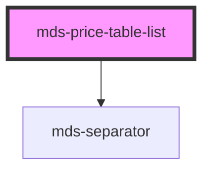

# mds-price-table-list


This is a web-component from Maggioli Design System [Magma](https://magma.maggiolicloud.it), built with StencilJS, TypeScript, Storybook. It's based on the web-component standard and it's designed to be agnostic from the JavaScript framework you are using.

<!-- Auto Generated Below -->


## Usage

### 1. Description

The `<mds-price-table-list>` web component is a single pricing-plan column inside the [`<mds-price-table>`](../../mds-price-table) layout container. It is a compound child that arranges a plan's heading, feature list, price and call-to-action into a consistent card-like structure built entirely from slots - it has no configurable props.

#### Semantic Behavior

- **Compound child**: Designed to sit as a direct slot child of [`<mds-price-table>`](../../mds-price-table); one instance represents one pricing plan, and several siblings line up to form the comparison table. It is not used standalone.
- **Owns the feature-list child type**: Feature rows are provided as `<mds-price-table-list-item>` elements - they are the intended child type for the list body.
- **Conditional list region**: The feature region and the separator above it render only when feature items are present; a plan with no features collapses to header plus footer.
- **No interactive state**: It renders pure structure with no role/ARIA defaults, no selected/active/disabled state and no emitted events; any interactivity (e.g. the CTA) comes from the components you slot in, such as `<mds-button>` in the `action` slot.
- **Footer composition**: The `price` and `action` slots are grouped together at the bottom of the card.

#### Properties & Visual Configurations

`<mds-price-table-list>` exposes no props; it is a layout-only child whose appearance is driven entirely by what you slot into it. Use the named slots to compose a plan:

- **`header`**: the plan title and supporting description (typically `<mds-text>` elements); rendered at the top.
- **default body**: the feature rows, supplied as `<mds-price-table-list-item>` children.
- **`price`**: the plan's price, shown in the grouped footer.
- **`action`**: the call-to-action; `<mds-button>` is recommended.

The only style hook is the `--mds-price-table-list-separator-color` CSS custom property, controlling the divider drawn between the header and the feature list.


### 2. Pattern

Correct and idiomatic ways to use the `<mds-price-table-list>` component, ordered from most common to most specialized. Patterns assume a working knowledge of the slot conventions documented in [`docs/COMPONENTS.md`](../../../../../../docs/COMPONENTS.md) and the generic stencil rules in [`projects/stencil/SPEC.md`](../../../../SPEC.md).

#### Minimal Plan Column (Header + Price + Action)

The simplest form: a plan name, a price, and a call-to-action. Feature rows are optional - the separator and the item region are omitted automatically when no `<mds-price-table-list-item>` children are present.

```html
<mds-price-table-list>
  <mds-text typography="h5" slot="header">Piano Base</mds-text>
  <mds-text typography="detail" slot="header">Adatto a professionisti individuali.</mds-text>

  <mds-text typography="h2" slot="price">49 &euro;/mese</mds-text>
  <mds-button slot="action" variant="dark">Inizia ora</mds-button>
</mds-price-table-list>
```

#### Full Plan Column with Feature List

Add `<mds-price-table-list-item>` children directly inside the component (no explicit `slot` attribute needed - the element self-assigns to the correct internal slot). Use `supported` to toggle the check / dash icon.

```html
<mds-price-table-list>
  <mds-text typography="h5" slot="header">Piano Pro</mds-text>
  <mds-text typography="detail" slot="header">Ideale per team di medie dimensioni.</mds-text>

  <mds-price-table-list-item supported>Funzionalita di base</mds-price-table-list-item>
  <mds-price-table-list-item supported>Fino a 50 utenti</mds-price-table-list-item>
  <mds-price-table-list-item supported>100 GB di spazio per utente</mds-price-table-list-item>
  <mds-price-table-list-item supported>Supporto via chat</mds-price-table-list-item>
  <mds-price-table-list-item supported>Flussi automatici</mds-price-table-list-item>
  <mds-price-table-list-item>Accesso API</mds-price-table-list-item>
  <mds-price-table-list-item>Report avanzati</mds-price-table-list-item>

  <mds-text typography="h2" slot="price">99 &euro;/mese</mds-text>
  <mds-button slot="action" variant="primary" tone="strong">Attiva piano</mds-button>
</mds-price-table-list>
```

#### Composing Multiple Plans Inside `<mds-price-table>`

`<mds-price-table-list>` is a compound child of [`<mds-price-table>`](../../mds-price-table). Place one instance per pricing plan as a direct slot child of the parent.

```html
<mds-price-table>
  <mds-price-table-list>
    <mds-text typography="h5" slot="header">Piano Base</mds-text>
    <mds-price-table-list-item supported>Funzionalita essenziali</mds-price-table-list-item>
    <mds-price-table-list-item>API access</mds-price-table-list-item>
    <mds-text typography="h2" slot="price">29 &euro;</mds-text>
    <mds-button slot="action" variant="dark">Scegli</mds-button>
  </mds-price-table-list>

  <mds-price-table-list>
    <mds-text typography="h5" slot="header">Piano Pro</mds-text>
    <mds-price-table-list-item supported>Funzionalita essenziali</mds-price-table-list-item>
    <mds-price-table-list-item supported>API access</mds-price-table-list-item>
    <mds-text typography="h2" slot="price">79 &euro;</mds-text>
    <mds-button slot="action" variant="primary" tone="strong">Scegli</mds-button>
  </mds-price-table-list>
</mds-price-table>
```

#### Feature Item with Contextual Help

Nest an [`<mds-help>`](../../mds-help) component inside a `<mds-price-table-list-item>` to add an inline tooltip for features that need extra explanation. Place it after the label text in the default slot.

```html
<mds-price-table-list>
  <mds-text typography="h5" slot="header">Piano Enterprise</mds-text>

  <mds-price-table-list-item supported>
    SLA garantito
    <mds-help>Disponibilita del 99,9% con monitoraggio dedicato.</mds-help>
  </mds-price-table-list-item>
  <mds-price-table-list-item supported>
    Archiviazione illimitata
    <mds-help>Soggetta a policy di utilizzo equo.</mds-help>
  </mds-price-table-list-item>
  <mds-price-table-list-item supported>Supporto telefonico 24/7</mds-price-table-list-item>

  <mds-text typography="h2" slot="price">Su richiesta</mds-text>
  <mds-button slot="action" variant="primary" tone="strong">Contattaci</mds-button>
</mds-price-table-list>
```

#### Adjusting Feature-Item Typography

`<mds-price-table-list-item>` accepts a `typography` prop (`"caption"`, `"detail"` (default), `"paragraph"`) to match the density of the surrounding layout. Apply a consistent value to all items in the same list.

```html
<mds-price-table-list>
  <mds-text typography="h5" slot="header">Piano Starter</mds-text>

  <mds-price-table-list-item supported typography="caption">5 utenti</mds-price-table-list-item>
  <mds-price-table-list-item supported typography="caption">1 GB di spazio</mds-price-table-list-item>
  <mds-price-table-list-item typography="caption">Esportazione dati</mds-price-table-list-item>

  <mds-text typography="h3" slot="price">Gratuito</mds-text>
  <mds-button slot="action" variant="dark" tone="outline">Registrati</mds-button>
</mds-price-table-list>
```

#### Styling via CSS Custom Property

Use `--mds-price-table-list-separator-color` to change the divider between the header and the feature list. Set it on the host element or a parent selector; use Magma color tokens via `rgb(var(--<token>))`.

```css
.highlight-plan mds-price-table-list {
  --mds-price-table-list-separator-color: rgb(var(--variant-primary-03) / 0.4);
}
```

#### Styling via Shadow Parts

Use the documented `::part()` targets - `header`, `content`, and `footer` - when you need to override layout that the CSS custom property surface does not cover. Limit part overrides to layout-only changes; do not pierce the shadow DOM via `>>>` or undocumented class names.

```css
mds-price-table-list::part(footer) {
  gap: var(--spacing-300);
}

mds-price-table-list::part(header) {
  padding-bottom: var(--spacing-200);
}
```


### 3. Antipattern

Common incorrect uses of `<mds-price-table-list>`. Each entry pairs the wrong form with the right one and a one-line reason. System-wide rules (boolean-as-string, shadow piercing, Tailwind color utilities, raw native event listening) live in [`docs/COMPONENTS.md`](../../../../../../docs/COMPONENTS.md#system-level-anti-patterns) - they apply here too but are not repeated.

#### Do Not Use `<mds-price-table-list>` Outside `<mds-price-table>`

The component is a compound child of [`<mds-price-table>`](../../mds-price-table) and relies on its parent for grid alignment across columns. Using it standalone breaks the multi-column layout and misrepresents the pricing comparison.

```html
<!-- 🚫 INCORRECT -->
<mds-price-table-list>
  <mds-text typography="h5" slot="header">Piano Base</mds-text>
  <mds-text typography="h2" slot="price">49 &euro;</mds-text>
  <mds-button slot="action" variant="dark">Scegli</mds-button>
</mds-price-table-list>

<!-- ✅ CORRECT -->
<mds-price-table>
  <mds-price-table-list>
    <mds-text typography="h5" slot="header">Piano Base</mds-text>
    <mds-text typography="h2" slot="price">49 &euro;</mds-text>
    <mds-button slot="action" variant="dark">Scegli</mds-button>
  </mds-price-table-list>
</mds-price-table>
```

#### Do Not Place Feature Items in the `header` Slot

The `header` slot is for the plan title and description only. Putting feature rows there bypasses the conditional separator logic and places items outside the styled `content` region.

```html
<!-- 🚫 INCORRECT -->
<mds-price-table-list>
  <mds-text typography="h5" slot="header">Piano Pro</mds-text>
  <mds-price-table-list-item slot="header" supported>Funzionalita avanzate</mds-price-table-list-item>
  <mds-text typography="h2" slot="price">99 &euro;</mds-text>
  <mds-button slot="action" variant="primary">Attiva</mds-button>
</mds-price-table-list>

<!-- ✅ CORRECT -->
<mds-price-table-list>
  <mds-text typography="h5" slot="header">Piano Pro</mds-text>
  <mds-price-table-list-item supported>Funzionalita avanzate</mds-price-table-list-item>
  <mds-text typography="h2" slot="price">99 &euro;</mds-text>
  <mds-button slot="action" variant="primary">Attiva</mds-button>
</mds-price-table-list>
```

#### Do Not Replace `<mds-price-table-list-item>` with Raw HTML List Elements

Using `<li>` or `<span>` inside the list body loses the consistent supported/unsupported icon, the correct typography sizing, and the accessible structure provided by `<mds-price-table-list-item>`.

```html
<!-- 🚫 INCORRECT -->
<mds-price-table-list>
  <mds-text typography="h5" slot="header">Piano Base</mds-text>
  <ul>
    <li>Funzionalita di base</li>
    <li>10 utenti</li>
  </ul>
  <mds-text typography="h2" slot="price">29 &euro;</mds-text>
  <mds-button slot="action" variant="dark">Scegli</mds-button>
</mds-price-table-list>

<!-- ✅ CORRECT -->
<mds-price-table-list>
  <mds-text typography="h5" slot="header">Piano Base</mds-text>
  <mds-price-table-list-item supported>Funzionalita di base</mds-price-table-list-item>
  <mds-price-table-list-item supported>10 utenti</mds-price-table-list-item>
  <mds-text typography="h2" slot="price">29 &euro;</mds-text>
  <mds-button slot="action" variant="dark">Scegli</mds-button>
</mds-price-table-list>
```

#### Do Not Set `supported="false"` as a String

`supported` is a boolean attribute. Any non-empty string value - including `"false"` - is truthy in HTML and will mark the feature as supported. Remove the attribute entirely to show the unsupported (dash) state.

```html
<!-- 🚫 INCORRECT -->
<mds-price-table-list-item supported="false">Esportazione dati</mds-price-table-list-item>

<!-- ✅ CORRECT -->
<mds-price-table-list-item>Esportazione dati</mds-price-table-list-item>
```

#### Do Not Put the CTA in the `price` Slot

The `price` slot is for the price text only; the `action` slot is where `<mds-button>` belongs. Mixing them breaks the vertical stacking order and the footer layout.

```html
<!-- 🚫 INCORRECT -->
<mds-price-table-list>
  <mds-text typography="h5" slot="header">Piano Pro</mds-text>
  <mds-button slot="price" variant="primary">Attiva piano</mds-button>
</mds-price-table-list>

<!-- ✅ CORRECT -->
<mds-price-table-list>
  <mds-text typography="h5" slot="header">Piano Pro</mds-text>
  <mds-text typography="h2" slot="price">79 &euro;/mese</mds-text>
  <mds-button slot="action" variant="primary">Attiva piano</mds-button>
</mds-price-table-list>
```

#### Do Not Pierce the Shadow DOM to Style Internal Regions

The supported customization surface is `--mds-price-table-list-separator-color` and the three documented `::part()` targets (`header`, `content`, `footer`). Targeting undocumented class names with `>>>` or deep selectors couples your code to the internal markup and breaks on minor releases.

```css
/* 🚫 INCORRECT */
mds-price-table-list >>> .main {
  background-color: yellow;
}
mds-price-table-list::part(separator) {
  height: 4px;
}

/* ✅ CORRECT */
mds-price-table-list {
  --mds-price-table-list-separator-color: rgb(var(--variant-primary-03) / 0.3);
}
mds-price-table-list::part(content) {
  gap: var(--spacing-400);
}
```


## Slots

| Slot        | Description                                                                                    |
| ----------- | ---------------------------------------------------------------------------------------------- |
| `"action"`  | Add `HTML elements` or `components`, it is **recommended** to use `mds-button` element.        |
| `"default"` | Add `mds-price-table-list-item` component, `HTML elements` or other `components` to this slot. |
| `"header"`  | Add `text string`, `HTML elements` or `components` to this slot.                               |
| `"price"`   | Add `text string`, `HTML elements` or `components` to this slot.                               |


## Shadow Parts

| Part        | Description                                                                           |
| ----------- | ------------------------------------------------------------------------------------- |
| `"content"` | Selects the element which wraps elements added via `default slot`                     |
| `"footer"`  | Selects the element which wraps elements added via `slot="price"` and `slot="action"` |
| `"header"`  | Selects the element which wraps elements added via `slot="header"`                    |


## Dependencies

### Depends on

- [mds-separator](../mds-separator)

### Graph


----------------------------------------------

Built with love @ [Gruppo Maggioli](https://www.maggioli.com) from [R&D Department](https://www.maggioli.com/it-it/chi-siamo/ricerca-sviluppo)
