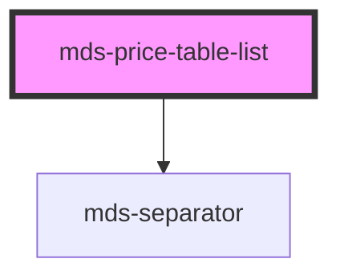

# mds-price-table-list

This is a web-component from Maggioli Design System [Magma](https://magma.maggiolicloud.it), built with StencilJS, TypeScript, Storybook. It's based on the web-component standard and it's designed to be agnostic from the JavaScirpt framework you are using.

<!-- Auto Generated Below -->

## Slots

| Slot        | Description                                                                                    |
| ----------- | ---------------------------------------------------------------------------------------------- |
| `"action"`  | Add `HTML elements` or `components`, it is **recommended** to use `mds-button` element.        |
| `"default"` | Add `mds-price-table-list-item` component, `HTML elements` or other `components` to this slot. |
| `"header"`  | Add `text string`, `HTML elements` or `components` to this slot.                               |
| `"price"`   | Add `text string`, `HTML elements` or `components` to this slot.                               |

## Shadow Parts

| Part        | Description                                                                           |
| ----------- | ------------------------------------------------------------------------------------- |
| `"content"` | Selects the element which wraps elements added via `default slot`                     |
| `"footer"`  | Selects the element which wraps elements added via `slot="price"` and `slot="action"` |
| `"header"`  | Selects the element which wraps elements added via `slot="header"`                    |

## Dependencies

### Depends on

- [mds-separator](../mds-separator)

### Graph

----------------------------------------------

Built with love @ [Gruppo Maggioli](https://www.maggioli.com) from [R&D Department](https://www.maggioli.com/it-it/chi-siamo/ricerca-sviluppo)
