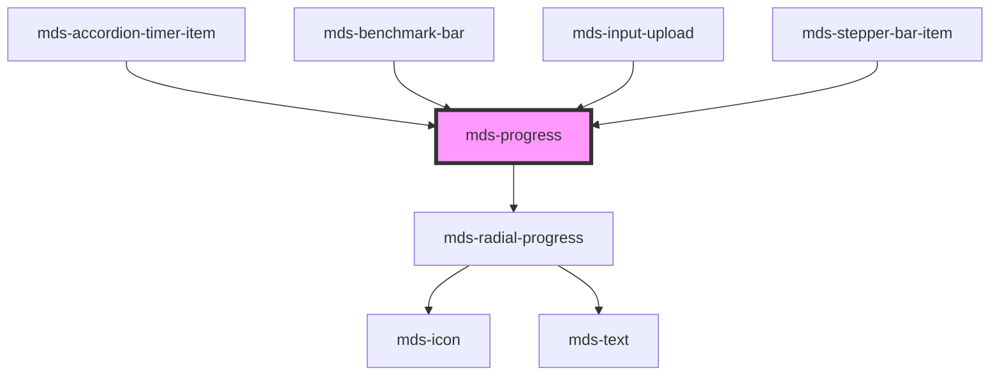

# mds-progress


This is a web-component from Maggioli Design System [Magma](https://magma.maggiolicloud.it), built with StencilJS, TypeScript, Storybook. It's based on the web-component standard and it's designed to be agnostic from the JavaScript framework you are using.

<!-- Auto Generated Below -->


## Usage

### 1. Description

The `<mds-progress>` web component is the progress indicator of the Magma Design System, rendering the completion state of a determinate task as a bar or ring. It is the system equivalent of the native HTML `<progress>` element, exposing the appropriate progressbar role and ARIA value attributes natively.

#### Semantic Behavior

- **Spoken step text**: As `progress` changes, the component maps the value onto the `steps` list and announces the matching label, so assistive technologies report a human-readable milestone rather than a raw number.
- **Decorative opt-out**: When the host carries `aria-hidden="true"`, all progressbar semantics are stripped so the indicator can be used as purely decorative chrome.
- **Radial delegation**: With `direction="radial"` the rendering is delegated to `mds-radial-progress`, which carries the typography and the textual percentage; the bar directions render a single fill instead.

#### Properties & Visual Configurations

- **`progress`** is the source of truth: a fractional value between `0` and `1` (not a percentage) that drives both the visual fill and the computed ARIA value.
- **`steps`** is a comma-separated string of milestone labels (default Italian: `'Inizio,Un quarto,Metà,Tre quarti,Fine'`); the current `progress` is quantized across these labels to pick what screen readers announce. Provide labels that match the granularity of the task.
- **`typography`** (`'option'` | `'label'`) selects the type scale applied to the textual percentage shown inside the radial variant; it has no effect on the bar directions.

#### Other behavioral props

- **`direction`** chooses the geometry: `'horizontal'` and `'vertical'` render a linear fill bar, while `'radial'` renders a circular ring with a centered percentage via `mds-radial-progress`.

The shared `variant` and `size` ladders are defined in [`projects/stencil/SPEC.md`](../../../../SPEC.md#tone-and-variant-system); this component adds no values beyond the shared sets.


### 2. Pattern

Correct and idiomatic ways to use the `<mds-progress>` component, ordered from most common to most specialized. Patterns assume a working knowledge of the variant / tone ladders documented in [`docs/COMPONENTS.md`](../../../../../../docs/COMPONENTS.md) and the generic stencil rules in [`projects/stencil/SPEC.md`](../../../../SPEC.md).

#### Basic Horizontal Progress Bar

The default form. Pass `progress` as a fractional value between `0` and `1`. The component exposes `role="progressbar"` and manages `aria-valuenow` automatically.

```html
<mds-progress progress="0.4" aria-label="Caricamento documento"></mds-progress>
```

#### Variant for Semantic Meaning

Use `variant` to communicate the nature of the task - not just the colour you want. The component maps every `ThemeVariantType` value to a matching color pair for the fill and track.

```html
<!-- Operazione riuscita -->
<mds-progress progress="1" variant="success" aria-label="Importazione completata"></mds-progress>

<!-- Operazione con avviso -->
<mds-progress progress="0.6" variant="warning" aria-label="Quota disco in esaurimento"></mds-progress>

<!-- Errore -->
<mds-progress progress="0.85" variant="error" aria-label="Errore di rete"></mds-progress>

<!-- Contenuto AI -->
<mds-progress progress="0.5" variant="ai" aria-label="Elaborazione AI in corso"></mds-progress>
```

#### Sizing

Use the `size` prop to control the thickness of the bar. `sm` is the default and suits most inline uses; larger values give more visual weight in dashboard or hero contexts.

```html
<mds-progress progress="0.5" size="sm" aria-label="Piccola barra"></mds-progress>
<mds-progress progress="0.5" size="md" aria-label="Barra media"></mds-progress>
<mds-progress progress="0.5" size="lg" aria-label="Barra grande"></mds-progress>
<mds-progress progress="0.5" size="xl" aria-label="Barra extra grande"></mds-progress>
```

#### Vertical Progress Bar

Set `direction="vertical"` for upward-fill layouts such as column charts or skill meters. Give the host an explicit height via CSS because the element stretches to fit its container.

```html
<mds-progress
  progress="0.65"
  direction="vertical"
  variant="primary"
  aria-label="Utilizzo CPU"
  style="height: 120px;"
></mds-progress>
```

#### Radial Progress Bar

Set `direction="radial"` to render a circular ring with a centered percentage label via the internal `mds-radial-progress` component. Control the ring diameter through a CSS width on the host.

```html
<mds-progress
  progress="0.72"
  direction="radial"
  variant="primary"
  aria-label="Completamento profilo"
  style="width: 80px;"
></mds-progress>
```

#### Radial with Typography Control

When `direction="radial"`, the `typography` prop selects the type scale applied to the centered percentage label. Use `'label'` for denser layouts and `'option'` (default) for standard sizing.

```html
<mds-progress
  progress="0.5"
  direction="radial"
  typography="label"
  aria-label="Avanzamento attivita"
  style="width: 64px;"
></mds-progress>
```

#### Accessible Step Labels

The `steps` prop is a comma-separated list of milestone strings. As `progress` changes the component picks the nearest label and sets `aria-valuetext`, so screen readers announce a meaningful milestone rather than a raw number. Provide labels that match the granularity of your task.

```html
<mds-progress
  progress="0.5"
  steps="Inizializzazione,Analisi,Elaborazione,Completamento"
  variant="primary"
  aria-label="Avanzamento analisi dati"
></mds-progress>
```

#### Decorative Use (aria-hidden)

When `<mds-progress>` is used purely as a visual indicator alongside a separate text description, set `aria-hidden="true"`. The component removes all progressbar ARIA attributes so assistive technologies skip it.

```html
<p>Progresso: 40%</p>
<mds-progress progress="0.4" aria-hidden="true"></mds-progress>
```

#### Updating Progress Dynamically

Set the `progress` attribute from JavaScript as the task advances. The component transitions the fill with `--mds-progress-duration` and updates `aria-valuenow` and `aria-valuetext` on each change.

```javascript
const bar = document.querySelector('mds-progress');

async function runTask() {
  for (let i = 0; i <= 10; i++) {
    await doWork(i);
    bar.progress = i / 10;
  }
}
```

#### Styling Customization

Override the documented `--mds-progress-*` CSS custom properties for one-off visual tweaks. Use Magma color tokens via `rgb(var(--<token>))` so dark mode keeps working.

```css
.upload-widget mds-progress {
  --mds-progress-background: rgb(var(--tone-neutral-09));
  --mds-progress-color: rgb(var(--variant-secondary-03));
  --mds-progress-thickness: var(--height-400);
  --mds-progress-duration: 400ms;
}
```


### 3. Antipattern

Common incorrect uses of `<mds-progress>`. Each entry pairs the wrong form with the right one and a one-line reason. System-wide rules (boolean-as-string, shadow piercing, Tailwind color utilities, raw native event listening) live in [`docs/COMPONENTS.md`](../../../../../../docs/COMPONENTS.md#system-level-anti-patterns) - they apply here too but are not repeated.

#### Do Not Use a Raw `<progress>` Element

Replacing `<mds-progress>` with the native element loses the Magma theme, the step-announcement system, and automatic `aria-valuenow` wiring.

```html
<!-- 🚫 INCORRECT -->
<progress value="40" max="100"></progress>

<!-- ✅ CORRECT -->
<mds-progress progress="0.4" aria-label="Avanzamento operazione"></mds-progress>
```

#### Do Not Pass `progress` as a Percentage Integer

`progress` is a fractional value between `0` and `1`, not a percentage. Passing `40` instead of `0.4` pins the bar at 100% fill and sets `aria-valuenow` to `4000`.

```html
<!-- 🚫 INCORRECT -->
<mds-progress progress="40"></mds-progress>

<!-- ✅ CORRECT -->
<mds-progress progress="0.4" aria-label="Avanzamento caricamento"></mds-progress>
```

#### Do Not Omit an Accessible Name

Without `aria-label` (or `aria-labelledby`) and without `aria-hidden="true"`, the progressbar role has no text label and screen readers can only announce the numeric value with no context.

```html
<!-- 🚫 INCORRECT -->
<mds-progress progress="0.6"></mds-progress>

<!-- ✅ CORRECT - informative bar with a label -->
<mds-progress progress="0.6" aria-label="Invio email in corso"></mds-progress>

<!-- ✅ CORRECT - purely decorative, no label needed -->
<mds-progress progress="0.6" aria-hidden="true"></mds-progress>
```

#### Do Not Use `direction="radial"` Without a Width Constraint

The radial variant sizes itself from the host's width. Without an explicit width the ring expands to fill the container, often breaking the layout.

```html
<!-- 🚫 INCORRECT -->
<mds-progress progress="0.5" direction="radial"></mds-progress>

<!-- ✅ CORRECT -->
<mds-progress progress="0.5" direction="radial" style="width: 80px;" aria-label="Completamento"></mds-progress>
```

#### Do Not Use `typography` on Bar Directions

The `typography` prop controls the type scale of the centered percentage label rendered only when `direction="radial"`. Setting it on `horizontal` or `vertical` bars has no visual effect and misleads readers.

```html
<!-- 🚫 INCORRECT -->
<mds-progress progress="0.5" direction="horizontal" typography="label"></mds-progress>

<!-- ✅ CORRECT -->
<mds-progress progress="0.5" direction="radial" typography="label" style="width: 64px;" aria-label="Avanzamento"></mds-progress>
```

#### Do Not Pierce the Shadow DOM to Style the Fill

`::part(progress)` is the supported way to reach the fill element; `>>>` or undocumented class names are not. Prefer the `--mds-progress-*` CSS custom properties for the most common overrides.

```css
/* 🚫 INCORRECT */
mds-progress >>> .progress {
  background: hotpink;
}

/* ✅ CORRECT - use the CSS custom property */
mds-progress {
  --mds-progress-color: rgb(var(--variant-secondary-03));
}

/* ✅ CORRECT - use the documented part only when a property is insufficient */
mds-progress::part(progress) {
  border-radius: 0;
}
```

#### Do Not Set `aria-hidden="false"` to Re-enable Semantics

`aria-hidden="false"` is a string attribute - it is truthy in HTML. To restore progressbar semantics after hiding the bar, remove the attribute entirely.

```html
<!-- 🚫 INCORRECT -->
<mds-progress progress="0.5" aria-hidden="false" aria-label="Avanzamento"></mds-progress>

<!-- ✅ CORRECT -->
<mds-progress progress="0.5" aria-label="Avanzamento"></mds-progress>
```


## Properties

| Property     | Attribute    | Description                                                            | Type                                                                                                 | Default                                   |
| ------------ | ------------ | ---------------------------------------------------------------------- | ---------------------------------------------------------------------------------------------------- | ----------------------------------------- |
| `direction`  | `direction`  | Specifies the direction of the progress bar, if horizonatl or vertical | `"horizontal" \| "radial" \| "vertical" \| undefined`                                                | `'horizontal'`                            |
| `progress`   | `progress`   | A value between 0 and 1 that rapresents the status progress            | `number`                                                                                             | `0`                                       |
| `size`       | `size`       | Sets the size of the component                                         | `"lg" \| "md" \| "sm" \| "xl" \| undefined`                                                          | `'sm'`                                    |
| `steps`      | `steps`      | Sets the steps that can be pronounced by accessibility technologies    | `string`                                                                                             | `'Inizio,Un quarto,Metà,Tre quarti,Fine'` |
| `typography` | `typography` | The typography of the component                                        | `"label" \| "option" \| undefined`                                                                   | `'option'`                                |
| `variant`    | `variant`    | Sets the theme variant colors                                          | `"ai" \| "dark" \| "error" \| "info" \| "light" \| "primary" \| "success" \| "warning" \| undefined` | `'primary'`                               |


## Shadow Parts

| Part                | Description                                                                     |
| ------------------- | ------------------------------------------------------------------------------- |
| `"progress"`        | Selects the `div` element that contains the progress bar                        |
| `"radial-progress"` | Selects the `mds-radial-progress` element that contains the radial progress bar |


## Dependencies

### Used by

 - [mds-accordion-timer-item](../mds-accordion-timer-item)
 - [mds-benchmark-bar](../mds-benchmark-bar)
 - [mds-input-upload](../mds-input-upload)
 - [mds-stepper-bar-item](../mds-stepper-bar-item)

### Depends on

- [mds-radial-progress](../mds-radial-progress)

### Graph


----------------------------------------------

Built with love @ [Gruppo Maggioli](https://www.maggioli.com) from [R&D Department](https://www.maggioli.com/it-it/chi-siamo/ricerca-sviluppo)
