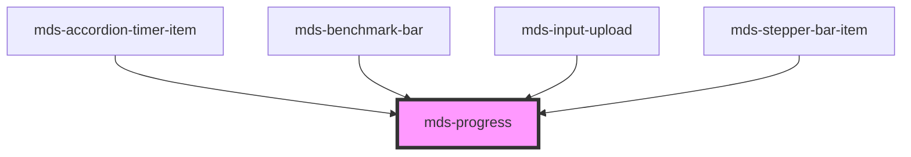

# mds-progress

This is a web-component from Maggioli Design System [Magma](https://magma.maggiolicloud.it), built with StencilJS, TypeScript, Storybook. It's based on the web-component standard and it's designed to be agnostic from the JavaScirpt framework you are using.

<!-- Auto Generated Below -->

## Properties

| Property    | Attribute   | Description                                                            | Type                                                                            | Default                                   |
| ----------- | ----------- | ---------------------------------------------------------------------- | ------------------------------------------------------------------------------- | ----------------------------------------- |
| `direction` | `direction` | Specifies the direction of the progress bar, if horizonatl or vertical | `"horizontal" \| "vertical" \| undefined`                                       | `'horizontal'`                            |
| `progress`  | `progress`  | A value between 0 and 1 that rapresents the status progress            | `number`                                                                        | `0`                                       |
| `steps`     | `steps`     | Sets the steps that can be pronounced by accessibility technologies    | `string`                                                                        | `'Inizio,Un quarto,Metà,Tre quarti,Fine'` |
| `variant`   | `variant`   | Sets the theme variant colors                                          | `"dark" \| "error" \| "info" \| "light" \| "primary" \| "success" \| "warning"` | `'primary'`                               |

## CSS Custom Properties

| Name                        | Description                                     |
| --------------------------- | ----------------------------------------------- |
| `--mds-progress-background` | Sets the background-color of the component      |
| `--mds-progress-color`      | Sets the background-color of the progress       |
| `--mds-progress-duration`   | Sets the duration of the progress bar animation |
| `--mds-progress-radius`     | Sets the border-radius of the component         |
| `--mds-progress-thickness`  | Sets the thickness of the progress bar          |

## Dependencies

### Used by

 - [mds-accordion-timer-item](../mds-accordion-timer-item)
 - [mds-benchmark-bar](../mds-benchmark-bar)
 - [mds-input-upload](../mds-input-upload)
 - [mds-stepper-bar-item](../mds-stepper-bar-item)

### Graph

----------------------------------------------

Built with love @ [Gruppo Maggioli](https://www.maggioli.com) from [R&D Department](https://www.maggioli.com/it-it/chi-siamo/ricerca-sviluppo)
