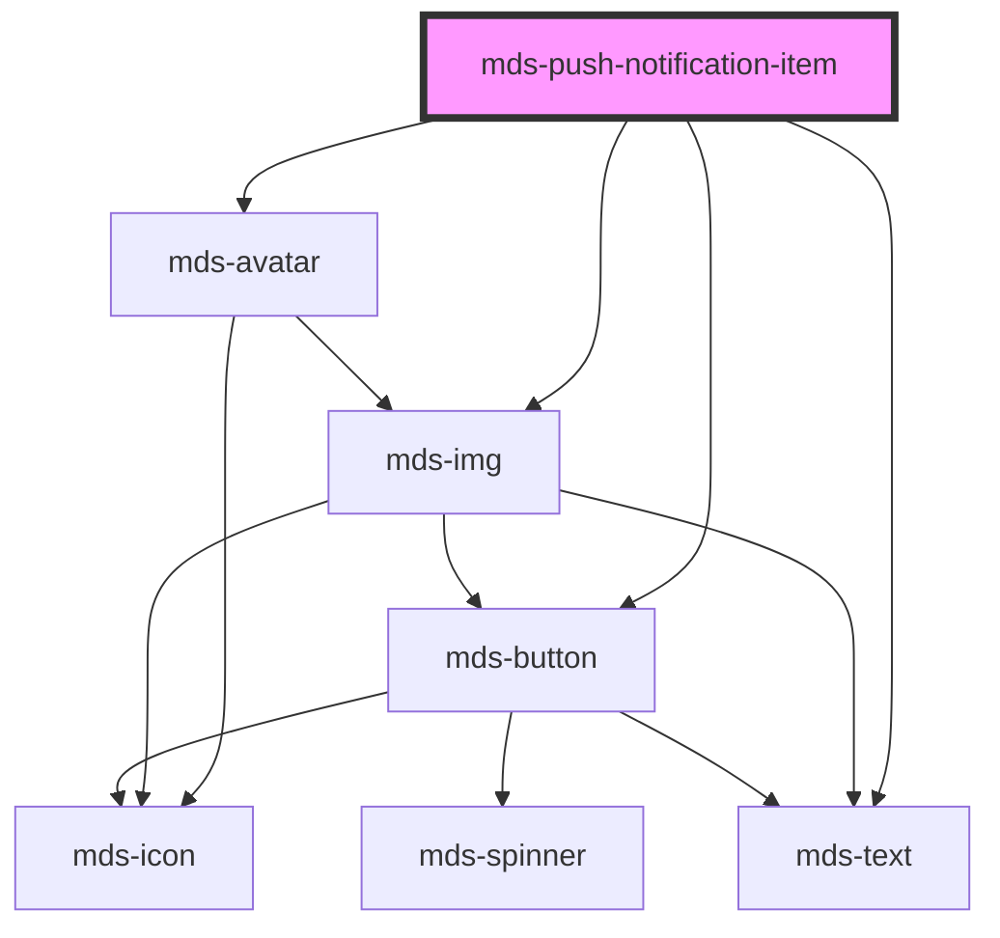

# mds-push-notification-item

<!-- Auto Generated Below -->

## Properties

| Property     | Attribute     | Description                                                                                                                                            | Type                                                                                                                                                                                                         | Default                          |
| ------------ | ------------- | ------------------------------------------------------------------------------------------------------------------------------------------------------ | ------------------------------------------------------------------------------------------------------------------------------------------------------------------------------------------------------------ | -------------------------------- |
| `dateFormat` | `date-format` | Specifies if the notification date format shows time passed or displays date as a static string                                                        | `string`                                                                                                                                                                                                     | `'timeago'`                      |
| `datetime`   | `datetime`    | Specifies the notification date based on [standard ISO 8601](https://www.iso.org/iso-8601-date-and-time-format.html).                                  | `string \| undefined`                                                                                                                                                                                        | `undefined`                      |
| `deletable`  | `deletable`   | Specifies if the component is dismissable or not, it should be set to true by default is used with it's parent component `mds-push-notification-items` | `boolean \| undefined`                                                                                                                                                                                       | `true`                           |
| `icon`       | `icon`        | Specifies the icon to be displayed                                                                                                                     | `string \| undefined`                                                                                                                                                                                        | `undefined`                      |
| `initials`   | `initials`    | The user's inizials displayed if there's no image available, initials will override tone and variant senttings to keep user recognizable from others   | `string \| undefined`                                                                                                                                                                                        | `undefined`                      |
| `message`    | `message`     | Specifies the message of the component                                                                                                                 | `string`                                                                                                                                                                                                     | `'Nessun messaggio disponibile'` |
| `preview`    | `preview`     | Specifies if the `src` attribute is used to show a the image as avatar or full image                                                                   | `"avatar" \| "image" \| undefined`                                                                                                                                                                           | `'image'`                        |
| `src`        | `src`         | Specifies the path to the image                                                                                                                        | `string \| undefined`                                                                                                                                                                                        | `undefined`                      |
| `subject`    | `subject`     | Specifies the subject of the component                                                                                                                 | `string \| undefined`                                                                                                                                                                                        | `undefined`                      |
| `tone`       | `tone`        | Specifies the color tone of the component                                                                                                              | `"strong" \| "weak" \| undefined`                                                                                                                                                                            | `'weak'`                         |
| `variant`    | `variant`     | Specifies the color variant of the component                                                                                                           | `"amaranth" \| "aqua" \| "blue" \| "error" \| "green" \| "info" \| "lime" \| "orange" \| "orchid" \| "primary" \| "purple" \| "red" \| "sky" \| "success" \| "violet" \| "warning" \| "yellow" \| undefined` | `undefined`                      |

## Events

| Event                          | Description                        | Type                                              |
| ------------------------------ | ---------------------------------- | ------------------------------------------------- |
| `mdsPushNotificationItemClose` | Emits when the component is closed | `CustomEvent<MdsPushNotificationItemEventDetail>` |

## Methods

### `updateLang() => Promise<void>`

#### Returns

Type: `Promise<void>`

## Slots

| Slot       | Description                                                                             |
| ---------- | --------------------------------------------------------------------------------------- |
| `"action"` | Add `HTML elements` or `components`, it is **recommended** to use `mds-button` element. |
| `"badge"`  | Add `HTML elements` or `components`, it is **recommended** to use `mds-badge` element.  |

## Shadow Parts

| Part        | Description                                |
| ----------- | ------------------------------------------ |
| `"actions"` | The actions wrapper                        |
| `"avatar"`  |                                            |
| `"content"` | The content wrapper of the message         |
| `"icon"`    | The icon set by `icon` attribute           |
| `"picture"` | The picture image added by `src` attribute |

## CSS Custom Properties

| Name                                                 | Description                                                  |
| ---------------------------------------------------- | ------------------------------------------------------------ |
| `--mds-push-notification-item-duration`              | Duration of the individual push notification item animation. |
| `--mds-push-notification-item-icon-background-color` | Background color of the item's icon.                         |
| `--mds-push-notification-item-icon-color`            | Color of the item's icon.                                    |
| `--mds-push-notification-item-message-line-clamp`    | Number of lines to clamp the message text.                   |
| `--mds-push-notification-item-shadow`                | Shadow applied to the push notification item.                |
| `--mds-push-notification-item-subject-line-clamp`    | Number of lines to clamp the subject text.                   |
| `--mds-push-notification-item-timing-function`       | Timing function used for the item animation.                 |

## Dependencies

### Depends on

- [mds-avatar](../mds-avatar)
- [mds-img](../mds-img)
- [mds-text](../mds-text)
- [mds-button](../mds-button)

### Graph

----------------------------------------------

Built with love @ [Gruppo Maggioli](https://www.maggioli.com) from [R&D Department](https://www.maggioli.com/it-it/chi-siamo/ricerca-sviluppo)
