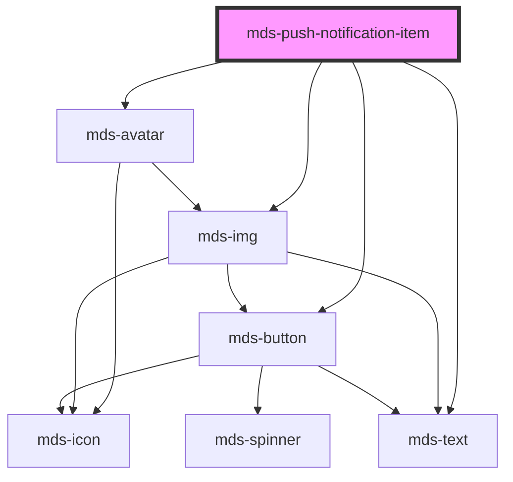

# mds-push-notification-item


<!-- Auto Generated Below -->


## Usage

### 1. Description

The `<mds-push-notification-item>` web component is a single notification card rendered inside its parent container [`<mds-push-notification>`](../../mds-push-notification). It composes an avatar/image, a subject, a relative or formatted timestamp, a message body and an optional dismiss control into one toast-like row.

#### Semantic Behavior

- **Compound child only**: It must be placed as a direct default-slot child of `<mds-push-notification>`; it is not used standalone or mixed with other child types, since the parent animates intro/outro and manages stacking.
- **Dismiss reports up, removal happens in the parent**: Clicking the built-in close button emits the bubbling `mdsPushNotificationItemClose` event; the parent runs the outro animation and removes the item. The item never removes itself.
- **Parent-driven visibility lifecycle**: When the last item closes, the parent auto-hides the whole notification area.
- **Timestamp rendering**: With `dateFormat="timeago"` `datetime` shows a localized relative time ("2 minutes ago"); otherwise the value is treated as a date-format string for a static date.
- **Localization**: The relative-time strings and the dismiss button title are localized (el/en/es/it).
- **Conditional avatar vs. picture**: An `<mds-avatar>` is rendered when `icon` is set or `preview="avatar"`; when `src` is set and `preview` is not `avatar`, a full-width `<mds-img>` preview is rendered instead.
- **Slot detection**: The `badge` and `action` named slots are only wired into the layout when matching slotted children exist, so empty slots add no markup.

#### Properties & Visual Configurations

- **`deletable`** (default `false`): Controls whether the dismiss button is shown. Add it to let the user close the notification manually; leave it off for items the user should not close.
- **`preview`**: Pick `avatar` to show the `src` image (or `initials`/`icon` fallback) as a compact round avatar, or `image` (default) to show `src` as a larger inline picture preview.
- **`initials`**: Provided as the avatar fallback when no image is available; it overrides `tone`/`variant` styling so the user stays visually recognizable.
- **`dateFormat`**: Use `timeago` for a live relative timestamp, or any date-format token string for a fixed display date.

For `tone` and `variant`, this component consumes the shared color ladders defined in [`projects/stencil/SPEC.md`](../../../../SPEC.md#tone-and-variant-system); the values are forwarded to the underlying `<mds-avatar>` and follow the avatar tone/variant set rather than adding component-specific values.


### 2. Pattern

Correct and idiomatic ways to use the `<mds-push-notification-item>` component, ordered from most common to most specialized. Patterns assume a working knowledge of the variant / tone ladders documented in [`docs/COMPONENTS.md`](../../../../../../docs/COMPONENTS.md) and the generic stencil rules in [`projects/stencil/SPEC.md`](../../../../SPEC.md).

#### Basic Message Notification

The minimal form: a message body with an icon and a relative timestamp. Always nest the item inside [`mds-push-notification`](../../mds-push-notification), which manages stacking and animation.

```html
<mds-push-notification>
  <mds-push-notification-item
    icon="mi/baseline/email"
    subject="Nuovo messaggio"
    message="Hai ricevuto 3 nuovi messaggi da account diversi"
    datetime="2024-06-01T10:30:00"
  ></mds-push-notification-item>
</mds-push-notification>
```

#### Variant for Semantic Status

Use `variant` to communicate meaning - success, warning, error, info - and `tone` to set visual weight. The values are forwarded to the internal `<mds-avatar>`.

```html
<mds-push-notification>
  <mds-push-notification-item
    icon="mi/baseline/check-circle"
    subject="Salvataggio completato"
    message="Il documento e' stato salvato con successo"
    datetime="2024-06-01T10:31:00"
    variant="success"
    tone="strong"
  ></mds-push-notification-item>

  <mds-push-notification-item
    icon="mi/baseline/warning"
    subject="Attenzione"
    message="La sessione scadra' tra 5 minuti"
    datetime="2024-06-01T10:32:00"
    variant="warning"
    tone="weak"
  ></mds-push-notification-item>
</mds-push-notification>
```

#### Dismissable Notification

Add the `deletable` attribute to show the dismiss button, letting the user close the notification manually. Without it the notification cannot be dismissed by the user - keep it off for system notifications the user must not close.

```html
<mds-push-notification>
  <mds-push-notification-item
    deletable
    icon="mi/baseline/email"
    subject="Nuovo messaggio"
    message="Hai ricevuto un nuovo messaggio"
    datetime="2024-06-01T09:00:00"
    variant="info"
  ></mds-push-notification-item>
</mds-push-notification>
```

#### Action Buttons via the `action` Slot

Slot one or more `<mds-button>` elements into `slot="action"` for in-notification CTAs. Use `size="sm"` to keep the actions compact.

```html
<mds-push-notification>
  <mds-push-notification-item
    icon="mi/baseline/person"
    subject="Mario Giannini"
    message="Ciao, sono Mario, questo e' il mio contatto, buona giornata!"
    datetime="2024-06-01T10:25:00"
    variant="primary"
    tone="strong"
  >
    <mds-button slot="action" variant="success" tone="weak" size="sm" label="Accetta"></mds-button>
    <mds-button slot="action" variant="error" tone="weak" size="sm" label="Ignora"></mds-button>
  </mds-push-notification-item>
</mds-push-notification>
```

#### Badge Label via the `badge` Slot

Slot an `<mds-badge>` into `slot="badge"` to show a category or type label above the subject line.

```html
<mds-push-notification>
  <mds-push-notification-item
    icon="mi/baseline/attach-file"
    subject="Nuovo allegato"
    message="Hai ricevuto un nuovo file allegato da Luca Bianchi"
    datetime="2024-06-01T10:20:00"
    variant="primary"
  >
    <mds-badge slot="badge" variant="amaranth" tone="weak">pdf</mds-badge>
    <mds-button slot="action" tone="outline" size="sm" label="Scarica"></mds-button>
  </mds-push-notification-item>
</mds-push-notification>
```

#### Avatar Mode with Image

Set `src` and `preview="avatar"` to display a user photo as a round avatar instead of the default full-width image preview.

```html
<mds-push-notification>
  <mds-push-notification-item
    src="./avatar-sarah.jpeg"
    preview="avatar"
    subject="Sarah Ho"
    message="Ciao, sono Sarah, questo e' il mio contatto, buona giornata!"
    datetime="2024-06-01T10:15:00"
    variant="primary"
    tone="strong"
  >
    <mds-button slot="action" variant="success" tone="weak" size="sm" label="Scrivi"></mds-button>
  </mds-push-notification-item>
</mds-push-notification>
```

#### Avatar Mode with Initials Fallback

When no image is available, set `initials` and `preview="avatar"`. The initials override `tone` and `variant` coloring so the user stays visually distinguishable.

```html
<mds-push-notification>
  <mds-push-notification-item
    initials="MG"
    preview="avatar"
    subject="Mario Giannini"
    message="Ha modificato il documento condiviso"
    datetime="2024-06-01T10:10:00"
  ></mds-push-notification-item>
</mds-push-notification>
```

#### Inline Image Preview

Omit `preview="avatar"` (or keep the default `image`) and supply `src` to show the image as a larger inline thumbnail - useful for file or media notifications.

```html
<mds-push-notification>
  <mds-push-notification-item
    src="./book-cover-01.webp"
    subject="Anteprima immagine"
    message="La copertina e' stata aggiornata"
    datetime="2024-06-01T10:05:00"
  ></mds-push-notification-item>
</mds-push-notification>
```

#### Fixed Date Format

Use any `dayjs`-compatible format string as `date-format` to show a static date instead of the default relative "time ago" display.

```html
<mds-push-notification>
  <mds-push-notification-item
    icon="mi/baseline/event"
    subject="Promemoria riunione"
    message="La riunione di progetto e' fissata per domani"
    datetime="2024-06-01T09:00:00"
    date-format="DD/MM/YYYY"
  ></mds-push-notification-item>
</mds-push-notification>
```

#### Listening to the Dismiss Event

Listen to `mdsPushNotificationItemClose` to handle cleanup when the user dismisses the item. The parent `<mds-push-notification>` does this automatically, but you can also add your own logic (e.g. marking the notification read in the server).

```javascript
document
  .querySelector('mds-push-notification-item')
  .addEventListener('mdsPushNotificationItemClose', (event) => {
    const { id } = event.detail;
    markNotificationRead(id);
  });
```

#### Styling Customization

Customize the item only through its documented `--mds-push-notification-item-*` CSS custom properties.

```css
.app-notifications mds-push-notification-item {
  --mds-push-notification-item-shadow: var(--shadow-md-sharp);
  --mds-push-notification-item-message-line-clamp: 3;
  --mds-push-notification-item-subject-line-clamp: 2;
  --mds-push-notification-item-icon-background-color: rgb(var(--variant-primary-03));
  --mds-push-notification-item-icon-color: rgb(var(--tone-neutral));
}
```


### 3. Antipattern

Common incorrect uses of `<mds-push-notification-item>`. Each entry pairs the wrong form with the right one and a one-line reason. System-wide rules (boolean-as-string, shadow piercing, Tailwind color utilities, raw native event listening) live in [`docs/COMPONENTS.md`](../../../../../../docs/COMPONENTS.md#system-level-anti-patterns) - they apply here too but are not repeated.

#### Do Not Use the Item Outside Its Parent

`<mds-push-notification-item>` is a compound child that must live inside [`<mds-push-notification>`](../../mds-push-notification). The parent drives entry / exit animation, stacking, and auto-hide when the last item closes.

```html
<!-- 🚫 INCORRECT -->
<mds-push-notification-item
  icon="mi/baseline/email"
  subject="Nuovo messaggio"
  message="Hai ricevuto un nuovo messaggio"
></mds-push-notification-item>

<!-- ✅ CORRECT -->
<mds-push-notification>
  <mds-push-notification-item
    icon="mi/baseline/email"
    subject="Nuovo messaggio"
    message="Hai ricevuto un nuovo messaggio"
  ></mds-push-notification-item>
</mds-push-notification>
```

#### Do Not Put Content in the Default Slot

`<mds-push-notification-item>` has no default slot. All text content goes through the `message` and `subject` props; interactive content goes into the named `action` or `badge` slots.

```html
<!-- 🚫 INCORRECT -->
<mds-push-notification-item>
  Hai un nuovo messaggio
</mds-push-notification-item>

<!-- ✅ CORRECT -->
<mds-push-notification-item
  message="Hai un nuovo messaggio"
  subject="Posta in arrivo"
></mds-push-notification-item>
```

#### Do Not Slot Arbitrary Content Into `action` Without `mds-button`

The `action` slot is designed for `<mds-button>` elements at `size="sm"`. Slotting raw `<button>` or large components breaks layout alignment and loses Magma theming and keyboard semantics.

```html
<!-- 🚫 INCORRECT -->
<mds-push-notification-item subject="Richiesta" message="Approva la richiesta di accesso">
  <button slot="action" class="btn">Approva</button>
</mds-push-notification-item>

<!-- ✅ CORRECT -->
<mds-push-notification-item subject="Richiesta" message="Approva la richiesta di accesso">
  <mds-button slot="action" variant="success" tone="weak" size="sm" label="Approva"></mds-button>
</mds-push-notification-item>
```

#### Do Not Mix `icon` and `src` With `preview="image"`

When `icon` is set, the component always renders an `<mds-avatar>` for the icon. If `src` is also set and `preview` is not `"avatar"`, a full-width `<mds-img>` is rendered as well - producing two media areas side by side, which is almost never the intended layout. Pick one visual mode per notification.

```html
<!-- 🚫 INCORRECT - both an icon avatar and a full-width image preview render simultaneously -->
<mds-push-notification-item
  icon="mi/baseline/photo"
  src="./cover.jpg"
  preview="image"
  subject="Nuova foto"
  message="La copertina e' stata aggiornata"
></mds-push-notification-item>

<!-- ✅ CORRECT - icon only, no image -->
<mds-push-notification-item
  icon="mi/baseline/photo"
  subject="Nuova foto"
  message="La copertina e' stata aggiornata"
></mds-push-notification-item>

<!-- ✅ CORRECT - image preview only, no icon -->
<mds-push-notification-item
  src="./cover.jpg"
  subject="Nuova foto"
  message="La copertina e' stata aggiornata"
></mds-push-notification-item>
```

#### Do Not Listen for the Native `close` DOM Event

The component emits `mdsPushNotificationItemClose`, not a native `close`. Listening for `close` or `click` on the dismiss button will not fire reliably because the button is inside shadow DOM.

```javascript
// 🚫 INCORRECT
element.addEventListener('close', handler);

// ✅ CORRECT
element.addEventListener('mdsPushNotificationItemClose', handler);
```

#### Customize via Documented Vars, Not Internal Selectors

The supported customization surface is `--mds-push-notification-item-*` CSS custom properties and documented shadow parts (`actions`, `content`, `picture`). Targeting shadow-DOM internals via `::part()` on undocumented parts or via `>>>` will break on minor releases.

```css
/* 🚫 INCORRECT */
mds-push-notification-item::part(header) {
  font-weight: bold;
}
mds-push-notification-item >>> .message {
  color: red;
}

/* ✅ CORRECT */
mds-push-notification-item {
  --mds-push-notification-item-message-line-clamp: 3;
  --mds-push-notification-item-shadow: var(--shadow-md-sharp);
}
mds-push-notification-item::part(content) {
  gap: var(--spacing-200);
}
```


## Properties

| Property     | Attribute     | Description                                                                                                                                          | Type                                                                                                                                                                                                         | Default                          |
| ------------ | ------------- | ---------------------------------------------------------------------------------------------------------------------------------------------------- | ------------------------------------------------------------------------------------------------------------------------------------------------------------------------------------------------------------ | -------------------------------- |
| `dateFormat` | `date-format` | Specifies if the notification date format shows time passed or displays date as a static string                                                      | `string`                                                                                                                                                                                                     | `'timeago'`                      |
| `datetime`   | `datetime`    | Specifies the notification date based on [standard ISO 8601](https://www.iso.org/iso-8601-date-and-time-format.html).                                | `string \| undefined`                                                                                                                                                                                        | `undefined`                      |
| `deletable`  | `deletable`   | Specifies if the component is dismissable; when set, a dismiss button is shown.                                                                      | `boolean \| undefined`                                                                                                                                                                                       | `false`                          |
| `icon`       | `icon`        | Specifies the icon to be displayed                                                                                                                   | `string \| undefined`                                                                                                                                                                                        | `undefined`                      |
| `initials`   | `initials`    | The user's inizials displayed if there's no image available, initials will override tone and variant senttings to keep user recognizable from others | `string \| undefined`                                                                                                                                                                                        | `undefined`                      |
| `message`    | `message`     | Specifies the message of the component                                                                                                               | `string`                                                                                                                                                                                                     | `'Nessun messaggio disponibile'` |
| `preview`    | `preview`     | Specifies if the `src` attribute is used to show a the image as avatar or full image                                                                 | `"avatar" \| "image" \| undefined`                                                                                                                                                                           | `'image'`                        |
| `src`        | `src`         | Specifies the path to the image                                                                                                                      | `string \| undefined`                                                                                                                                                                                        | `undefined`                      |
| `subject`    | `subject`     | Specifies the subject of the component                                                                                                               | `string \| undefined`                                                                                                                                                                                        | `undefined`                      |
| `tone`       | `tone`        | Specifies the color tone of the component                                                                                                            | `"strong" \| "weak" \| undefined`                                                                                                                                                                            | `'weak'`                         |
| `variant`    | `variant`     | Specifies the color variant of the component                                                                                                         | `"amaranth" \| "aqua" \| "blue" \| "error" \| "green" \| "info" \| "lime" \| "orange" \| "orchid" \| "primary" \| "purple" \| "red" \| "sky" \| "success" \| "violet" \| "warning" \| "yellow" \| undefined` | `undefined`                      |


## Events

| Event                          | Description                        | Type                                              |
| ------------------------------ | ---------------------------------- | ------------------------------------------------- |
| `mdsPushNotificationItemClose` | Emits when the component is closed | `CustomEvent<MdsPushNotificationItemEventDetail>` |


## Methods

### `updateLang() => Promise<void>`

Updates the component's texts to the locale currently set on the host element.

#### Returns

Type: `Promise<void>`


## Slots

| Slot       | Description                                                                             |
| ---------- | --------------------------------------------------------------------------------------- |
| `"action"` | Add `HTML elements` or `components`, it is **recommended** to use `mds-button` element. |
| `"badge"`  | Add `HTML elements` or `components`, it is **recommended** to use `mds-badge` element.  |


## Shadow Parts

| Part        | Description                                |
| ----------- | ------------------------------------------ |
| `"actions"` | The actions wrapper                        |
| `"avatar"`  |                                            |
| `"content"` | The content wrapper of the message         |
| `"icon"`    | The icon set by `icon` attribute           |
| `"picture"` | The picture image added by `src` attribute |


## CSS Custom Properties

| Name                                                 | Description                                                  |
| ---------------------------------------------------- | ------------------------------------------------------------ |
| `--mds-push-notification-item-duration`              | Duration of the individual push notification item animation. |
| `--mds-push-notification-item-icon-background-color` | Background color of the item's icon.                         |
| `--mds-push-notification-item-icon-color`            | Color of the item's icon.                                    |
| `--mds-push-notification-item-message-line-clamp`    | Number of lines to clamp the message text.                   |
| `--mds-push-notification-item-shadow`                | Shadow applied to the push notification item.                |
| `--mds-push-notification-item-subject-line-clamp`    | Number of lines to clamp the subject text.                   |
| `--mds-push-notification-item-timing-function`       | Timing function used for the item animation.                 |


## Dependencies

### Depends on

- [mds-avatar](../mds-avatar)
- [mds-img](../mds-img)
- [mds-text](../mds-text)
- [mds-button](../mds-button)

### Graph


----------------------------------------------

Built with love @ [Gruppo Maggioli](https://www.maggioli.com) from [R&D Department](https://www.maggioli.com/it-it/chi-siamo/ricerca-sviluppo)
