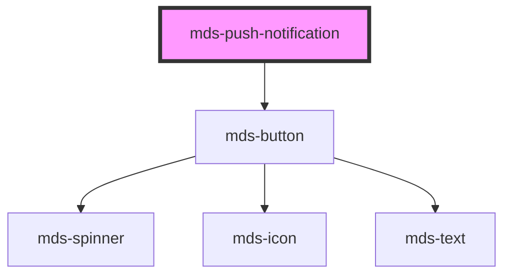

# mds-push-notification

<!-- Auto Generated Below -->

## Properties

| Property   | Attribute  | Description                                                                                                                                                                                                                                                                                                                           | Type                              | Default     |
| ---------- | ---------- | ------------------------------------------------------------------------------------------------------------------------------------------------------------------------------------------------------------------------------------------------------------------------------------------------------------------------------------- | --------------------------------- | ----------- |
| `behavior` | `behavior` | Specifies if the component is visible or not. behavior = manual should hide when click outside should hide when all notifications are removed should show when change visible from component or call show method  behavior = auto should hide when all notifications are removed should show when one or more notifications are added | `"auto" \| "manual" \| undefined` | `'auto'`    |
| `visible`  | `visible`  | Specifies if the component is visible or not.                                                                                                                                                                                                                                                                                         | `boolean \| undefined`            | `undefined` |

## Events

| Event                       | Description                                 | Type                                          |
| --------------------------- | ------------------------------------------- | --------------------------------------------- |
| `mdsPushNotificationChange` | Emits when the component visibility changes | `CustomEvent<MdsPushNotificationEventDetail>` |
| `mdsPushNotificationHide`   | Emits when the component is hidden          | `CustomEvent<void>`                           |
| `mdsPushNotificationShow`   | Emits when the component is shown           | `CustomEvent<void>`                           |

## Methods

### `hide() => Promise<void>`

#### Returns

Type: `Promise<void>`

### `removeNotification(notification: HTMLMdsPushNotificationItemElement | HTMLMdsPushNotificationItemElement[]) => Promise<void>`

#### Parameters

| Name           | Type  | Description |
| -------------- | ----- | ----------- |
| `notification` | `any` |             |

#### Returns

Type: `Promise<void>`

### `show() => Promise<void>`

#### Returns

Type: `Promise<void>`

## Slots

| Slot        | Description                                                                                        |
| ----------- | -------------------------------------------------------------------------------------------------- |
| `"bottom"`  | Add `HTML elements` or `components`, it is **recommended** to use `mds-button` element.            |
| `"default"` | Add `HTML elements` or `components`, it is **recommended** to use `mds-push-notification` element. |
| `"top"`     | Add `HTML elements` or `components`, it is **recommended** to use `mds-button` element.            |

## Shadow Parts

| Part              | Description                                 |
| ----------------- | ------------------------------------------- |
| `"notifications"` | The container wrapper of the notifications. |

## CSS Custom Properties

| Name                                            | Description                                                       |
| ----------------------------------------------- | ----------------------------------------------------------------- |
| `--mds-push-notification-background`            | Background of the push notification, supports gradients.          |
| `--mds-push-notification-fadeout-delay`         | Delay before the push notification starts fading out.             |
| `--mds-push-notification-gap`                   | Gap between multiple push notifications.                          |
| `--mds-push-notification-items-duration`        | Duration of the item animation inside the notification.           |
| `--mds-push-notification-items-gap`             | Gap between items inside the notification.                        |
| `--mds-push-notification-items-intro-delay`     | Delay before items inside the notification animate in.            |
| `--mds-push-notification-items-outro-delay`     | Delay before items inside the notification animate out.           |
| `--mds-push-notification-items-timing-function` | Timing function used for item animations inside the notification. |

## Dependencies

### Depends on

- [mds-button](../mds-button)

### Graph

----------------------------------------------

Built with love @ [Gruppo Maggioli](https://www.maggioli.com) from [R&D Department](https://www.maggioli.com/it-it/chi-siamo/ricerca-sviluppo)
