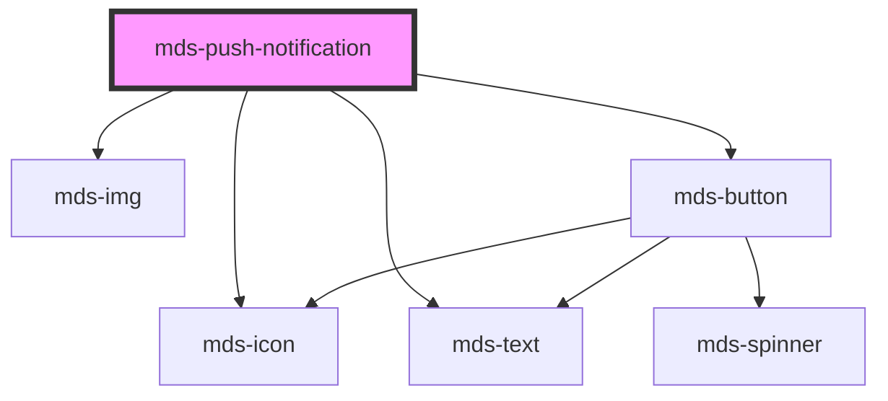

# mds-push-notification

<!-- Auto Generated Below -->

## Properties

| Property  | Attribute | Description                            | Type                  | Default                          |
| --------- | --------- | -------------------------------------- | --------------------- | -------------------------------- |
| `icon`    | `icon`    | Specifies the icon to be displayed     | `string \| undefined` | `undefined`                      |
| `message` | `message` | Specifies the message of the component | `string`              | `'Nessun messaggio disponibile'` |
| `src`     | `src`     | Specifies the path to the image        | `string \| undefined` | `undefined`                      |
| `subject` | `subject` | Specifies the subject of the component | `string \| undefined` | `undefined`                      |

## Slots

| Slot        | Description                                                                             |
| ----------- | --------------------------------------------------------------------------------------- |
| `"actions"` | Add `HTML elements` or `components`, it is **recommended** to use `mds-button` element. |

## Shadow Parts

| Part        | Description                                |
| ----------- | ------------------------------------------ |
| `"actions"` | The actions wrapper                        |
| `"content"` | The content wrapper of the message         |
| `"icon"`    | The icon set by `icon` attribute           |
| `"picture"` | The picture image added by `src` attribute |

## Dependencies

### Depends on

- [mds-icon](../mds-icon)
- [mds-img](../mds-img)
- [mds-text](../mds-text)
- [mds-button](../mds-button)

### Graph

----------------------------------------------

Built with love @ [Gruppo Maggioli](https://www.maggioli.com) from [R&D Department](https://www.maggioli.com/it-it/chi-siamo/ricerca-sviluppo)
