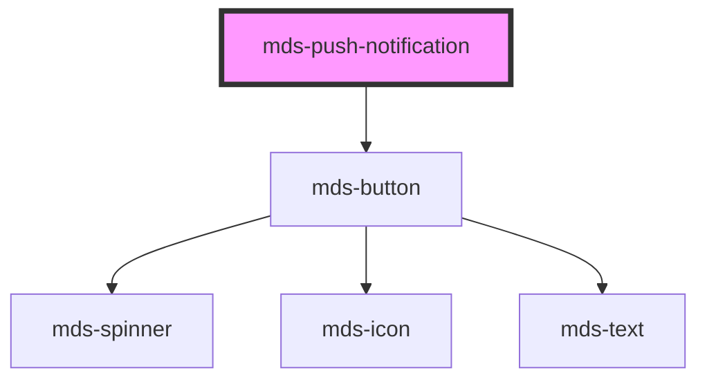

# mds-push-notification


<!-- Auto Generated Below -->


## Usage

### 1. Description

The `<mds-push-notification>` web component is the Magma Design System container that hosts and orchestrates a stack of transient notification items, managing their show/hide lifecycle, entry/exit animations, and overall visibility. It is a compound parent: its default slot holds `mds-push-notification-item` children, and it has no direct HTML primitive equivalent.

#### Semantic Behavior

- **Slot-driven lifecycle**: Items placed in the default slot are animated in automatically; each item animates out and is removed when closed.
- **Auto vs. manual behavior**: With `behavior="auto"` the container shows itself as soon as one or more items are added; with `behavior="manual"` visibility is driven only by the `visible` prop or the imperative methods.
- **Empty-stack auto-hide**: When the last remaining item animates out, the container hides itself regardless of behavior.
- **Emitted events**: `mdsPushNotificationShow` fires when it becomes visible, `mdsPushNotificationHide` when hidden, and `mdsPushNotificationChange` on every transition carrying a `{ visible: boolean }` detail.
- **Imperative API**: Exposes `show()` and `hide()` methods to control visibility programmatically, plus `removeNotification()` to dismiss one or an array of `mds-push-notification-item` elements with the standard outro animation.
- **Animation timing**: Intro/outro durations and inter-item gap are read from CSS custom properties (`--mds-push-notification-items-intro-delay`, `--mds-push-notification-items-outro-delay`, `--mds-push-notification-items-gap`), so motion is themeable without code changes.

#### Properties & Visual Configurations

The container intentionally exposes a minimal prop surface; most configuration is structural (which items you slot in) or stylistic (via CSS custom properties).

#### Other behavioral props

- **`behavior`** selects the visibility strategy: pick `'auto'` (default) when the stack should appear and disappear purely as a function of how many items it contains, and `'manual'` when you want explicit control over when the container is shown via `visible` or the `show()`/`hide()` methods.
- **`visible`** is the controlled visibility flag; set it to drive the container open or closed, while reading it reflects the current animated state.


### 2. Pattern

Correct and idiomatic ways to use the `<mds-push-notification>` component, ordered from most common to most specialized. Patterns assume a working knowledge of the variant / tone ladders documented in [`docs/COMPONENTS.md`](../../../../../../docs/COMPONENTS.md) and the generic stencil rules in [`projects/stencil/SPEC.md`](../../../../SPEC.md).

#### Minimal Auto-Managed Stack

The default `behavior="auto"` configuration. Drop `mds-push-notification-item` children into the default slot and the container shows itself, animates each item in, and hides itself when all items have been dismissed.

```html
<mds-push-notification>
  <mds-push-notification-item
    subject="Nuovo messaggio"
    message="Il documento e' pronto per la revisione."
  ></mds-push-notification-item>
</mds-push-notification>
```

#### Items with Avatar Preview

Use `preview="avatar"` and `src` to show a user photo. Supply `initials` as a fallback when no image is available.

```html
<mds-push-notification>
  <mds-push-notification-item
    preview="avatar"
    src="/avatars/marco.jpg"
    initials="MC"
    subject="Marco Cicognetti"
    message="Ci sei andato poi alla riunione?"
  ></mds-push-notification-item>
</mds-push-notification>
```

#### Items with Icon Preview

Use `icon` (an iconsauce slug) instead of `src` when the notification represents an event or system action rather than a person.

```html
<mds-push-notification>
  <mds-push-notification-item
    icon="mi/baseline/attachment"
    subject="Documento allegato"
    message="E' stato caricato un nuovo allegato nella pratica 2024-1042."
  ></mds-push-notification-item>
</mds-push-notification>
```

#### Item with Date and Timestamp

Pass an ISO 8601 datetime string to display a relative time-ago label (default) or a static formatted date.

```html
<mds-push-notification>
  <mds-push-notification-item
    subject="Approvazione completata"
    message="La richiesta e' stata approvata."
    datetime="2024-11-12T09:30:00Z"
  ></mds-push-notification-item>

  <!-- Static date format -->
  <mds-push-notification-item
    subject="Scadenza contratto"
    message="Il contratto scade il giorno indicato."
    datetime="2024-12-31T00:00:00Z"
    date-format="DD/MM/YYYY"
  ></mds-push-notification-item>
</mds-push-notification>
```

#### Item with Action Button

Slot an `mds-button` into the `action` slot of the item to provide an inline CTA.

```html
<mds-push-notification>
  <mds-push-notification-item
    preview="avatar"
    src="/avatars/sara.jpg"
    subject="Sara Ho"
    message="Hai ricevuto una nuova richiesta di collaborazione."
  >
    <mds-button slot="action" variant="primary" tone="weak" size="sm">
      Rispondi
    </mds-button>
  </mds-push-notification-item>
</mds-push-notification>
```

#### Manual Behavior with Programmatic Control

Set `behavior="manual"` when visibility should be controlled by your application logic rather than inferred from slot contents. Toggle the `visible` attribute or call `show()` / `hide()` on the element.

```html
<mds-push-notification behavior="manual" id="notif-panel">
  <mds-push-notification-item
    subject="Aggiornamento sistema"
    message="Un aggiornamento e' disponibile. Riavviare per applicarlo."
  ></mds-push-notification-item>
</mds-push-notification>

<script>
  const panel = document.querySelector('#notif-panel');

  // Show programmatically
  panel.show();

  // Hide programmatically
  panel.hide();
</script>
```

#### Programmatic Dismissal of a Single Item

Call `removeNotification()` with an `mds-push-notification-item` element reference to animate it out and remove it without the user interacting with the close button.

```html
<mds-push-notification id="notif-panel">
  <mds-push-notification-item id="item-1"
    subject="Avviso temporaneo"
    message="Questa notifica viene rimossa dopo 5 secondi."
  ></mds-push-notification-item>
</mds-push-notification>

<script>
  const panel = document.querySelector('#notif-panel');
  const item = document.querySelector('#item-1');

  setTimeout(() => {
    panel.removeNotification(item);
  }, 5000);
</script>
```

#### Reacting to Visibility Events

Listen to `mdsPushNotificationShow`, `mdsPushNotificationHide`, or `mdsPushNotificationChange` to synchronize UI state when the panel opens or closes.

```javascript
const panel = document.querySelector('mds-push-notification');

panel.addEventListener('mdsPushNotificationShow', () => {
  console.info('Pannello notifiche aperto');
});

panel.addEventListener('mdsPushNotificationHide', () => {
  console.info('Pannello notifiche chiuso');
});

panel.addEventListener('mdsPushNotificationChange', (e) => {
  console.info('Visibilita' cambiata:', e.detail.visible);
});
```

#### Item Tone and Variant

Use `variant` and `tone` on the item to reflect the semantic nature of the notification (status or theme family). `tone` accepts `strong` or `weak` on this component.

```html
<mds-push-notification>
  <mds-push-notification-item
    variant="success"
    tone="weak"
    subject="Operazione completata"
    message="Il file e' stato salvato con successo."
  ></mds-push-notification-item>

  <mds-push-notification-item
    variant="error"
    tone="strong"
    subject="Errore critico"
    message="Impossibile completare l'operazione. Riprovare."
  ></mds-push-notification-item>
</mds-push-notification>
```

#### Styling Customization via CSS Custom Properties

Override animation timing, inter-item gap, and the panel background through the documented `--mds-push-notification-*` properties. Set them on the host or a parent selector.

```css
mds-push-notification {
  --mds-push-notification-items-intro-delay: 200ms;
  --mds-push-notification-items-outro-delay: 100ms;
  --mds-push-notification-items-duration: 250ms;
  --mds-push-notification-items-gap: var(--spacing-300);
  --mds-push-notification-fadeout-delay: 0.5s;
  --mds-push-notification-background: linear-gradient(
    to right,
    rgb(255 255 255 / 0) 0%,
    rgb(255 255 255 / 0.95) 100%
  );
}
```


### 3. Antipattern

Common incorrect uses of `<mds-push-notification>`. Each entry pairs the wrong form with the right one and a one-line reason. System-wide rules (boolean-as-string, shadow piercing, Tailwind color utilities, raw native event listening) live in [`docs/COMPONENTS.md`](../../../../../../docs/COMPONENTS.md#system-level-anti-patterns) - they apply here too but are not repeated.

#### Do Not Put Arbitrary HTML in the Default Slot

The default slot is designed for `mds-push-notification-item` children only. Placing raw HTML or other components breaks the animation lifecycle, event wiring, and the intro/outro sequencing the container manages.

```html
<!-- 🚫 INCORRECT -->
<mds-push-notification>
  <div class="my-notification">
    <strong>Avviso</strong>
    <p>Il documento e' pronto.</p>
  </div>
</mds-push-notification>

<!-- ✅ CORRECT -->
<mds-push-notification>
  <mds-push-notification-item
    subject="Avviso"
    message="Il documento e' pronto."
  ></mds-push-notification-item>
</mds-push-notification>
```

#### Do Not Set `visible="false"` to Hide the Panel

`visible` is a boolean prop. Setting it to the string `"false"` is truthy in HTML/Stencil and keeps the panel visible. Remove the attribute entirely - or call `hide()` - to close the panel.

```html
<!-- 🚫 INCORRECT -->
<mds-push-notification visible="false"></mds-push-notification>

<!-- ✅ CORRECT: remove the attribute -->
<mds-push-notification></mds-push-notification>
```

```javascript
// ✅ CORRECT: via imperative method
document.querySelector('mds-push-notification').hide();
```

#### Do Not Listen to the Native `close` Event Instead of `mdsPushNotificationHide`

The component emits `mdsPushNotificationHide` when the panel hides. Listening for a native `close` event will never fire because the component does not dispatch it, and native DOM events from inside the shadow root do not reliably bubble to the light DOM.

```javascript
// 🚫 INCORRECT
panel.addEventListener('close', () => updateUI());

// ✅ CORRECT
panel.addEventListener('mdsPushNotificationHide', () => updateUI());
```

#### Do Not Use `behavior="manual"` and Then Forget to Call `show()` / `hide()`

With `behavior="manual"` the container never auto-shows when items are added; you must explicitly call `show()` or set `visible`. Leaving it on `manual` without wiring visibility logic means notifications are silently queued but never displayed.

```html
<!-- 🚫 INCORRECT: items never appear because manual mode needs explicit show() -->
<mds-push-notification behavior="manual" id="notif-panel">
  <mds-push-notification-item
    subject="Nuovo messaggio"
    message="Messaggio ricevuto."
  ></mds-push-notification-item>
</mds-push-notification>

<!-- ✅ CORRECT: call show() after adding items -->
<mds-push-notification behavior="manual" id="notif-panel">
  <mds-push-notification-item
    subject="Nuovo messaggio"
    message="Messaggio ricevuto."
  ></mds-push-notification-item>
</mds-push-notification>

<script>
  document.querySelector('#notif-panel').show();
</script>
```

#### Do Not Pierce Shadow DOM to Style Item Internals

The only supported customization surface for the container is the `--mds-push-notification-*` CSS custom properties plus the documented `::part(notifications)` part. Use per-item CSS custom properties (prefixed `--mds-push-notification-item-*`) for item-level styling. Do not reach into shadow parts that are not documented.

```css
/* 🚫 INCORRECT */
mds-push-notification >>> .notifications {
  background: white;
}
mds-push-notification::part(content) {
  padding: 2rem;
}

/* ✅ CORRECT */
mds-push-notification {
  --mds-push-notification-background: rgb(255 255 255 / 0.9);
  --mds-push-notification-items-gap: var(--spacing-300);
}
mds-push-notification::part(notifications) {
  /* documented part - safe to target */
  padding-block: var(--spacing-200);
}
```

#### Do Not Slot Actions in the Wrong Slot

Action buttons belong in the `action` slot of `mds-push-notification-item`, not in the default slot of `mds-push-notification`. Placing a button in the parent's default slot treats it like a notification item, breaks the animation sequence, and the button will be styled and animated as if it were a notification.

```html
<!-- 🚫 INCORRECT: button lands in the parent's default slot -->
<mds-push-notification>
  <mds-button variant="dark">Cancella tutto</mds-button>
  <mds-push-notification-item subject="Avviso" message="Nuovo messaggio."></mds-push-notification-item>
</mds-push-notification>

<!-- ✅ CORRECT: action belongs on the item's action slot -->
<mds-push-notification>
  <mds-push-notification-item subject="Avviso" message="Nuovo messaggio.">
    <mds-button slot="action" variant="primary" tone="weak" size="sm">Apri</mds-button>
  </mds-push-notification-item>
</mds-push-notification>
```

#### Do Not Apply an Unsupported `tone` Value to Item

`mds-push-notification-item` accepts `tone="strong"` or `tone="weak"` only (`ToneMinimalVariantType`). Using `tone="outline"` or `tone="text"` silently falls back to the default and the intended visual emphasis is lost.

```html
<!-- 🚫 INCORRECT: outline and text are not supported tones for this component -->
<mds-push-notification-item
  variant="error"
  tone="outline"
  subject="Errore"
  message="Operazione fallita."
></mds-push-notification-item>

<!-- ✅ CORRECT -->
<mds-push-notification-item
  variant="error"
  tone="strong"
  subject="Errore"
  message="Operazione fallita."
></mds-push-notification-item>
```


## Properties

| Property   | Attribute  | Description                                                                                                                                                                                                                                                                                                                           | Type                              | Default     |
| ---------- | ---------- | ------------------------------------------------------------------------------------------------------------------------------------------------------------------------------------------------------------------------------------------------------------------------------------------------------------------------------------- | --------------------------------- | ----------- |
| `behavior` | `behavior` | Specifies if the component is visible or not. behavior = manual should hide when click outside should hide when all notifications are removed should show when change visible from component or call show method  behavior = auto should hide when all notifications are removed should show when one or more notifications are added | `"auto" \| "manual" \| undefined` | `'auto'`    |
| `visible`  | `visible`  | Specifies if the component is visible or not.                                                                                                                                                                                                                                                                                         | `boolean \| undefined`            | `undefined` |


## Events

| Event                       | Description                                 | Type                                          |
| --------------------------- | ------------------------------------------- | --------------------------------------------- |
| `mdsPushNotificationChange` | Emits when the component visibility changes | `CustomEvent<MdsPushNotificationEventDetail>` |
| `mdsPushNotificationHide`   | Emits when the component is hidden          | `CustomEvent<void>`                           |
| `mdsPushNotificationShow`   | Emits when the component is shown           | `CustomEvent<void>`                           |


## Methods

### `hide() => Promise<void>`


#### Returns

Type: `Promise<void>`


### `removeNotification(notification: HTMLMdsPushNotificationItemElement | HTMLMdsPushNotificationItemElement[]) => Promise<void>`


#### Parameters

| Name           | Type                                                                         | Description |
| -------------- | ---------------------------------------------------------------------------- | ----------- |
| `notification` | `HTMLMdsPushNotificationItemElement \| HTMLMdsPushNotificationItemElement[]` |             |

#### Returns

Type: `Promise<void>`


### `show() => Promise<void>`


#### Returns

Type: `Promise<void>`


## Slots

| Slot        | Description                                                                                        |
| ----------- | -------------------------------------------------------------------------------------------------- |
| `"bottom"`  | Add `HTML elements` or `components`, it is **recommended** to use `mds-button` element.            |
| `"default"` | Add `HTML elements` or `components`, it is **recommended** to use `mds-push-notification` element. |
| `"top"`     | Add `HTML elements` or `components`, it is **recommended** to use `mds-button` element.            |


## Shadow Parts

| Part              | Description                                 |
| ----------------- | ------------------------------------------- |
| `"notifications"` | The container wrapper of the notifications. |


## CSS Custom Properties

| Name                                            | Description                                                       |
| ----------------------------------------------- | ----------------------------------------------------------------- |
| `--mds-push-notification-background`            | Background of the push notification, supports gradients.          |
| `--mds-push-notification-fadeout-delay`         | Delay before the push notification starts fading out.             |
| `--mds-push-notification-gap`                   | Gap between multiple push notifications.                          |
| `--mds-push-notification-items-duration`        | Duration of the item animation inside the notification.           |
| `--mds-push-notification-items-gap`             | Gap between items inside the notification.                        |
| `--mds-push-notification-items-intro-delay`     | Delay before items inside the notification animate in.            |
| `--mds-push-notification-items-outro-delay`     | Delay before items inside the notification animate out.           |
| `--mds-push-notification-items-timing-function` | Timing function used for item animations inside the notification. |


## Dependencies

### Depends on

- [mds-button](../mds-button)

### Graph


----------------------------------------------

Built with love @ [Gruppo Maggioli](https://www.maggioli.com) from [R&D Department](https://www.maggioli.com/it-it/chi-siamo/ricerca-sviluppo)
