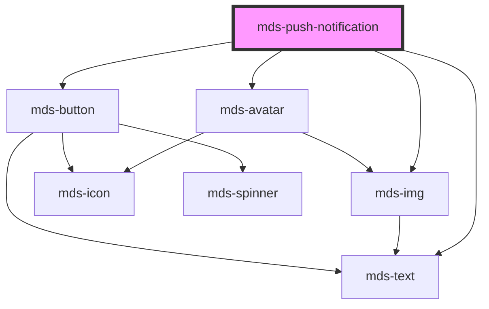

# mds-push-notification

<!-- Auto Generated Below -->

## Properties

| Property   | Attribute  | Description                                                                                                                                          | Type                                                                                                                                                                                    | Default                          |
| ---------- | ---------- | ---------------------------------------------------------------------------------------------------------------------------------------------------- | --------------------------------------------------------------------------------------------------------------------------------------------------------------------------------------- | -------------------------------- |
| `icon`     | `icon`     | Specifies the icon to be displayed                                                                                                                   | `string \| undefined`                                                                                                                                                                   | `undefined`                      |
| `initials` | `initials` | The user's inizials displayed if there's no image available, initials will override tone and variant senttings to keep user recognizable from others | `string \| undefined`                                                                                                                                                                   | `undefined`                      |
| `message`  | `message`  | Specifies the message of the component                                                                                                               | `string`                                                                                                                                                                                | `'Nessun messaggio disponibile'` |
| `preview`  | `preview`  | Specifies if the `src` attribute is used to show a the image as avatar or full image                                                                 | `"avatar" \| "image" \| undefined`                                                                                                                                                      | `'image'`                        |
| `src`      | `src`      | Specifies the path to the image                                                                                                                      | `string \| undefined`                                                                                                                                                                   | `undefined`                      |
| `subject`  | `subject`  | Specifies the subject of the component                                                                                                               | `string \| undefined`                                                                                                                                                                   | `undefined`                      |
| `tone`     | `tone`     | Specifies the color tone of the component                                                                                                            | `"strong" \| "weak" \| undefined`                                                                                                                                                       | `'weak'`                         |
| `variant`  | `variant`  | Specifies the color variant of the component                                                                                                         | `"amaranth" \| "aqua" \| "blue" \| "error" \| "green" \| "info" \| "lime" \| "orange" \| "orchid" \| "primary" \| "sky" \| "success" \| "violet" \| "warning" \| "yellow" \| undefined` | `undefined`                      |

## Events

| Event                      | Description                        | Type                                          |
| -------------------------- | ---------------------------------- | --------------------------------------------- |
| `mdsPushNotificationClose` | Emits when the component is closed | `CustomEvent<MdsPushNotificationEventDetail>` |

## Slots

| Slot        | Description                                                                             |
| ----------- | --------------------------------------------------------------------------------------- |
| `"actions"` | Add `HTML elements` or `components`, it is **recommended** to use `mds-button` element. |

## Shadow Parts

| Part        | Description                                |
| ----------- | ------------------------------------------ |
| `"actions"` | The actions wrapper                        |
| `"avatar"`  |                                            |
| `"content"` | The content wrapper of the message         |
| `"icon"`    | The icon set by `icon` attribute           |
| `"picture"` | The picture image added by `src` attribute |

## Dependencies

### Depends on

- [mds-avatar](../mds-avatar)
- [mds-img](../mds-img)
- [mds-text](../mds-text)
- [mds-button](../mds-button)

### Graph

----------------------------------------------

Built with love @ [Gruppo Maggioli](https://www.maggioli.com) from [R&D Department](https://www.maggioli.com/it-it/chi-siamo/ricerca-sviluppo)
