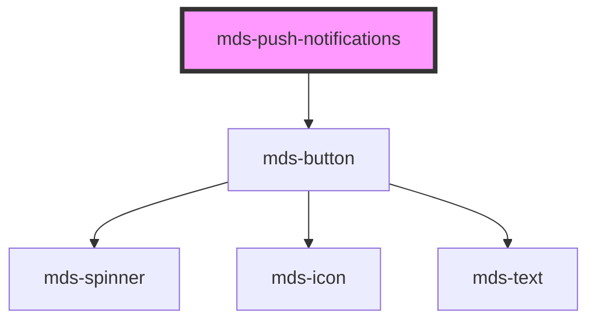

# mds-push-notifications

<!-- Auto Generated Below -->

## Properties

| Property     | Attribute    | Description                                                                                                                                                                                                  | Type                              | Default     |
| ------------ | ------------ | ------------------------------------------------------------------------------------------------------------------------------------------------------------------------------------------------------------ | --------------------------------- | ----------- |
| `visibility` | `visibility` | Specifies if the component is visible or not. visibility = auto \| manual should hide when click outside should hide when all notifications are removed should show when one or more notifications are added | `"auto" \| "manual" \| undefined` | `'auto'`    |
| `visible`    | `visible`    | Specifies if the component is visible or not.                                                                                                                                                                | `boolean \| undefined`            | `undefined` |

## Events

| Event                        | Description                                 | Type                                           |
| ---------------------------- | ------------------------------------------- | ---------------------------------------------- |
| `mdsPushNotificationsChange` | Emits when the component visibility changes | `CustomEvent<MdsPushNotificationsEventDetail>` |
| `mdsPushNotificationsHide`   | Emits when the component is hidden          | `CustomEvent<void>`                            |
| `mdsPushNotificationsShow`   | Emits when the component is shown           | `CustomEvent<void>`                            |

## Methods

### `hide() => Promise<void>`

#### Returns

Type: `Promise<void>`

### `removeNotification(notification: HTMLMdsPushNotificationElement | HTMLMdsPushNotificationElement[]) => Promise<void>`

#### Parameters

| Name           | Type                                                                 | Description |
| -------------- | -------------------------------------------------------------------- | ----------- |
| `notification` | `HTMLMdsPushNotificationElement \| HTMLMdsPushNotificationElement[]` |             |

#### Returns

Type: `Promise<void>`

### `show() => Promise<void>`

#### Returns

Type: `Promise<void>`

## Slots

| Slot        | Description                                                                                        |
| ----------- | -------------------------------------------------------------------------------------------------- |
| `"bottom"`  | Add `HTML elements` or `components`, it is **recommended** to use `mds-button` element.            |
| `"default"` | Add `HTML elements` or `components`, it is **recommended** to use `mds-push-notification` element. |
| `"top"`     | Add `HTML elements` or `components`, it is **recommended** to use `mds-button` element.            |

## Shadow Parts

| Part              | Description                                 |
| ----------------- | ------------------------------------------- |
| `"notifications"` | The container wrapper of the notifications. |

## Dependencies

### Depends on

- [mds-button](../mds-button)

### Graph

----------------------------------------------

Built with love @ [Gruppo Maggioli](https://www.maggioli.com) from [R&D Department](https://www.maggioli.com/it-it/chi-siamo/ricerca-sviluppo)
