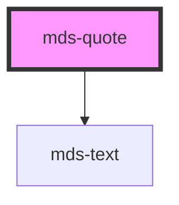

# mds-quote

<!-- Auto Generated Below -->

## Properties

| Property     | Attribute    | Description                                  | Type                                                       | Default |
| ------------ | ------------ | -------------------------------------------- | ---------------------------------------------------------- | ------- |
| `typography` | `typography` | Specifies the font typography of the element | `"action" \| "h1" \| "h2" \| "h3" \| "h4" \| "h5" \| "h6"` | `'h3'`  |

## Slots

| Slot        | Description                                                      |
| ----------- | ---------------------------------------------------------------- |
| `"author"`  | Add `text string`, `HTML elements` or `components` to this slot. |
| `"default"` | Add `text string`, `HTML elements` or `components` to this slot. |

## Dependencies

### Depends on

- [mds-text](../mds-text)

### Graph

----------------------------------------------

Built with love @ [Gruppo Maggioli](https://www.maggioli.com) from [R&D Department](https://www.maggioli.com/it-it/chi-siamo/ricerca-sviluppo)
