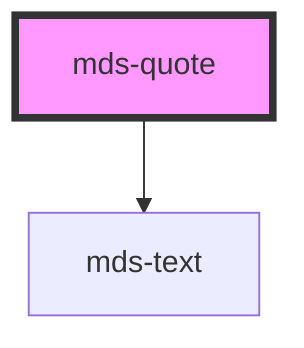

# mds-quote


This is a web-component from Maggioli Design System [Magma](https://magma.maggiolicloud.it), built with StencilJS, TypeScript, Storybook. It's based on the web-component standard and it's designed to be agnostic from the JavaScript framework you are using.

<!-- Auto Generated Below -->


## Usage

### 1. Description

The `<mds-quote>` web component is the Magma Design System primitive for rendering a stylized blockquote: it wraps quoted text in decorative typographic quotation marks (`❝ … ❞`) and exposes an optional attribution slot, replacing a hand-styled `<blockquote>` + citation markup.

#### Semantic Behavior

- **Default slot is the quote body**: the unnamed slot holds the quoted text (string, HTML, or components) and is wrapped between the opening `❝` and closing `❞` glyphs.
- **`author` named slot**: holds the attribution (text, HTML, or components) and renders directly beneath the quote body.
- **Selection semantics**: selecting the quote body selects the whole quotation, while the decorative quote-mark glyphs stay out of any copied text.
- **Heading semantics vs. visual size are decoupled**: the rendered tag and the applied typography are driven by two independent props, so the component can carry the correct document outline level without forcing a matching visual scale.

#### Properties & Visual Configurations

- **`tag`** sets the actual HTML heading element emitted for the quote body (`h1`–`h6`); pick the value that reflects the quote's real position in the document outline, independent of how large it should look.
- **`typography`** sets the visual type scale applied to both the quote body and the decorative marks; choose it for visual weight, since it can differ from `tag`. Beyond the heading scales it also accepts `'action'` for cases where the quote should adopt the action type style rather than a heading scale.

#### Notes

`<mds-quote>` is a purely presentational component: it has no `variant` / `tone` ladder, no state props, no events, and no form association. The shared system rules live in [`projects/stencil/SPEC.md`](../../../../SPEC.md) and the usage contract in [`docs/COMPONENTS.md`](../../../../../../docs/COMPONENTS.md).


### 2. Pattern

Correct and idiomatic ways to use the `<mds-quote>` component, ordered from most common to most specialized. Patterns assume a working knowledge of the variant / tone ladders documented in [`docs/COMPONENTS.md`](../../../../../../docs/COMPONENTS.md) and the generic stencil rules in [`projects/stencil/SPEC.md`](../../../../SPEC.md).

#### Basic Quote with Attribution

The minimal form: slot the quoted text into the default slot and slot the attribution into the `author` slot. Both slots accept plain text, HTML, or components.

```html
<mds-quote tag="h3" typography="h3">
  Chi smette di migliorare, smette di essere buono.
  <mds-author slot="author">
    <mds-text typography="h6">Philip Rosenthal</mds-text>
    <mds-text typography="caption">Imprenditore</mds-text>
  </mds-author>
</mds-quote>
```

#### Quote Without Attribution

Omit the `author` slot entirely when no attribution is needed. The decorative quotation marks still render correctly.

```html
<mds-quote tag="h4" typography="h4">
  La semplicita' e' la massima sofisticazione.
</mds-quote>
```

#### Decoupling Semantic Tag from Visual Scale

Set `tag` to the heading level that correctly represents the quote in the document outline, and `typography` independently for the visual weight that suits the design. A large pull-quote may be visually `h2` but logically only an `h4` in the hierarchy.

```html
<!-- visually prominent (h2 scale) but semantically an h4 in the outline -->
<mds-quote tag="h4" typography="h2">
  Il futuro appartiene a chi crede nella bellezza dei propri sogni.
  <mds-author slot="author">
    <mds-text typography="h6">Eleanor Roosevelt</mds-text>
  </mds-author>
</mds-quote>
```

#### Using the `action` Typography Scale

Set `typography="action"` when the quote should adopt the action type style rather than any heading scale - for instance inside a callout card or a narrow testimonial widget.

```html
<mds-quote tag="h5" typography="action">
  Ogni grande impresa inizia con un piccolo passo coraggioso.
  <mds-author slot="author">
    <mds-text typography="caption">Autore sconosciuto</mds-text>
  </mds-author>
</mds-quote>
```

#### Full Author Attribution with Avatar

The `author` slot accepts rich compound components. Use [`mds-author`](../../mds-author) with a nested [`mds-avatar`](../../mds-avatar) for a complete testimonial block.

```html
<mds-quote tag="h5" typography="h5">
  Un programmatore e' una macchina che trasforma il caffe' in codice.
  <mds-author slot="author">
    <mds-avatar
      slot="avatar"
      initials="PW"
      src="./paul-washam.webp"
    ></mds-avatar>
    <mds-text typography="h6">Paul Washam</mds-text>
    <mds-text typography="caption">Software engineer</mds-text>
  </mds-author>
</mds-quote>
```

#### Composing Inside a Card

Place `<mds-quote>` inside [`mds-card-content`](../../mds-card-content) to embed a testimonial in a card layout. Use a smaller typography scale to fit the card's visual hierarchy.

```html
<mds-card>
  <mds-card-content slot="content">
    <mds-quote tag="h6" typography="h6">
      La qualita' non e' mai un caso; e' sempre il risultato di uno sforzo intelligente.
      <mds-author slot="author">
        <mds-text typography="h6">John Ruskin</mds-text>
        <mds-text typography="caption">Critico d'arte</mds-text>
      </mds-author>
    </mds-quote>
  </mds-card-content>
</mds-card>
```

#### Color Customization via Host Styles

`<mds-quote>` inherits `color` from its host context. Override the text color by setting the Magma token on the host element. Always use `rgb(var(--<token>))` so dark mode and high-contrast modes keep working.

```css
.featured-testimonial mds-quote {
  color: rgb(var(--tone-neutral-02));
}
```


### 3. Antipattern

Common incorrect uses of `<mds-quote>`. Each entry pairs the wrong form with the right one and a one-line reason. System-wide rules (boolean-as-string, shadow piercing, Tailwind color utilities, raw native event listening) live in [`docs/COMPONENTS.md`](../../../../../../docs/COMPONENTS.md#system-level-anti-patterns) - they apply here too but are not repeated.

#### Do Not Replace `<mds-quote>` with a Raw `<blockquote>`

Hand-rolling a blockquote loses the decorative quotation marks, the decoupled typography system, and the high-contrast preference support the component provides.

```html
<!-- 🚫 INCORRECT -->
<blockquote>
  <p>La semplicita' e' la massima sofisticazione.</p>
  <cite>Leonardo da Vinci</cite>
</blockquote>

<!-- ✅ CORRECT -->
<mds-quote tag="h4" typography="h4">
  La semplicita' e' la massima sofisticazione.
  <mds-author slot="author">
    <mds-text typography="h6">Leonardo da Vinci</mds-text>
  </mds-author>
</mds-quote>
```

#### Do Not Put Attribution in the Default Slot

The default slot is the quote body; attribution placed there renders as quoted text and is wrapped between the opening and closing quotation glyphs. Use the `author` named slot for attribution.

```html
<!-- 🚫 INCORRECT -->
<mds-quote tag="h4" typography="h4">
  L'innovazione distingue il leader dal seguace.
  Steve Jobs, Apple
</mds-quote>

<!-- ✅ CORRECT -->
<mds-quote tag="h4" typography="h4">
  L'innovazione distingue il leader dal seguace.
  <mds-author slot="author">
    <mds-text typography="h6">Steve Jobs</mds-text>
    <mds-text typography="caption">Apple</mds-text>
  </mds-author>
</mds-quote>
```

#### Do Not Omit `tag` and Rely on the Default Heading Level

The default `tag` is `h3`, which may be semantically wrong for the document outline. Always set `tag` explicitly to the level that matches the quote's real position in the heading hierarchy.

```html
<!-- 🚫 INCORRECT - relies on h3 default regardless of page structure -->
<mds-quote typography="h5">
  Ogni problema e' un'opportunita' travestita da difficolta'.
</mds-quote>

<!-- ✅ CORRECT - tag reflects the actual outline position -->
<mds-quote tag="h5" typography="h5">
  Ogni problema e' un'opportunita' travestita da difficolta'.
</mds-quote>
```

#### Do Not Conflate `tag` and `typography`

`tag` controls the semantic heading element; `typography` controls the visual scale. Setting only one and assuming the other adjusts automatically is wrong - they are independent props and must both be set intentionally.

```html
<!-- 🚫 INCORRECT - sets tag but leaves typography at its h3 default,
     producing an h5 semantic element that looks like an h3 -->
<mds-quote tag="h5">
  Il coraggio non e' assenza di paura, ma la decisione che qualcosa e' piu' importante della paura.
</mds-quote>

<!-- ✅ CORRECT - both props set to the intended values -->
<mds-quote tag="h5" typography="h5">
  Il coraggio non e' assenza di paura, ma la decisione che qualcosa e' piu' importante della paura.
</mds-quote>
```

#### Do Not Use an Invalid `typography` Value

`typography` accepts only `action`, `h1`, `h2`, `h3`, `h4`, `h5`, `h6`. Passing any other value (e.g. a body or caption scale) silently falls back to the default and produces unexpected output.

```html
<!-- 🚫 INCORRECT - "body" is not a valid TypographyTitleType value -->
<mds-quote tag="h5" typography="body">
  Il talento vince le partite, ma il lavoro di squadra vince i campionati.
</mds-quote>

<!-- ✅ CORRECT - use a valid title typography scale -->
<mds-quote tag="h5" typography="h5">
  Il talento vince le partite, ma il lavoro di squadra vince i campionati.
</mds-quote>
```

#### Do Not Wrap `<mds-quote>` in a Native `<figure>` or `<cite>` to Add Attribution

Adding a `<figure>` / `<figcaption>` or `<cite>` wrapper around or inside the component to bolt on attribution is redundant and breaks the component's internal layout. The `author` slot is the right extension point.

```html
<!-- 🚫 INCORRECT -->
<figure>
  <mds-quote tag="h4" typography="h4">
    La creativita' e' l'intelligenza che si diverte.
  </mds-quote>
  <figcaption>Albert Einstein</figcaption>
</figure>

<!-- ✅ CORRECT -->
<mds-quote tag="h4" typography="h4">
  La creativita' e' l'intelligenza che si diverte.
  <mds-author slot="author">
    <mds-text typography="h6">Albert Einstein</mds-text>
  </mds-author>
</mds-quote>
```


## Properties

| Property     | Attribute    | Description                                  | Type                                                       | Default |
| ------------ | ------------ | -------------------------------------------- | ---------------------------------------------------------- | ------- |
| `tag`        | `tag`        | Specifies the tag the element                | `"h1" \| "h2" \| "h3" \| "h4" \| "h5" \| "h6"`             | `'h3'`  |
| `typography` | `typography` | Specifies the font typography of the element | `"action" \| "h1" \| "h2" \| "h3" \| "h4" \| "h5" \| "h6"` | `'h3'`  |


## Slots

| Slot       | Description                                                      |
| ---------- | ---------------------------------------------------------------- |
|            | Add `text string`, `HTML elements` or `components` to this slot. |
| `"author"` | Add `text string`, `HTML elements` or `components` to this slot. |


## Dependencies

### Depends on

- [mds-text](../mds-text)

### Graph


----------------------------------------------

Built with love @ [Gruppo Maggioli](https://www.maggioli.com) from [R&D Department](https://www.maggioli.com/it-it/chi-siamo/ricerca-sviluppo)
