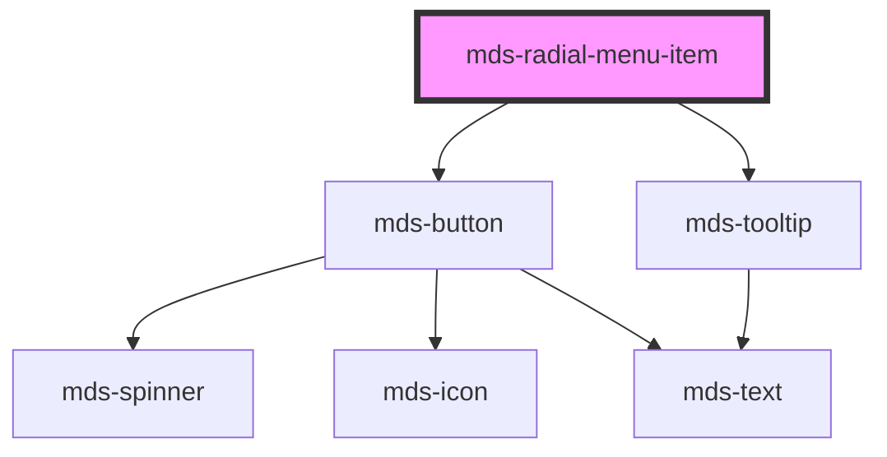

# mds-radial-menu-item


<!-- Auto Generated Below -->


## Usage

### 1. Description

The `<mds-radial-menu-item>` web component is a single actionable spoke of the [`<mds-radial-menu>`](../../mds-radial-menu) compound. It wraps an `<mds-button>` (rendered as a circular icon button) plus an optional `<mds-tooltip>`, and is positioned along the menu arc by its parent.

#### Semantic Behavior

- **Compound child only**: Must be a direct slot child of `<mds-radial-menu>`; it is not used standalone, and the radial menu's `item` slot should contain only `<mds-radial-menu-item>` elements.
- **Parent-driven sizing and ordering**: The parent overrides each item's `size` to match the menu and assigns its angular position, so an item's `size` prop is effectively a fallback the menu normalizes.
- **Open/close animation**: Items are hidden until the parent menu is opened, then translate outward along the arc - the item itself carries no `opened` state.
- **Conditional tooltip**: An `<mds-tooltip>` is rendered only when `tooltip` is set.
- **Accessibility**: The `tooltip` string is also used as the inner button's accessible name, so it doubles as the label of the icon-only action.
- **No own events**: Activation is the inner `<mds-button>`'s native click, which the consumer wires up directly on the element.

#### Properties & Visual Configurations

The shared `variant` / `tone` / `size` ladders are defined in [`projects/stencil/SPEC.md`](../../../../SPEC.md#tone-and-variant-system); they are forwarded to the inner `<mds-button>`. Defaults are deliberately distinct from a standalone button: `variant` defaults to `dark` and `tone` to `weak` so items read as secondary spokes against the parent's trigger button (which defaults to the `strong` tone). Set `icon` to the glyph that represents the action - it is the primary content of each item since the label lives only in the `tooltip`. Use `tooltip` both to describe the action on hover and to supply the accessible name; omit it only when the icon is unambiguous and labelled elsewhere. Prefer leaving `size` unset and letting the parent menu drive it for visual consistency across all spokes.


### 2. Pattern

Correct and idiomatic ways to use the `<mds-radial-menu-item>` component, ordered from most common to most specialized. Patterns assume a working knowledge of the variant / tone ladders documented in [`docs/COMPONENTS.md`](../../../../../../docs/COMPONENTS.md) and the generic stencil rules in [`projects/stencil/SPEC.md`](../../../../SPEC.md).

#### Basic Item with Icon and Tooltip

The canonical form. Always place `<mds-radial-menu-item>` as a direct child of [`<mds-radial-menu>`](../../mds-radial-menu). Set `icon` to a slug from the Magma icon library and `tooltip` to the label of the action - it doubles as the inner button's accessible name.

```html
<mds-radial-menu>
  <mds-radial-menu-item icon="mi/baseline/edit" tooltip="Modifica"></mds-radial-menu-item>
</mds-radial-menu>
```

#### Multiple Items Around the Arc

Add one `<mds-radial-menu-item>` per spoke. The parent assigns each item its angular position automatically; order in the DOM controls the arc sequence.

```html
<mds-radial-menu opened>
  <mds-radial-menu-item icon="mi/baseline/edit"   tooltip="Modifica"></mds-radial-menu-item>
  <mds-radial-menu-item icon="mi/baseline/delete" tooltip="Elimina"></mds-radial-menu-item>
  <mds-radial-menu-item icon="mi/baseline/share"  tooltip="Condividi"></mds-radial-menu-item>
  <mds-radial-menu-item icon="mi/baseline/download" tooltip="Scarica"></mds-radial-menu-item>
</mds-radial-menu>
```

#### Variant and Tone for Emphasis

Use `variant` to convey the semantic meaning of the action and `tone` to control visual weight. The defaults (`variant="dark"` + `tone="weak"`) keep spokes visually subordinate to the trigger button, which defaults to `tone="strong"`. Override them only when the action demands a different signal.

```html
<mds-radial-menu opened>
  <!-- Default: neutral dark spoke -->
  <mds-radial-menu-item icon="mi/baseline/share" tooltip="Condividi"></mds-radial-menu-item>

  <!-- Destructive action: error variant -->
  <mds-radial-menu-item
    icon="mi/baseline/delete"
    tooltip="Elimina"
    variant="error"
    tone="strong"
  ></mds-radial-menu-item>

  <!-- Primary call to action -->
  <mds-radial-menu-item
    icon="mi/baseline/save"
    tooltip="Salva"
    variant="primary"
    tone="strong"
  ></mds-radial-menu-item>
</mds-radial-menu>
```

#### Listening for Activation

`<mds-radial-menu-item>` emits no own events. Wire the native `click` event directly on the element - it bubbles from the inner `<mds-button>`.

```html
<mds-radial-menu>
  <mds-radial-menu-item id="edit-item" icon="mi/baseline/edit" tooltip="Modifica"></mds-radial-menu-item>
</mds-radial-menu>

<script>
  document.querySelector('#edit-item').addEventListener('click', () => {
    console.log('Modifica attivato');
  });
</script>
```

#### Item Without a Tooltip (Unambiguous Icon)

Omit `tooltip` only when the icon is self-evident in context and the action is labelled elsewhere (for example, via a screen-reader landmark). Without `tooltip`, the inner button has no accessible name - reserve this for cases where the icon is genuinely unambiguous.

```html
<mds-radial-menu opened>
  <mds-radial-menu-item icon="mi/baseline/add"></mds-radial-menu-item>
</mds-radial-menu>
```

#### Customizing Transition Timing

Use the two documented CSS custom properties to control how fast each spoke animates in and out. Set them on the item host or on a parent selector.

```css
/* Slow, elastic entrance for a playful UI */
mds-radial-menu-item {
  --mds-radial-menu-item-transition-duration: 700ms;
  --mds-radial-menu-item-transition-timing-function: var(--ease-out-back);
}
```


### 3. Antipattern

Common incorrect uses of `<mds-radial-menu-item>`. Each entry pairs the wrong form with the right one and a one-line reason. System-wide rules (boolean-as-string, shadow piercing, Tailwind color utilities, raw native event listening) live in [`docs/COMPONENTS.md`](../../../../../../docs/COMPONENTS.md#system-level-anti-patterns) - they apply here too but are not repeated.

#### Do Not Use Outside `<mds-radial-menu>`

`<mds-radial-menu-item>` is a compound child; it relies on its parent to set angular position, size, and open/close animation. Rendering it standalone leaves it permanently hidden and incorrectly positioned.

```html
<!-- 🚫 INCORRECT -->
<mds-radial-menu-item icon="mi/baseline/edit" tooltip="Modifica"></mds-radial-menu-item>

<!-- ✅ CORRECT -->
<mds-radial-menu>
  <mds-radial-menu-item icon="mi/baseline/edit" tooltip="Modifica"></mds-radial-menu-item>
</mds-radial-menu>
```

#### Do Not Wrap Items in a Container Element

The parent queries direct slot children (`[slot="item"]`) to assign positions and sizes. An intermediate wrapper breaks parent-child communication and the item never receives its angular placement.

```html
<!-- 🚫 INCORRECT -->
<mds-radial-menu>
  <div>
    <mds-radial-menu-item icon="mi/baseline/share" tooltip="Condividi"></mds-radial-menu-item>
  </div>
</mds-radial-menu>

<!-- ✅ CORRECT -->
<mds-radial-menu>
  <mds-radial-menu-item icon="mi/baseline/share" tooltip="Condividi"></mds-radial-menu-item>
</mds-radial-menu>
```

#### Do Not Put Text or HTML in a Slot

`<mds-radial-menu-item>` has no default slot - any slotted content is ignored. The visible label lives exclusively in the `tooltip` prop.

```html
<!-- 🚫 INCORRECT -->
<mds-radial-menu>
  <mds-radial-menu-item icon="mi/baseline/edit">Modifica</mds-radial-menu-item>
</mds-radial-menu>

<!-- ✅ CORRECT -->
<mds-radial-menu>
  <mds-radial-menu-item icon="mi/baseline/edit" tooltip="Modifica"></mds-radial-menu-item>
</mds-radial-menu>
```

#### Do Not Omit `tooltip` for an Icon-Only Item Without Another Label

Omitting `tooltip` leaves the inner `<mds-button>` with no accessible name and no hover description. Provide `tooltip` unless the icon's purpose is unambiguous and the action is described by a surrounding landmark or heading.

```html
<!-- 🚫 INCORRECT: no accessible name, no hover hint -->
<mds-radial-menu>
  <mds-radial-menu-item icon="mi/baseline/send"></mds-radial-menu-item>
</mds-radial-menu>

<!-- ✅ CORRECT -->
<mds-radial-menu>
  <mds-radial-menu-item icon="mi/baseline/send" tooltip="Invia messaggio"></mds-radial-menu-item>
</mds-radial-menu>
```

#### Do Not Force `size` When the Parent Controls It

`<mds-radial-menu>` overrides each item's `size` to match its own `size` prop. Setting `size` on the item is redundant and can leave a stale value if the parent's `size` later changes.

```html
<!-- 🚫 INCORRECT: size will be overridden by the parent anyway -->
<mds-radial-menu size="md">
  <mds-radial-menu-item icon="mi/baseline/edit" tooltip="Modifica" size="xl"></mds-radial-menu-item>
</mds-radial-menu>

<!-- ✅ CORRECT: let the parent drive size for all spokes -->
<mds-radial-menu size="md">
  <mds-radial-menu-item icon="mi/baseline/edit" tooltip="Modifica"></mds-radial-menu-item>
</mds-radial-menu>
```

#### Do Not Style via Undocumented Shadow Internals

The only supported customization surface is `--mds-radial-menu-item-transition-duration` and `--mds-radial-menu-item-transition-timing-function`. Targeting shadow-internal classes or undocumented `::part()` names couples code to the implementation and breaks on minor releases.

```css
/* 🚫 INCORRECT */
mds-radial-menu-item >>> .button {
  border-radius: 0;
}

/* ✅ CORRECT: use the documented CSS custom properties */
mds-radial-menu-item {
  --mds-radial-menu-item-transition-duration: 300ms;
}
```


## Properties

| Property  | Attribute | Description                                         | Type                                                                                                                                       | Default     |
| --------- | --------- | --------------------------------------------------- | ------------------------------------------------------------------------------------------------------------------------------------------ | ----------- |
| `icon`    | `icon`    | The icon displayed in the button                    | `string \| undefined`                                                                                                                      | `undefined` |
| `size`    | `size`    | Specifies the size of the menu item.                | `"lg" \| "md" \| "sm" \| "xl"`                                                                                                             | `'lg'`      |
| `tone`    | `tone`    | Specifies the tone variant for the button           | `"outline" \| "strong" \| "text" \| "weak" \| undefined`                                                                                   | `'weak'`    |
| `tooltip` | `tooltip` | The tooltip displayed when hovering over the button | `string \| undefined`                                                                                                                      | `undefined` |
| `variant` | `variant` | Specifies the color variant for the button          | `"ai" \| "apple" \| "dark" \| "error" \| "google" \| "info" \| "light" \| "primary" \| "secondary" \| "success" \| "warning" \| undefined` | `'dark'`    |


## CSS Custom Properties

| Name                                                | Description                                                  |
| --------------------------------------------------- | ------------------------------------------------------------ |
| `--mds-radial-menu-item-transition-duration`        | Duration of individual radial menu item transitions.         |
| `--mds-radial-menu-item-transition-timing-function` | Timing function for individual radial menu item transitions. |


## Dependencies

### Depends on

- [mds-button](../mds-button)
- [mds-tooltip](../mds-tooltip)

### Graph


----------------------------------------------

Built with love @ [Gruppo Maggioli](https://www.maggioli.com) from [R&D Department](https://www.maggioli.com/it-it/chi-siamo/ricerca-sviluppo)
