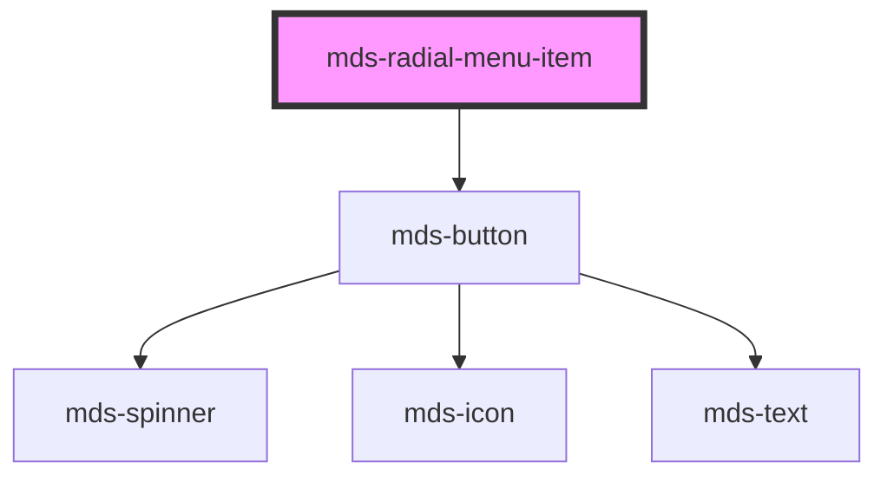

# mds-radial-menu-item

<!-- Auto Generated Below -->

## Properties

| Property  | Attribute | Description                                | Type                                                                                                                               | Default  |
| --------- | --------- | ------------------------------------------ | ---------------------------------------------------------------------------------------------------------------------------------- | -------- |
| `icon`    | `icon`    |                                            | `string`                                                                                                                           | `''`     |
| `size`    | `size`    | Specifies the size for the button          | `"lg" \| "md" \| "sm" \| "xl"`                                                                                                     | `'lg'`   |
| `variant` | `variant` | Specifies the color variant for the button | `"apple" \| "dark" \| "error" \| "google" \| "info" \| "light" \| "primary" \| "secondary" \| "success" \| "warning" \| undefined` | `'dark'` |

## Dependencies

### Depends on

- [mds-button](../mds-button)

### Graph

----------------------------------------------

Built with love @ [Gruppo Maggioli](https://www.maggioli.com) from [R&D Department](https://www.maggioli.com/it-it/chi-siamo/ricerca-sviluppo)
