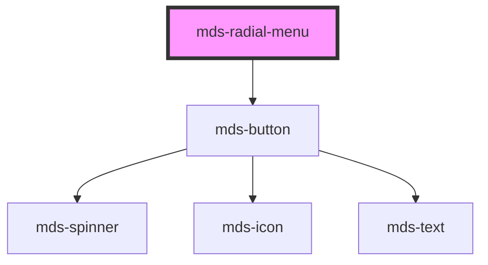

# mds-radial-menu

<!-- Auto Generated Below -->

## Properties

| Property       | Attribute       | Description                       | Type                                             | Default     |
| -------------- | --------------- | --------------------------------- | ------------------------------------------------ | ----------- |
| `angleEnd`     | `angle-end`     |                                   | `number \| undefined`                            | `undefined` |
| `angleStart`   | `angle-start`   |                                   | `number \| undefined`                            | `undefined` |
| `direction`    | `direction`     |                                   | `"clockwise" \| "counterclockwise" \| undefined` | `undefined` |
| `opened`       | `opened`        |                                   | `boolean \| undefined`                           | `undefined` |
| `radiusLength` | `radius-length` |                                   | `number \| undefined`                            | `undefined` |
| `size`         | `size`          | Specifies the size for the button | `"lg" \| "md" \| "sm" \| "xl"`                   | `'lg'`      |

## Shadow Parts

| Part            | Description |
| --------------- | ----------- |
| `"radial-menu"` |             |

## Dependencies

### Depends on

- [mds-button](../mds-button)

### Graph

----------------------------------------------

Built with love @ [Gruppo Maggioli](https://www.maggioli.com) from [R&D Department](https://www.maggioli.com/it-it/chi-siamo/ricerca-sviluppo)
