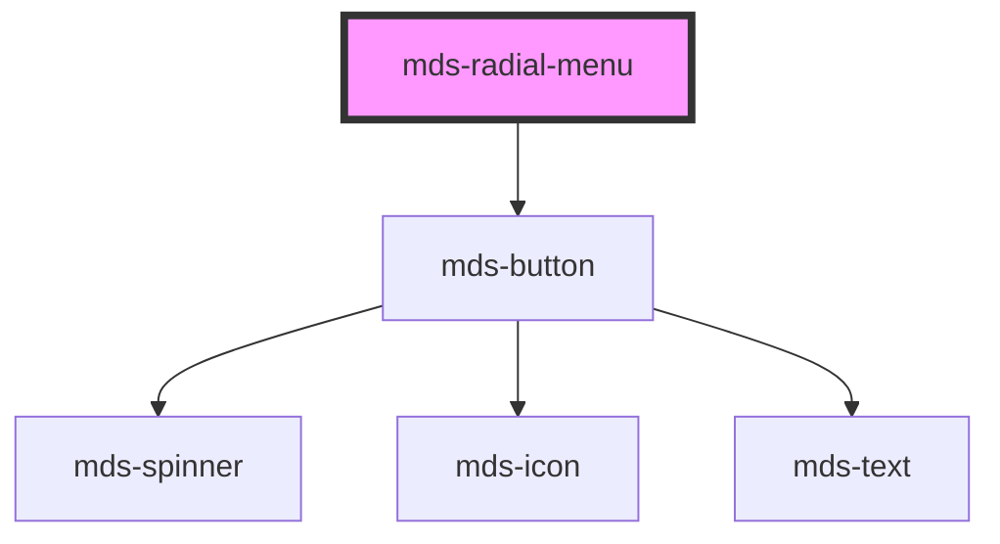

# mds-radial-menu

<!-- Auto Generated Below -->

## Properties

| Property      | Attribute     | Description                                | Type                                                                                                                                       | Default       |
| ------------- | ------------- | ------------------------------------------ | ------------------------------------------------------------------------------------------------------------------------------------------ | ------------- |
| `angleEnd`    | `angle-end`   |                                            | `number \| undefined`                                                                                                                      | `360`         |
| `angleStart`  | `angle-start` |                                            | `number \| undefined`                                                                                                                      | `0`           |
| `direction`   | `direction`   |                                            | `"clockwise" \| "counterclockwise" \| undefined`                                                                                           | `'clockwise'` |
| `disc`        | `disc`        |                                            | `boolean \| undefined`                                                                                                                     | `undefined`   |
| `icon`        | `icon`        | The icon displayed in the button           | `string \| undefined`                                                                                                                      | `undefined`   |
| `interaction` | `interaction` |                                            | `"click" \| "rightclick" \| undefined`                                                                                                     | `'click'`     |
| `opened`      | `opened`      |                                            | `boolean \| undefined`                                                                                                                     | `undefined`   |
| `radius`      | `radius`      |                                            | `number \| undefined`                                                                                                                      | `5`           |
| `size`        | `size`        | Specifies the size for the button          | `"lg" \| "md" \| "sm" \| "xl"`                                                                                                             | `'lg'`        |
| `tone`        | `tone`        | Specifies the tone variant for the button  | `"ghost" \| "quiet" \| "strong" \| "weak" \| undefined`                                                                                    | `'strong'`    |
| `variant`     | `variant`     | Specifies the color variant for the button | `"ai" \| "apple" \| "dark" \| "error" \| "google" \| "info" \| "light" \| "primary" \| "secondary" \| "success" \| "warning" \| undefined` | `'dark'`      |

## Shadow Parts

| Part            | Description |
| --------------- | ----------- |
| `"radial-menu"` |             |

## Dependencies

### Depends on

- [mds-button](../mds-button)

### Graph

----------------------------------------------

Built with love @ [Gruppo Maggioli](https://www.maggioli.com) from [R&D Department](https://www.maggioli.com/it-it/chi-siamo/ricerca-sviluppo)
