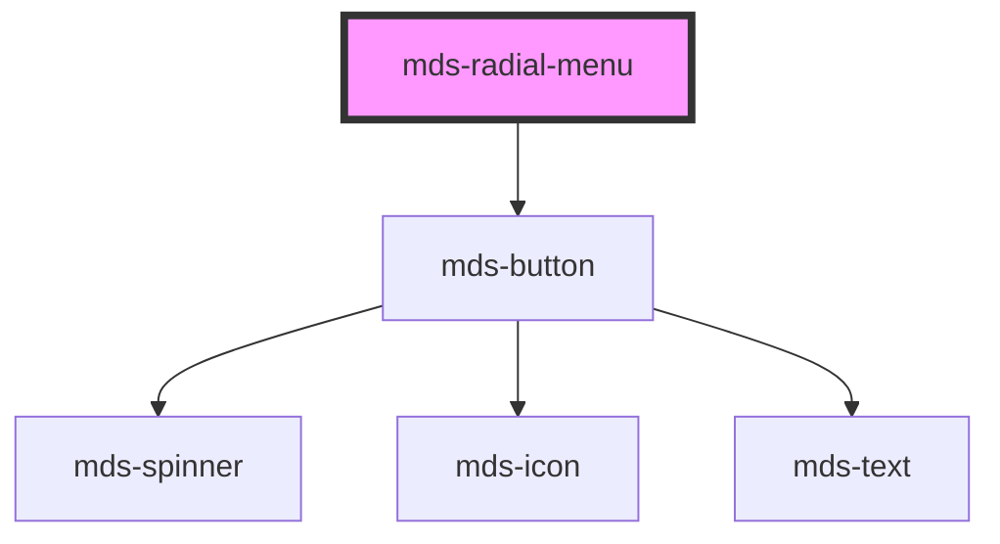

# mds-radial-menu


<!-- Auto Generated Below -->


## Usage

### 1. Description

The `<mds-radial-menu>` web component is a floating action menu of the Magma Design System that arranges its child items along a circular arc around a central trigger button, expanding them outward when opened. It is the parent of a compound pair: it owns the trigger and the geometry, while each option is supplied as an `<mds-radial-menu-item>` in the `item` slot.

#### Semantic Behavior

- **Trigger button**: Renders a trigger button whose `tone`, `variant` and `size` are forwarded from the host; clicking it toggles the menu open and closed.
- **Open state**: `opened` is the source of truth for visibility; when set the items animate out along the arc and the trigger icon swaps to a close glyph.
- **Interaction mode**: With `interaction="rightclick"` the trigger is hidden and the menu instead opens on right-click, centred on the cursor.
- **Backdrop**: When `backdrop` is enabled an overlay is shown while the menu is open, so an outside click can dismiss it.
- **Item registration**: Items are read from the `item` slot; the component assigns each item's position and propagates the host `size` down to every `<mds-radial-menu-item>`.

#### Properties & Visual Configurations

The internal trigger consumes the shared `variant` / `tone` / `size` ladders defined in [`projects/stencil/SPEC.md`](../../../../SPEC.md#tone-and-variant-system); they default to `'dark'` / `'strong'` / `'lg'` here.

#### Other behavioral props

- **`angleStart`** and **`angleEnd`** define the angular sweep (in degrees) over which items are distributed; a 360° span produces a full ring, while a narrower range produces a fan. Setting `angleStart` greater than `angleEnd` reverses the distribution.
- **`radius`** sets the distance (in `rem`) of the items from the centre, controlling how far they travel when the menu opens.
- **`direction`** chooses whether items lay out `'clockwise'` or `'counterclockwise'` around the arc.
- **`interaction`** selects how the menu is summoned: `'click'` shows the trigger button, `'rightclick'` hides it and opens at the cursor.
- **`disc`** renders a decorative disc beneath the menu; **`icon`** overrides the default trigger glyph and defaults to the "more-vert" Material icon when unset.


### 2. Pattern

Correct and idiomatic ways to use the `<mds-radial-menu>` component, ordered from most common to most specialized. Patterns assume a working knowledge of the variant / tone ladders documented in [`docs/COMPONENTS.md`](../../../../../../docs/COMPONENTS.md) and the generic stencil rules in [`projects/stencil/SPEC.md`](../../../../SPEC.md).

`<mds-radial-menu>` is a compound component: it always needs one or more [`mds-radial-menu-item`](../../mds-radial-menu-item) children placed in the `item` slot.

#### Basic Radial Menu

The minimal form: a trigger button with items arranged in a full ring. Each item requires `icon` (a slug from the Magma icon library) and `tooltip` (the accessible label shown on hover). The parent propagates its `size` down to every item automatically.

```html
<mds-radial-menu>
  <mds-radial-menu-item slot="item" icon="mi/baseline/favorite" tooltip="Aggiungi ai preferiti" variant="dark" tone="weak"></mds-radial-menu-item>
  <mds-radial-menu-item slot="item" icon="mi/baseline/email" tooltip="Invia email" variant="dark" tone="weak"></mds-radial-menu-item>
  <mds-radial-menu-item slot="item" icon="mi/baseline/print" tooltip="Stampa" variant="dark" tone="weak"></mds-radial-menu-item>
  <mds-radial-menu-item slot="item" icon="mi/baseline/delete" tooltip="Elimina" variant="error"></mds-radial-menu-item>
</mds-radial-menu>
```

#### Trigger Button Variant and Tone

Use `variant` and `tone` to style the central trigger button to match the surrounding UI. Defaults are `variant="dark"` and `tone="strong"`.

```html
<!-- Primary trigger in a content area -->
<mds-radial-menu variant="primary" tone="strong">
  <mds-radial-menu-item slot="item" icon="mi/baseline/edit" tooltip="Modifica" variant="primary" tone="weak"></mds-radial-menu-item>
  <mds-radial-menu-item slot="item" icon="mi/baseline/ios-share" tooltip="Condividi" variant="primary" tone="weak"></mds-radial-menu-item>
  <mds-radial-menu-item slot="item" icon="mi/baseline/delete" tooltip="Elimina" variant="error" tone="weak"></mds-radial-menu-item>
</mds-radial-menu>

<!-- Light trigger overlaid on a dark image -->
<mds-radial-menu variant="light" tone="weak">
  <mds-radial-menu-item slot="item" icon="mi/baseline/favorite" tooltip="Aggiungi ai preferiti" variant="light"></mds-radial-menu-item>
  <mds-radial-menu-item slot="item" icon="mi/baseline/ios-share" tooltip="Condividi" variant="light"></mds-radial-menu-item>
</mds-radial-menu>
```

#### Fan Layout with Angle Range

Restrict `angle-start` and `angle-end` to create a fan instead of a full ring. This is useful when the component is positioned in a corner of a card or image where a full ring would overlap content.

```html
<!-- Quarter-circle fan opening toward the top-left, placed at the bottom-right corner -->
<mds-radial-menu angle-start="180" angle-end="270" direction="counterclockwise" radius="5">
  <mds-radial-menu-item slot="item" icon="mi/baseline/favorite" tooltip="Aggiungi ai preferiti" variant="light"></mds-radial-menu-item>
  <mds-radial-menu-item slot="item" icon="mi/baseline/ios-share" tooltip="Condividi" variant="light"></mds-radial-menu-item>
  <mds-radial-menu-item slot="item" icon="mi/baseline/delete" tooltip="Elimina" variant="error"></mds-radial-menu-item>
</mds-radial-menu>
```

#### Adjusting the Radius

Set `radius` (in `rem`) to control how far items travel from the trigger when the menu opens. Increase it when items would otherwise overlap; decrease it in constrained layouts.

```html
<mds-radial-menu radius="7" variant="secondary" tone="outline">
  <mds-radial-menu-item slot="item" icon="mi/baseline/edit" tooltip="Modifica" variant="secondary" tone="weak"></mds-radial-menu-item>
  <mds-radial-menu-item slot="item" icon="mi/baseline/content-copy" tooltip="Copia" variant="secondary" tone="weak"></mds-radial-menu-item>
  <mds-radial-menu-item slot="item" icon="mi/baseline/delete" tooltip="Elimina" variant="error" tone="weak"></mds-radial-menu-item>
</mds-radial-menu>
```

#### Controlling the Open State Programmatically

The `opened` attribute reflects the menu's open state and can be set from JavaScript to open or close the menu without a user interaction. Remove the attribute (or set the prop to `undefined`) to close it - do not set `opened="false"`.

```html
<mds-radial-menu id="menu-azioni">
  <mds-radial-menu-item slot="item" icon="mi/baseline/edit" tooltip="Modifica" variant="dark" tone="weak"></mds-radial-menu-item>
  <mds-radial-menu-item slot="item" icon="mi/baseline/delete" tooltip="Elimina" variant="error" tone="weak"></mds-radial-menu-item>
</mds-radial-menu>

<script>
  const menu = document.querySelector('#menu-azioni');
  // open programmatically
  menu.opened = true;
  // close programmatically - remove the prop, do not set false
  menu.opened = undefined;
</script>
```

#### Contextual (Right-Click) Menu with Backdrop

Set `interaction="rightclick"` to hide the trigger button and open the menu at the cursor position on a context-menu event. Add `backdrop` to show an overlay that blocks the page while the menu is open.

```html
<mds-radial-menu interaction="rightclick" disc backdrop>
  <mds-radial-menu-item slot="item" icon="mi/baseline/favorite" tooltip="Aggiungi ai preferiti" variant="dark" tone="text"></mds-radial-menu-item>
  <mds-radial-menu-item slot="item" icon="mi/baseline/email" tooltip="Invia email" variant="dark" tone="text"></mds-radial-menu-item>
  <mds-radial-menu-item slot="item" icon="mi/baseline/insert-drive-file" tooltip="Nuovo documento" variant="dark" tone="text"></mds-radial-menu-item>
  <mds-radial-menu-item slot="item" icon="mi/baseline/info" tooltip="Informazioni" variant="dark" tone="text"></mds-radial-menu-item>
  <mds-radial-menu-item slot="item" icon="mi/baseline/print" tooltip="Stampa" variant="dark" tone="text"></mds-radial-menu-item>
  <mds-radial-menu-item slot="item" icon="mi/baseline/delete" tooltip="Elimina" variant="error" tone="text"></mds-radial-menu-item>
</mds-radial-menu>
```

#### Disc Decoration

Enable the `disc` attribute to render a decorative circular background beneath the items, visually grouping the open menu. Combine with `backdrop` for modal-style emphasis.

```html
<mds-radial-menu disc variant="dark" tone="strong">
  <mds-radial-menu-item slot="item" icon="mi/baseline/edit" tooltip="Modifica" variant="dark" tone="weak"></mds-radial-menu-item>
  <mds-radial-menu-item slot="item" icon="mi/baseline/ios-share" tooltip="Condividi" variant="dark" tone="weak"></mds-radial-menu-item>
  <mds-radial-menu-item slot="item" icon="mi/baseline/delete" tooltip="Elimina" variant="error" tone="weak"></mds-radial-menu-item>
</mds-radial-menu>
```

#### Custom Trigger Icon

Override the default "more-vert" glyph with any slug from the Magma icon library using the `icon` prop. The trigger automatically switches to the close icon while the menu is open.

```html
<mds-radial-menu icon="mi/baseline/add" variant="primary" tone="strong">
  <mds-radial-menu-item slot="item" icon="mi/baseline/edit" tooltip="Modifica" variant="primary" tone="weak"></mds-radial-menu-item>
  <mds-radial-menu-item slot="item" icon="mi/baseline/content-copy" tooltip="Duplica" variant="primary" tone="weak"></mds-radial-menu-item>
  <mds-radial-menu-item slot="item" icon="mi/baseline/delete" tooltip="Elimina" variant="error" tone="weak"></mds-radial-menu-item>
</mds-radial-menu>
```

#### Sizing

Use the `size` prop to resize the trigger button and all items simultaneously. Do not override dimensions with inline `width` / `height`.

```html
<mds-radial-menu size="sm" variant="dark" tone="strong">
  <mds-radial-menu-item slot="item" icon="mi/baseline/edit" tooltip="Modifica" variant="dark" tone="weak"></mds-radial-menu-item>
  <mds-radial-menu-item slot="item" icon="mi/baseline/delete" tooltip="Elimina" variant="error" tone="weak"></mds-radial-menu-item>
</mds-radial-menu>
```

#### Styling Customization

Style the component through its documented `--mds-radial-menu-*` CSS custom properties. Use Magma color tokens wrapped in `rgb(var(...))` so dark mode and high-contrast modes keep working.

```css
.my-context mds-radial-menu {
  --mds-radial-menu-radius: 7rem;
  --mds-radial-menu-transition-duration: 300ms;
  --mds-radial-menu-disc-background: rgb(var(--tone-neutral) / 0.8);
  --mds-radial-menu-disc-size: 12rem;
}
```


### 3. Antipattern

Common incorrect uses of `<mds-radial-menu>`. Each entry pairs the wrong form with the right one and a one-line reason. System-wide rules (boolean-as-string, shadow piercing, Tailwind color utilities, raw native event listening) live in [`docs/COMPONENTS.md`](../../../../../../docs/COMPONENTS.md#system-level-anti-patterns) - they apply here too but are not repeated.

#### Do Not Omit the `slot="item"` Attribute

Items placed without `slot="item"` are not discovered by the component's internal registration logic and will not be positioned or sized.

```html
<!-- 🚫 INCORRECT -->
<mds-radial-menu>
  <mds-radial-menu-item icon="mi/baseline/edit" tooltip="Modifica" variant="dark"></mds-radial-menu-item>
  <mds-radial-menu-item icon="mi/baseline/delete" tooltip="Elimina" variant="error"></mds-radial-menu-item>
</mds-radial-menu>

<!-- ✅ CORRECT -->
<mds-radial-menu>
  <mds-radial-menu-item slot="item" icon="mi/baseline/edit" tooltip="Modifica" variant="dark"></mds-radial-menu-item>
  <mds-radial-menu-item slot="item" icon="mi/baseline/delete" tooltip="Elimina" variant="error"></mds-radial-menu-item>
</mds-radial-menu>
```

#### Do Not Close the Menu by Setting `opened="false"`

`opened` is a boolean prop; any non-empty string attribute - including `"false"` - is truthy in HTML. Remove the attribute or set the prop to `undefined` to close the menu.

```html
<!-- 🚫 INCORRECT -->
<mds-radial-menu opened="false">...</mds-radial-menu>

<!-- ✅ CORRECT -->
<mds-radial-menu>...</mds-radial-menu>
```

```js
// 🚫 INCORRECT
menu.opened = false;

// ✅ CORRECT
menu.opened = undefined;
```

#### Do Not Place Non-Item Children in the `item` Slot

Only `<mds-radial-menu-item>` elements belong in the `item` slot. Slotting arbitrary HTML or other components breaks the positioning and size-propagation logic.

```html
<!-- 🚫 INCORRECT -->
<mds-radial-menu>
  <mds-button slot="item" label="Azione" variant="primary"></mds-button>
  <button slot="item">Azione</button>
</mds-radial-menu>

<!-- ✅ CORRECT -->
<mds-radial-menu>
  <mds-radial-menu-item slot="item" icon="mi/baseline/edit" tooltip="Azione" variant="primary" tone="weak"></mds-radial-menu-item>
</mds-radial-menu>
```

#### Do Not Set Item Size Individually

`<mds-radial-menu>` propagates its `size` prop down to every `<mds-radial-menu-item>` automatically. Setting `size` on individual items is overridden on the next update and produces inconsistent results.

```html
<!-- 🚫 INCORRECT -->
<mds-radial-menu size="lg">
  <mds-radial-menu-item slot="item" size="sm" icon="mi/baseline/edit" tooltip="Modifica" variant="dark"></mds-radial-menu-item>
  <mds-radial-menu-item slot="item" size="xl" icon="mi/baseline/delete" tooltip="Elimina" variant="error"></mds-radial-menu-item>
</mds-radial-menu>

<!-- ✅ CORRECT -->
<mds-radial-menu size="lg">
  <mds-radial-menu-item slot="item" icon="mi/baseline/edit" tooltip="Modifica" variant="dark"></mds-radial-menu-item>
  <mds-radial-menu-item slot="item" icon="mi/baseline/delete" tooltip="Elimina" variant="error"></mds-radial-menu-item>
</mds-radial-menu>
```

#### Do Not Listen for Native `contextmenu` to Drive `interaction="rightclick"`

When `interaction="rightclick"` the component registers its own `contextmenu` listener on `document` and prevents the default browser menu. Adding a second listener from application code causes both to fire and may reopen the menu after it closes.

```js
// 🚫 INCORRECT
document.addEventListener('contextmenu', (e) => {
  e.preventDefault();
  menu.opened = true; // fights the component's own handler
});

// ✅ CORRECT - just set the prop and let the component manage it
menu.interaction = 'rightclick';
```

#### Do Not Override Geometry via Inline Styles

The arc geometry is driven by `angle-start`, `angle-end`, `radius`, and `direction` props - not by inline CSS. Applying `transform`, `top`, or `left` directly on the host or items conflicts with the component's own animation values.

```html
<!-- 🚫 INCORRECT -->
<mds-radial-menu style="transform: rotate(45deg);">
  <mds-radial-menu-item slot="item" style="transform: translateX(80px);" icon="mi/baseline/edit" tooltip="Modifica" variant="dark"></mds-radial-menu-item>
</mds-radial-menu>

<!-- ✅ CORRECT -->
<mds-radial-menu angle-start="45" angle-end="315" radius="6" direction="clockwise">
  <mds-radial-menu-item slot="item" icon="mi/baseline/edit" tooltip="Modifica" variant="dark"></mds-radial-menu-item>
</mds-radial-menu>
```

#### Do Not Use an Item Without a `tooltip`

`<mds-radial-menu-item>` renders icon-only buttons. Without a `tooltip` there is no visible label and no accessible name, so screen readers cannot announce the item's purpose.

```html
<!-- 🚫 INCORRECT -->
<mds-radial-menu>
  <mds-radial-menu-item slot="item" icon="mi/baseline/delete" variant="error"></mds-radial-menu-item>
</mds-radial-menu>

<!-- ✅ CORRECT -->
<mds-radial-menu>
  <mds-radial-menu-item slot="item" icon="mi/baseline/delete" tooltip="Elimina elemento" variant="error"></mds-radial-menu-item>
</mds-radial-menu>
```


## Properties

| Property      | Attribute     | Description                                          | Type                                                                                                                                       | Default       |
| ------------- | ------------- | ---------------------------------------------------- | ------------------------------------------------------------------------------------------------------------------------------------------ | ------------- |
| `angleEnd`    | `angle-end`   | Specifies the ending angle of the menu               | `number`                                                                                                                                   | `360`         |
| `angleStart`  | `angle-start` | Specifies the starting angle of the menu             | `number`                                                                                                                                   | `0`           |
| `backdrop`    | `backdrop`    | Specifies if the component has a backdrop background | `boolean \| undefined`                                                                                                                     | `false`       |
| `direction`   | `direction`   | Specifies the direction of the menu elements         | `"clockwise" \| "counterclockwise"`                                                                                                        | `'clockwise'` |
| `disc`        | `disc`        | Specifies if the menu has a disc beneath or not      | `boolean \| undefined`                                                                                                                     | `undefined`   |
| `icon`        | `icon`        | The icon displayed in the button                     | `string \| undefined`                                                                                                                      | `undefined`   |
| `interaction` | `interaction` | Specifies how to open the menu                       | `"click" \| "rightclick"`                                                                                                                  | `'click'`     |
| `opened`      | `opened`      | Specifies if the menu is opened or not               | `boolean \| undefined`                                                                                                                     | `undefined`   |
| `radius`      | `radius`      | Specifies the radius of the menu                     | `number`                                                                                                                                   | `5`           |
| `size`        | `size`        | Specifies the size for the button                    | `"lg" \| "md" \| "sm" \| "xl"`                                                                                                             | `'lg'`        |
| `tone`        | `tone`        | Specifies the tone variant for the button            | `"outline" \| "strong" \| "text" \| "weak" \| undefined`                                                                                   | `'strong'`    |
| `variant`     | `variant`     | Specifies the color variant for the button           | `"ai" \| "apple" \| "dark" \| "error" \| "google" \| "info" \| "light" \| "primary" \| "secondary" \| "success" \| "warning" \| undefined` | `'dark'`      |


## Shadow Parts

| Part            | Description |
| --------------- | ----------- |
| `"radial-menu"` |             |


## Dependencies

### Depends on

- [mds-button](../mds-button)

### Graph


----------------------------------------------

Built with love @ [Gruppo Maggioli](https://www.maggioli.com) from [R&D Department](https://www.maggioli.com/it-it/chi-siamo/ricerca-sviluppo)
