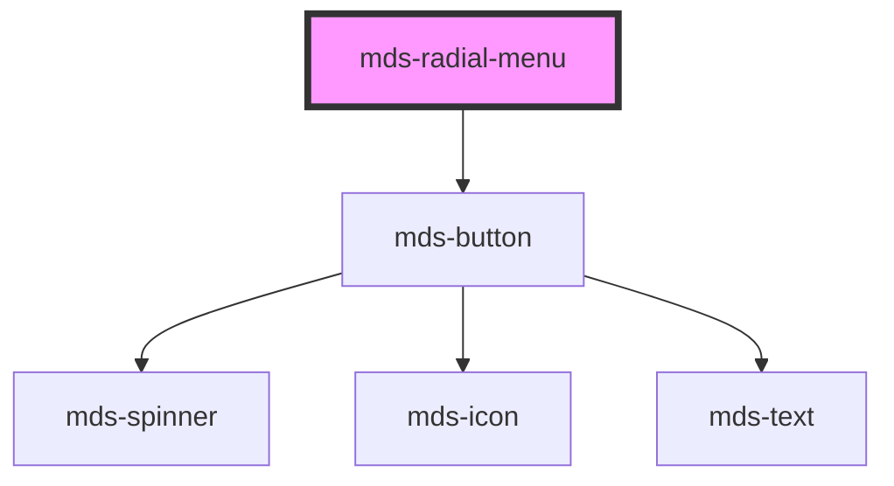

# mds-radial-menu

<!-- Auto Generated Below -->

## Properties

| Property      | Attribute     | Description                                          | Type                                                                                                                                       | Default       |
| ------------- | ------------- | ---------------------------------------------------- | ------------------------------------------------------------------------------------------------------------------------------------------ | ------------- |
| `angleEnd`    | `angle-end`   | Specifies the ending angle of the menu               | `number`                                                                                                                                   | `360`         |
| `angleStart`  | `angle-start` | Specifies the starting angle of the menu             | `number`                                                                                                                                   | `0`           |
| `backdrop`    | `backdrop`    | Specifies if the component has a backdrop background | `boolean \| undefined`                                                                                                                     | `false`       |
| `direction`   | `direction`   | Specifies the direction of the menu elements         | `"clockwise" \| "counterclockwise"`                                                                                                        | `'clockwise'` |
| `disc`        | `disc`        | Specifies if the menu has a disc beneath or not      | `boolean \| undefined`                                                                                                                     | `undefined`   |
| `icon`        | `icon`        | The icon displayed in the button                     | `string \| undefined`                                                                                                                      | `undefined`   |
| `interaction` | `interaction` | Specifies how to open the menu                       | `"click" \| "rightclick"`                                                                                                                  | `'click'`     |
| `opened`      | `opened`      | Specifies if the menu is opened or not               | `boolean \| undefined`                                                                                                                     | `undefined`   |
| `radius`      | `radius`      | Specifies the radius of the menu                     | `number`                                                                                                                                   | `5`           |
| `size`        | `size`        | Specifies the size for the button                    | `"lg" \| "md" \| "sm" \| "xl"`                                                                                                             | `'lg'`        |
| `tone`        | `tone`        | Specifies the tone variant for the button            | `"ghost" \| "quiet" \| "strong" \| "weak" \| undefined`                                                                                    | `'strong'`    |
| `variant`     | `variant`     | Specifies the color variant for the button           | `"ai" \| "apple" \| "dark" \| "error" \| "google" \| "info" \| "light" \| "primary" \| "secondary" \| "success" \| "warning" \| undefined` | `'dark'`      |

## Shadow Parts

| Part            | Description |
| --------------- | ----------- |
| `"radial-menu"` |             |

## CSS Custom Properties

| Name                                           | Description                                                      |
| ---------------------------------------------- | ---------------------------------------------------------------- |
| `--mds-radial-menu-angle-end`                  | Sets the end angle of the menu                                   |
| `--mds-radial-menu-angle-start`                | Sets the start angle of the menu                                 |
| `--mds-radial-menu-context-menu-z-index`       | Sets the z-index of the context menu with rightclick interaction |
| `--mds-radial-menu-delay`                      | Sets the delay before the menu items start appearing             |
| `--mds-radial-menu-direction`                  | Sets the direction in which the menu items are positioned        |
| `--mds-radial-menu-disc-background`            | Sets the background of the disc                                  |
| `--mds-radial-menu-disc-filter`                | Sets the filter of the disc                                      |
| `--mds-radial-menu-disc-shadow`                | Sets the shadow of the disc                                      |
| `--mds-radial-menu-disc-size`                  | Sets the size of the disc                                        |
| `--mds-radial-menu-radius`                     | Sets the radius of the menu                                      |
| `--mds-radial-menu-transition-duration`        | Set the transition duration of the menu                          |
| `--mds-radial-menu-transition-timing-function` | Set the transition timing function of the menu                   |

## Dependencies

### Depends on

- [mds-button](../mds-button)

### Graph

----------------------------------------------

Built with love @ [Gruppo Maggioli](https://www.maggioli.com) from [R&D Department](https://www.maggioli.com/it-it/chi-siamo/ricerca-sviluppo)
