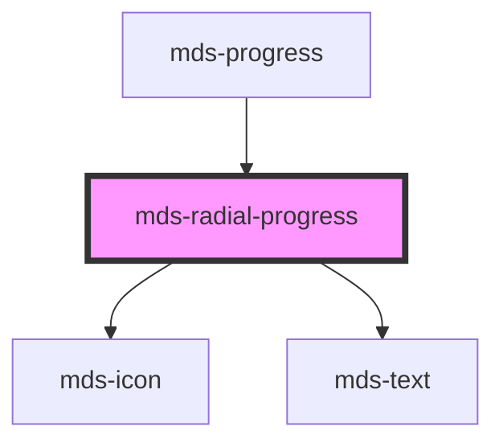

# mds-radial-progress


<!-- Auto Generated Below -->


## Usage

### 1. Description

The `<mds-radial-progress>` web component renders a circular progress indicator that visualizes a completion ratio as a ring with a numeric percentage at its center. It is the radial counterpart of the linear bar exposed by `<mds-progress>`, which composes it internally, and it has no native HTML primitive equivalent.

#### Semantic Behavior

- **Progress semantics**: Exposed to assistive technology as a progress widget.
- **Value clamping**: `progress` is interpreted as a 0 - 1 ratio and clamped to that range, so out-of-bounds values never overflow the ring or the displayed percentage.
- **Centered readout**: The clamped ratio is shown as a whole-number percentage at the ring's center.
- **Animated fill**: Changing `progress` at runtime animates the ring toward the new value (~500ms).
- **Reduced motion**: When the user's OS signals `prefers-reduced-motion: reduce`, the ring jumps directly to the target value with no tween.
- **Icon prop**: Setting `icon` renders an icon above the percentage; the component has no slots.

#### Properties & Visual Configurations

- **`progress`** is the single source of truth for the indicator, expressed as a fraction between `0` and `1` (e.g. `0.42` shows "42"). It is the value to bind for live updates.

The shared `variant` ladder is defined in [`projects/stencil/SPEC.md`](../../../../SPEC.md#tone-and-variant-system). On this component `variant` selects the ring color and is the only way to express status: pick a brand value (`'primary'`, `'secondary'`, `'ai'`) for neutral progress, or a status value (`'success'`, `'warning'`, `'error'`, `'info'`) to color the completion state. There is no separate `tone` prop.

#### Other behavioral props

- **`icon`** is an SVG filename slug from the Magma icon library; when present it is shown alongside the centered percentage rather than replacing it.
- **`typography`** controls the type token of the centered percentage text, restricted to the technical scale (`'option'` by default, or `'label'`) so the readout stays sized for the ring.


### 2. Pattern

Correct and idiomatic ways to use the `<mds-radial-progress>` component, ordered from most common to most specialized. Patterns assume a working knowledge of the variant ladder documented in [`docs/COMPONENTS.md`](../../../../../../docs/COMPONENTS.md) and the generic stencil rules in [`projects/stencil/SPEC.md`](../../../../SPEC.md).

#### Basic Progress Indicator

The minimal form. Pass `progress` as a fraction between `0` and `1`; the component renders the ring and displays the whole-number percentage at its center.

```html
<mds-radial-progress progress="0.65"></mds-radial-progress>
```

#### Variant for Semantic Coloring

Use `variant` to communicate what kind of progress is being tracked. Pick a brand value for neutral steps and a status value to express the outcome color.

```html
<!-- Neutral brand progress -->
<mds-radial-progress progress="0.4" variant="primary"></mds-radial-progress>

<!-- Success state - caricamento completato -->
<mds-radial-progress progress="1" variant="success"></mds-radial-progress>

<!-- Warning - procedura parziale -->
<mds-radial-progress progress="0.3" variant="warning"></mds-radial-progress>

<!-- Error - operazione fallita -->
<mds-radial-progress progress="0.15" variant="error"></mds-radial-progress>

<!-- AI variant - elaborazione AI in corso -->
<mds-radial-progress progress="0.72" variant="ai"></mds-radial-progress>
```

#### Progress with Icon

Set `icon` to an iconsauce slug to show a glyph above the percentage readout. The icon is colored by the same `--mds-radial-progress-color` token as the ring.

```html
<!-- Caricamento file -->
<mds-radial-progress
  progress="0.55"
  icon="mi/baseline/cloud-upload"
  variant="primary"
></mds-radial-progress>

<!-- Stato di salvataggio -->
<mds-radial-progress
  progress="0.9"
  icon="mi/baseline/save"
  variant="success"
></mds-radial-progress>
```

#### Typography Scale

`typography` controls the type token used for the centered percentage. Use `'option'` (default) for most sizes and `'label'` when the ring is rendered at a smaller size and a tighter type scale is needed.

```html
<!-- Default - token "option" -->
<mds-radial-progress progress="0.5" typography="option"></mds-radial-progress>

<!-- Compact version - token "label" -->
<mds-radial-progress progress="0.5" typography="label"></mds-radial-progress>
```

#### Controlling Size via CSS

`<mds-radial-progress>` is sized by its `width` (the host uses a 1:1 `aspect-ratio`). Set the width on the host; do not set `height` separately.

```css
.dashboard-kpi mds-radial-progress {
  width: 96px;
}

.compact-cell mds-radial-progress {
  width: 32px;
}
```

#### Live Updates and Animation

Bind `progress` to a reactive state value. When the prop changes, the component smoothly animates the ring to the new value over ~500 ms using an ease-out curve. Respects `prefers-reduced-motion` automatically - no extra code needed.

```html
<mds-radial-progress id="upload-ring" progress="0"></mds-radial-progress>

<script>
  const ring = document.getElementById('upload-ring');
  // Simulate upload progress
  let value = 0;
  const interval = setInterval(() => {
    value = Math.min(1, value + 0.1);
    ring.progress = value;
    if (value >= 1) clearInterval(interval);
  }, 300);
</script>
```

#### Dark and Light Neutral Variants

Use `variant="dark"` over light backgrounds and `variant="light"` when the ring sits on a dark surface. Both use neutral palette tokens so they adapt without custom CSS.

```html
<!-- Su sfondo chiaro -->
<mds-radial-progress progress="0.6" variant="dark"></mds-radial-progress>

<!-- Su sfondo scuro -->
<mds-radial-progress progress="0.6" variant="light"></mds-radial-progress>
```

#### CSS Custom Property Customization

Style the component only through its documented `--mds-radial-progress-*` CSS custom properties. Set them on the host or a parent selector; use Magma color tokens via `rgb(var(--<token>))` so dark mode and high-contrast modes keep working. The `--mds-radial-progress-text-suffix` property controls the suffix appended after the number (default `'%'`).

```css
.branded-progress mds-radial-progress {
  --mds-radial-progress-color: rgb(var(--variant-secondary-03));
  --mds-radial-progress-background: rgb(var(--tone-neutral-08));
  --mds-radial-progress-text-background: rgb(var(--tone-neutral));
  --mds-radial-progress-text-suffix: '%';
}
```

#### Shadow Part Customization

The two documented shadow parts - `value-container` and `icon` - allow deeper styling when CSS custom properties are not sufficient.

```css
/* Adjust the inner circle shadow */
mds-radial-progress::part(value-container) {
  box-shadow: none;
}

/* Tint the icon independently from the ring color */
mds-radial-progress::part(icon) {
  fill: rgb(var(--status-warning-05));
}
```


### 3. Antipattern

Common incorrect uses of `<mds-radial-progress>`. Each entry pairs the wrong form with the right one and a one-line reason. System-wide rules (boolean-as-string, shadow piercing, Tailwind color utilities, raw native event listening) live in [`docs/COMPONENTS.md`](../../../../../../docs/COMPONENTS.md#system-level-anti-patterns) - they apply here too but are not repeated.

#### Do Not Pass `progress` Outside the 0-1 Range

`progress` is a 0-1 fraction, not a 0-100 percentage. Values outside the range are silently clamped, so `progress="75"` displays "100%" rather than "75%".

```html
<!-- 🚫 INCORRECT -->
<mds-radial-progress progress="75"></mds-radial-progress>

<!-- ✅ CORRECT -->
<mds-radial-progress progress="0.75"></mds-radial-progress>
```

#### Do Not Use Slots to Add Content

`<mds-radial-progress>` has no slots - neither a default slot nor any named slot. Placing child elements inside the tag has no effect; they are not rendered.

```html
<!-- 🚫 INCORRECT -->
<mds-radial-progress progress="0.5">
  <mds-icon name="mi/baseline/check"></mds-icon>
</mds-radial-progress>

<!-- ✅ CORRECT -->
<mds-radial-progress progress="0.5" icon="mi/baseline/check"></mds-radial-progress>
```

#### Do Not Set Both `width` and `height`

The component enforces a 1:1 `aspect-ratio` internally. Setting both dimensions independently can distort the circular ring into an ellipse.

```css
/* 🚫 INCORRECT */
mds-radial-progress {
  width: 80px;
  height: 60px;
}

/* ✅ CORRECT */
mds-radial-progress {
  width: 80px;
}
```

#### Do Not Hard-Code Colors with Inline Styles

Inline `style` bypasses the `--mds-radial-progress-*` custom properties and the Magma token system, breaking dark-mode and high-contrast adaptations.

```html
<!-- 🚫 INCORRECT -->
<mds-radial-progress
  progress="0.6"
  style="color: #FF5500; background: #eee;"
></mds-radial-progress>

<!-- ✅ CORRECT -->
<mds-radial-progress progress="0.6" variant="warning"></mds-radial-progress>
```

```css
/* ✅ CORRECT for deeper customization */
.my-context mds-radial-progress {
  --mds-radial-progress-color: rgb(var(--status-warning-05));
  --mds-radial-progress-background: rgb(var(--status-warning-09));
}
```

#### Do Not Use `variant` Values Not Accepted by the Component

`<mds-radial-progress>` accepts `ThemeVariantType` (`primary`, `secondary`, `ai`, `dark`, `light`, `error`, `warning`, `success`, `info`). Decorative label variants (`'red'`, `'blue'`, `'orchid'`, etc.) defined in `ThemeFullVariantType` are not wired in this component and silently fall back to the default styling.

```html
<!-- 🚫 INCORRECT -->
<mds-radial-progress progress="0.4" variant="red"></mds-radial-progress>

<!-- ✅ CORRECT - use a semantic status variant for color emphasis -->
<mds-radial-progress progress="0.4" variant="error"></mds-radial-progress>
```

#### Do Not Pierce the Shadow DOM

Targeting internal class names via `>>>` or undocumented `::part()` selectors couples your code to the component's implementation and breaks on future releases. Use the documented `--mds-radial-progress-*` properties and the `value-container` / `icon` shadow parts only.

```css
/* 🚫 INCORRECT */
mds-radial-progress >>> .value {
  font-size: 20px;
}
mds-radial-progress::part(value-container__text) {
  display: none;
}

/* ✅ CORRECT */
mds-radial-progress {
  --mds-radial-progress-text-suffix: '';
}
mds-radial-progress::part(value-container) {
  box-shadow: none;
}
```


## Properties

| Property     | Attribute    | Description                                                 | Type                                                                                                 | Default     |
| ------------ | ------------ | ----------------------------------------------------------- | ---------------------------------------------------------------------------------------------------- | ----------- |
| `icon`       | `icon`       | Specifies if the component should display an icon           | `string \| undefined`                                                                                | `undefined` |
| `progress`   | `progress`   | A value between 0 and 1 that rapresents the status progress | `number`                                                                                             | `0`         |
| `typography` | `typography` | The typography of the component                             | `"label" \| "option" \| undefined`                                                                   | `'option'`  |
| `variant`    | `variant`    | Sets the theme variant colors                               | `"ai" \| "dark" \| "error" \| "info" \| "light" \| "primary" \| "success" \| "warning" \| undefined` | `'primary'` |


## Shadow Parts

| Part                | Description                                         |
| ------------------- | --------------------------------------------------- |
| `"icon"`            | Selects the icon of the radial progress.            |
| `"value-container"` | Selects the value container of the radial progress. |


## Dependencies

### Used by

 - [mds-progress](../mds-progress)

### Depends on

- [mds-icon](../mds-icon)
- [mds-text](../mds-text)

### Graph


----------------------------------------------

Built with love @ [Gruppo Maggioli](https://www.maggioli.com) from [R&D Department](https://www.maggioli.com/it-it/chi-siamo/ricerca-sviluppo)
