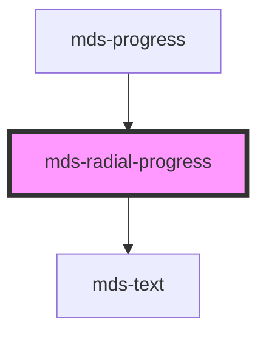

# mds-radial-progress

<!-- Auto Generated Below -->

## Properties

| Property     | Attribute    | Description                                                 | Type                                                                                                 | Default     |
| ------------ | ------------ | ----------------------------------------------------------- | ---------------------------------------------------------------------------------------------------- | ----------- |
| `progress`   | `progress`   | A value between 0 and 1 that rapresents the status progress | `number`                                                                                             | `0`         |
| `typography` | `typography` | The typography of the component                             | `"label" \| "option" \| undefined`                                                                   | `'option'`  |
| `variant`    | `variant`    | Sets the theme variant colors                               | `"ai" \| "dark" \| "error" \| "info" \| "light" \| "primary" \| "success" \| "warning" \| undefined` | `'primary'` |

## Dependencies

### Used by

 - [mds-progress](../mds-progress)

### Depends on

- [mds-text](../mds-text)

### Graph

----------------------------------------------

Built with love @ [Gruppo Maggioli](https://www.maggioli.com) from [R&D Department](https://www.maggioli.com/it-it/chi-siamo/ricerca-sviluppo)
