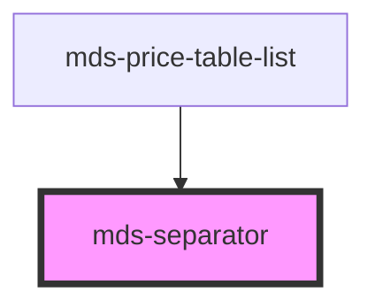

# mds-separator


This is a web-component from Maggioli Design System [Magma](https://magma.maggiolicloud.it), built with StencilJS, TypeScript, Storybook. It's based on the web-component standard and it's designed to be agnostic from the JavaScript framework you are using.

<!-- Auto Generated Below -->


## Usage

### 1. Description

The `<mds-separator>` web component is the visual divider of the Magma Design System: a thin, full-radius horizontal rule used to partition content into distinct groups. It is a purely presentational primitive - the styled equivalent of an `<hr>` - with no props, slots, events, or interactive state.

#### Semantic Behavior

- **Presentational by default**: It exposes no role or ARIA attributes and accepts no children, so it is treated as decorative chrome rather than semantic content.
- **Theme-reactive coloring**: The separator color adapts automatically to the active appearance - darker under dark themes and stronger under high-contrast preferences - with no consumer wiring required.
- **No state or interaction**: There is no disabled, await, focus, or keyboard behavior - the element is inert and never enters the tab sequence.

#### Properties & Visual Configurations

The component defines no configurable props. The only intended customization point is the CSS custom property **`--mds-separator-background`** (default `rgb(var(--tone-neutral-08))`) that overrides the divider color while preserving its theme- and contrast-aware fallbacks.

For the shared color foundations the default value draws from, see the tone ladder in [`projects/stencil/SPEC.md`](../../../../SPEC.md#tone-and-variant-system). The broader `usage/` documentation contract is defined in [`docs/COMPONENTS.md`](../../../../../../docs/COMPONENTS.md).


### 2. Pattern

Correct and idiomatic ways to use the `<mds-separator>` component, ordered from most common to most specialized. Patterns assume familiarity with the conventions in [`docs/COMPONENTS.md`](../../../../../../docs/COMPONENTS.md) and the generic stencil rules in [`projects/stencil/SPEC.md`](../../../../SPEC.md).

#### Dividing Items in a List or Card

The most common use: place `<mds-separator>` between stacked rows or sections to create a thin visual boundary without adding semantic structure. The component is inert and carries no ARIA role, so it works as pure chrome.

```html
<div class="grid rounded-xl bg-tone-neutral overflow-hidden">
  <mds-entity icon="mi/baseline/person">
    <mds-text typography="h6">Mario Rossi</mds-text>
  </mds-entity>
  <mds-separator></mds-separator>
  <mds-entity icon="mi/baseline/person">
    <mds-text typography="h6">Luigi Verdi</mds-text>
  </mds-entity>
  <mds-separator></mds-separator>
  <mds-entity icon="mi/baseline/person">
    <mds-text typography="h6">Wario</mds-text>
  </mds-entity>
</div>
```

#### Dividing Sections Inside a Card

Use `<mds-separator>` to separate header, body, and footer regions of a card when the parent component does not already provide built-in separators. Keep it as a direct sibling of the sections - do not wrap it.

```html
<mds-card>
  <mds-card-header slot="header" label="Riepilogo ordine"></mds-card-header>
  <mds-separator></mds-separator>
  <mds-card-content slot="content">
    <mds-text typography="body">Totale: 128,00 EUR</mds-text>
  </mds-card-content>
  <mds-separator></mds-separator>
  <mds-card-footer slot="footer">
    <mds-button label="Conferma" variant="primary" tone="strong"></mds-button>
  </mds-card-footer>
</mds-card>
```

#### Dividing Items Inside a Price-Table List

`<mds-separator>` is the internal divider used by [`mds-price-table-list`](../../mds-price-table-list). When building a custom pricing layout, follow the same pattern: one separator between each feature row, never one before the first or after the last.

```html
<div class="grid">
  <mds-text typography="caption">Archiviazione inclusa</mds-text>
  <mds-separator></mds-separator>
  <mds-text typography="caption">Utenti illimitati</mds-text>
  <mds-separator></mds-separator>
  <mds-text typography="caption">Supporto dedicato</mds-text>
</div>
```

#### Custom Separator Color

Override the divider color through the single documented CSS custom property `--mds-separator-background`. Use a Magma color token wrapped in `rgb(var(...))` so dark-mode and high-contrast variants keep working.

```css
.sezione-speciale mds-separator {
  --mds-separator-background: rgb(var(--variant-primary-05));
}
```

```html
<div class="sezione-speciale">
  <mds-text typography="h6">Piano Pro</mds-text>
  <mds-separator></mds-separator>
  <mds-text typography="body">Accesso a tutte le funzionalita</mds-text>
</div>
```


### 3. Antipattern

Common incorrect uses of `<mds-separator>`. Each entry pairs the wrong form with the right one and a one-line reason. System-wide rules (boolean-as-string, shadow piercing, Tailwind color utilities, raw native event listening) live in [`docs/COMPONENTS.md`](../../../../../../docs/COMPONENTS.md#system-level-anti-patterns) - they apply here too but are not repeated.

#### Do Not Use a Raw `<hr>` Instead of `<mds-separator>`

Using a plain `<hr>` bypasses the Magma token system, so the divider will not adapt to dark mode or high-contrast preferences automatically. Use `<mds-separator>` for any themed divider inside a Magma layout.

```html
<!-- 🚫 INCORRECT -->
<mds-entity icon="mi/baseline/person">
  <mds-text typography="h6">Mario Rossi</mds-text>
</mds-entity>
<hr>
<mds-entity icon="mi/baseline/person">
  <mds-text typography="h6">Luigi Verdi</mds-text>
</mds-entity>

<!-- ✅ CORRECT -->
<mds-entity icon="mi/baseline/person">
  <mds-text typography="h6">Mario Rossi</mds-text>
</mds-entity>
<mds-separator></mds-separator>
<mds-entity icon="mi/baseline/person">
  <mds-text typography="h6">Luigi Verdi</mds-text>
</mds-entity>
```

#### Do Not Put Content Inside `<mds-separator>`

The component defines no slots and accepts no children. Placing text or elements inside it has no effect and may produce unexpected layout behavior.

```html
<!-- 🚫 INCORRECT -->
<mds-separator>oppure</mds-separator>

<!-- ✅ CORRECT -->
<!-- Use a dedicated labeled-divider pattern with a flex row if a label is needed -->
<div class="flex items-center gap-300">
  <mds-separator></mds-separator>
  <mds-text typography="caption">oppure</mds-text>
  <mds-separator></mds-separator>
</div>
```

#### Do Not Override Color with a Raw CSS Value

Setting `--mds-separator-background` to a literal hex or RGB value without using a Magma token breaks dark mode and high-contrast adaptation. Always wrap the value in `rgb(var(--token))`.

```css
/* 🚫 INCORRECT */
mds-separator {
  --mds-separator-background: #cccccc;
}

/* ✅ CORRECT */
mds-separator {
  --mds-separator-background: rgb(var(--tone-neutral-06));
}
```

#### Do Not Pierce Shadow DOM to Style the Separator

There are no documented `::part()` names on `<mds-separator>`. The only supported customization surface is `--mds-separator-background`. Targeting internal elements via `>>>` or undocumented selectors will break on future releases.

```css
/* 🚫 INCORRECT */
mds-separator >>> :host {
  height: 2px;
  border-radius: 0;
}

/* ✅ CORRECT */
/* Only --mds-separator-background is the supported override.
   Layout constraints such as height are not overridable by design. */
mds-separator {
  --mds-separator-background: rgb(var(--variant-primary-05));
}
```

#### Do Not Add Semantic Roles to `<mds-separator>`

`<mds-separator>` is purely decorative. Adding `role="separator"` or `aria-orientation` introduces misleading semantics for assistive technology - use `<mds-hr>` instead if you need a semantically meaningful `<hr>`.

```html
<!-- 🚫 INCORRECT -->
<mds-separator role="separator" aria-orientation="horizontal"></mds-separator>

<!-- ✅ CORRECT - decorative divider (no ARIA needed) -->
<mds-separator></mds-separator>

<!-- ✅ CORRECT - semantic horizontal rule (use mds-hr) -->
<mds-hr></mds-hr>
```


## CSS Custom Properties

| Name                         | Description                                |
| ---------------------------- | ------------------------------------------ |
| `--mds-separator-background` | Background color of the separator element. |


## Dependencies

### Used by

 - [mds-price-table-list](../mds-price-table-list)

### Graph


----------------------------------------------

Built with love @ [Gruppo Maggioli](https://www.maggioli.com) from [R&D Department](https://www.maggioli.com/it-it/chi-siamo/ricerca-sviluppo)
