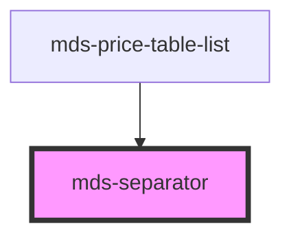

# mds-separator

This is a web-component from Maggioli Design System [Magma](https://magma.maggiolicloud.it), built with StencilJS, TypeScript, Storybook. It's based on the web-component standard and it's designed to be agnostic from the JavaScirpt framework you are using.

<!-- Auto Generated Below -->

## Dependencies

### Used by

 - [mds-price-table-list](../mds-price-table-list)

### Graph

----------------------------------------------

Built with love @ **Maggioli Informatica / R&D Department**
