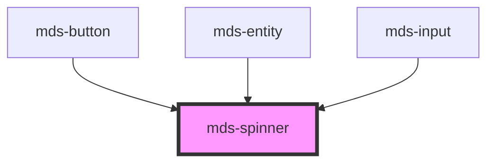

# mds-spinner


This is a web-component from Maggioli Design System [Magma](https://magma.maggiolicloud.it), built with StencilJS, TypeScript, Storybook. It's based on the web-component standard and it's designed to be agnostic from the JavaScript framework you are using.

<!-- Auto Generated Below -->


## Usage

### 1. Description

The `<mds-spinner>` web component is the Magma Design System's loading/await indicator: a self-contained, animated SVG spinner used standalone or embedded inside host components (`mds-button`, `mds-input`, `mds-entity`) to signal an in-progress, indeterminate operation. It has no HTML primitive equivalent and exposes no text content.

#### Semantic Behavior

- **Visibility is gated by `running`**: When `running` is absent/false the spinner is hidden and its animation is paused; setting `running` reveals it and starts the animation. The animation never runs while hidden, for performance.
- **No interactivity or accessibility role**: It is decorative - not focusable, emits no events, has no ARIA role, and is not form-associated. Any loading semantics (e.g. `aria-busy`) must be set by the surrounding context.
- **Reduced-motion and contrast aware**: The animation adapts under `prefers-reduced-motion` and `prefers-contrast`, so motion and color degrade gracefully without consumer intervention.

#### Properties & Visual Configurations

The component exposes a single behavioral prop:

- **`running`** is the master switch that both shows the spinner and runs its animation; treat it as a boolean presence attribute and drive it from the consuming component's loading/await state rather than toggling visibility manually.

#### Other behavioral props

- **`--mds-spinner-duration`** (CSS custom property, default `0.725s`) tunes the rotation speed of the spin animation; override it on the host to slow down or speed up the indicator without touching markup.


### 2. Pattern

Correct and idiomatic ways to use the `<mds-spinner>` component, ordered from most common to most specialized. Patterns assume a working knowledge of the variant / tone ladders documented in [`docs/COMPONENTS.md`](../../../../../../docs/COMPONENTS.md) and the generic stencil rules in [`projects/stencil/SPEC.md`](../../../../SPEC.md).

#### Basic Spinner - Hidden by Default

The component is invisible and animation-paused until `running` is set. Render it into the DOM early and toggle `running` when a request starts; removing the attribute (or setting the prop to `undefined`) hides it again when done.

```html
<!-- Spinner hidden - no running attribute -->
<mds-spinner></mds-spinner>

<!-- Spinner visible and animating -->
<mds-spinner running></mds-spinner>
```

#### Inline Loading Indicator

Place the spinner next to a label to signal that a section is loading. The spinner inherits `color: currentColor` from its parent, so it adapts to the surrounding text colour without extra CSS.

```html
<div class="loading-row">
  <mds-spinner running></mds-spinner>
  <span>Caricamento dati in corso...</span>
</div>
```

#### Full-Page or Overlay Loading State

Centre the spinner over a region with a wrapper. Drive `running` programmatically - set it when the async operation starts, remove it when done.

```html
<div class="overlay">
  <mds-spinner running></mds-spinner>
</div>
```

```css
.overlay {
  align-items: center;
  display: flex;
  inset: 0;
  justify-content: center;
  position: absolute;
}
```

#### Inside `mds-button` (via `await`)

`mds-button` manages its own internal `<mds-spinner>` automatically through its `await` prop. Do not add a separate `<mds-spinner>` next to a button - use `await` on the button itself.

```html
<!-- While an async operation is in flight -->
<mds-button label="Salvataggio in corso..." await variant="primary" tone="strong"></mds-button>
```

#### Controlling Animation Speed

Use the `--mds-spinner-duration` CSS custom property to tune the rotation speed. Set it on the host element - shorter values spin faster, longer values spin slower. Reduced-motion preferences are handled automatically by the component; this override is for brand or context-specific adjustments only.

```css
.fast-indicator mds-spinner {
  --mds-spinner-duration: 0.4s;
}

.slow-indicator mds-spinner {
  --mds-spinner-duration: 1.5s;
}
```

#### Accessible Loading Region

`<mds-spinner>` is purely decorative and carries no ARIA role. Announce the loading state to screen readers by adding `aria-busy` and `aria-live` on the surrounding container, not on the spinner itself.

```html
<section aria-busy="true" aria-live="polite" aria-label="Ricerca in corso">
  <mds-spinner running></mds-spinner>
</section>
```

#### Colour Customization via CSS Color

The spinner stroke inherits `color` from the host, so you can recolour it without touching shadow internals. Use a Magma colour token so dark mode and high-contrast modes keep working.

```css
.status-warning-spinner mds-spinner {
  color: rgb(var(--variant-warning-03));
}
```

```html
<div class="status-warning-spinner">
  <mds-spinner running></mds-spinner>
</div>
```


### 3. Antipattern

Common incorrect uses of `<mds-spinner>`. Each entry pairs the wrong form with the right one and a one-line reason. System-wide rules (boolean-as-string, shadow piercing, Tailwind color utilities, raw native event listening) live in [`docs/COMPONENTS.md`](../../../../../../docs/COMPONENTS.md#system-level-anti-patterns) - they apply here too but are not repeated.

#### Do Not Set `running="false"` to Hide the Spinner

Any non-empty string is truthy in HTML. `running="false"` is parsed as the boolean `true` and the spinner stays visible. Remove the attribute entirely - or set the prop to `undefined` - to stop and hide the spinner.

```html
<!-- 🚫 INCORRECT -->
<mds-spinner running="false"></mds-spinner>

<!-- ✅ CORRECT -->
<mds-spinner></mds-spinner>
```

#### Do Not Show Spinner Without `running` and Expect It to Animate

The spinner renders as invisible (`opacity: 0`, `transform: scale(0)`) and with the animation paused when `running` is absent. Toggling CSS visibility or opacity from outside will not start the animation - you must set the `running` attribute.

```html
<!-- 🚫 INCORRECT -->
<mds-spinner style="opacity: 1; transform: none;"></mds-spinner>

<!-- ✅ CORRECT -->
<mds-spinner running></mds-spinner>
```

#### Do Not Add ARIA Roles or Labels to the Spinner Itself

The spinner is decorative - it has no semantic content and must not become a labelled landmark or a status region. Screen readers should be informed of loading state through a parent container with `aria-busy` / `aria-live`, not through attributes placed on `<mds-spinner>`.

```html
<!-- 🚫 INCORRECT -->
<mds-spinner running role="status" aria-label="Caricamento"></mds-spinner>

<!-- ✅ CORRECT -->
<div role="status" aria-live="polite" aria-label="Caricamento">
  <mds-spinner running></mds-spinner>
</div>
```

#### Do Not Add a Separate Spinner Alongside `mds-button`

`mds-button` controls its own internal `<mds-spinner>` through the `await` prop. Adding an extra spinner next to the button produces a double indicator and breaks the button's built-in activation guard.

```html
<!-- 🚫 INCORRECT -->
<mds-button label="Salva" variant="primary"></mds-button>
<mds-spinner running></mds-spinner>

<!-- ✅ CORRECT -->
<mds-button label="Salva" await variant="primary"></mds-button>
```

#### Do Not Pierce Shadow DOM to Change the SVG Colour

The only documented customization surface is the `color` CSS property on the host (inherited by the internal stroke) and the `--mds-spinner-duration` CSS custom property. Targeting internals via `>>>` or undocumented selectors couples your code to the implementation and will break on minor releases.

```css
/* 🚫 INCORRECT */
mds-spinner >>> .await-icon svg {
  stroke: red;
}

/* ✅ CORRECT */
mds-spinner {
  color: rgb(var(--variant-error-03));
}
```

#### Do Not Override `--mds-spinner-duration` to Pause or Stop the Animation

Setting an extremely long or `infinite` duration is not a supported way to pause the spinner. Use the `running` attribute to start and stop the animation - the component manages animation-play-state itself.

```css
/* 🚫 INCORRECT */
mds-spinner {
  --mds-spinner-duration: 9999s;
}
```

```html
<!-- ✅ CORRECT - remove the attribute to stop -->
<mds-spinner></mds-spinner>
```


## Properties

| Property  | Attribute | Description                                                                         | Type                   | Default |
| --------- | --------- | ----------------------------------------------------------------------------------- | ---------------------- | ------- |
| `running` | `running` | Specifies if the animation is running or not, it's required for performance reasons | `boolean \| undefined` | `false` |


## CSS Custom Properties

| Name                     | Description                        |
| ------------------------ | ---------------------------------- |
| `--mds-spinner-duration` | Duration of the spinner animation. |


## Dependencies

### Used by

 - [mds-button](../mds-button)
 - [mds-entity](../mds-entity)
 - [mds-input](../mds-input)

### Graph


----------------------------------------------

Built with love @ [Gruppo Maggioli](https://www.maggioli.com) from [R&D Department](https://www.maggioli.com/it-it/chi-siamo/ricerca-sviluppo)
