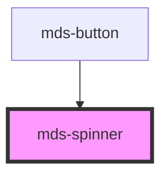

# mds-spinner

<!-- Auto Generated Below -->

## Properties

| Property  | Attribute | Description                                                                         | Type                   | Default |
| --------- | --------- | ----------------------------------------------------------------------------------- | ---------------------- | ------- |
| `running` | `running` | Specifies if the animation is running or not, it's required for performance reasons | `boolean \| undefined` | `false` |

## CSS Custom Properties

| Name                     | Description                             |
| ------------------------ | --------------------------------------- |
| `--mds-spinner-duration` | Sets the duration of the icon animation |

## Dependencies

### Used by

 - [mds-button](../mds-button)

### Graph

----------------------------------------------

Built with love @ [Gruppo Maggioli](https://www.maggioli.com) from [R&D Department](https://www.maggioli.com/it-it/chi-siamo/ricerca-sviluppo)
