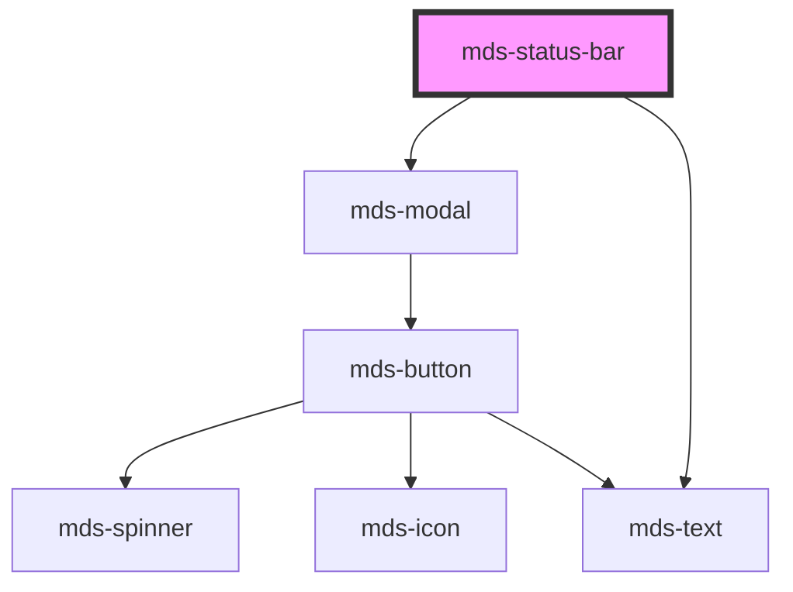

# mds-status-bar


<!-- Auto Generated Below -->


## Usage

### 1. Description

The `<mds-status-bar>` web component is a persistent action bar of the Magma Design System that docks a small set of actions (typically `mds-button` elements) to an edge of the viewport, accompanied by an optional descriptive label. It is built on top of `<mds-modal>`, reusing its positioning and overflow handling without rendering a dismissable dialog.

#### Semantic Behavior

- **Floating surface**: The bar floats over content without a blocking overlay.
- **Visibility control**: The bar shows only while `visible` is truthy; the exposed `hide()` method resets it to hidden.
- **Overflow delegation**: The `overflow` prop governs whether body scrolling is locked while the bar is shown.
- **Default slot is actions**: The default slot is intended for interactive content (recommended: `mds-button`), placed next to the optional description text.

#### Properties & Visual Configurations

- **`position`** anchors the bar to the bottom of the viewport, choosing the horizontal alignment: `'bottom-left'`, `'bottom'` (centered), or `'bottom-right'` (default).
- **`description`** renders an optional caption beside the slotted actions; omit it when the actions are self-explanatory.

#### Other behavioral props

- **`overflow`** selects how page scrolling is treated while the bar is visible: `'manual'` (default) leaves the body scrollable, `'auto'` locks scroll.
- **`visible`** can be toggled either declaratively via the attribute or imperatively via `hide()`.


### 2. Pattern

Correct and idiomatic ways to use the `<mds-status-bar>` component, ordered from most common to most specialized. Patterns assume a working knowledge of the variant / tone ladders documented in [`docs/COMPONENTS.md`](../../../../../../docs/COMPONENTS.md) and the generic stencil rules in [`projects/stencil/SPEC.md`](../../../../SPEC.md).

#### Basic Action Bar

The canonical form. Place `mds-button` elements in the default slot and show the bar by setting `visible`. The bar docks to the bottom-right corner of the viewport by default.

```html
<mds-status-bar visible>
  <mds-button id="cancel" variant="dark" tone="weak">Annulla</mds-button>
  <mds-button id="confirm" variant="primary" tone="strong">Conferma azione</mds-button>
</mds-status-bar>
```

#### Showing a Contextual Description

Use `description` to render an optional caption beside the slotted actions when the context is not obvious from the buttons alone.

```html
<mds-status-bar visible description="Stai modificando 4 elementi">
  <mds-button variant="dark" tone="weak">Annulla</mds-button>
  <mds-button variant="primary" tone="strong">Salva</mds-button>
</mds-status-bar>
```

#### Controlling Position

Use the `position` prop to anchor the bar to the bottom-left or to the bottom-center of the viewport. The default is `'bottom-right'`.

```html
<!-- Bottom-left -->
<mds-status-bar visible position="bottom-left" description="Selezione attiva">
  <mds-button variant="error" tone="outline">Elimina selezionati</mds-button>
</mds-status-bar>

<!-- Centered bottom -->
<mds-status-bar visible position="bottom" description="Azione in corso">
  <mds-button variant="primary" tone="strong">Applica</mds-button>
</mds-status-bar>
```

#### Programmatic Show / Hide

Toggle the bar imperatively: set `visible = true` to show it and call `hide()` to dismiss it. Do not set `visible = false` - remove the attribute or call `hide()` instead.

```html
<mds-button id="edit-trigger">Modifica elementi</mds-button>

<mds-status-bar id="bar" description="Stai modificando la selezione">
  <mds-button id="cancel" variant="dark" tone="weak">Annulla</mds-button>
  <mds-button id="save" variant="primary" tone="strong">Salva modifiche</mds-button>
</mds-status-bar>

<script>
  const bar = document.getElementById('bar');
  document.getElementById('edit-trigger').addEventListener('click', () => {
    bar.visible = true;
  });
  document.getElementById('cancel').addEventListener('click', () => {
    bar.hide();
  });
</script>
```

#### Async Confirm Flow

Show an in-flight state on the confirm button using `await`, then call `hide()` when the operation completes. The cancel button should be disabled while the request is in progress.

```html
<mds-status-bar id="bar" visible description="Stai modificando 3 elementi">
  <mds-button id="cancel" variant="dark" tone="weak">Annulla</mds-button>
  <mds-button id="confirm" variant="primary" tone="strong">Conferma</mds-button>
</mds-status-bar>

<script>
  const bar = document.getElementById('bar');
  const cancel = document.getElementById('cancel');
  const confirm = document.getElementById('confirm');

  confirm.addEventListener('click', async () => {
    cancel.disabled = true;
    confirm.await = true;
    confirm.textContent = 'Salvataggio in corso...';
    await saveChanges();
    bar.hide();
  });
</script>
```

#### Locking Body Scroll

Set `overflow="auto"` to prevent the page from scrolling while the status bar is open. The default `'manual'` leaves the body scrollable.

```html
<mds-status-bar visible overflow="auto" description="Salvataggio in corso">
  <mds-button variant="dark" tone="weak">Annulla</mds-button>
  <mds-button variant="primary" tone="strong" await>Salva</mds-button>
</mds-status-bar>
```

#### Styling Customization

Customize the bar only through its documented `--mds-status-bar-*` CSS custom properties and the exposed `::part()` names (`status-bar`, `status-bar-area`, `actions`). Use Magma color tokens via `rgb(var(--<token>))` so dark mode keeps working.

```css
mds-status-bar {
  --mds-status-bar-max-width: 700px;
  --mds-status-bar-backdrop: rgb(var(--tone-neutral-01) / 0.2);
  --mds-status-bar-backdrop-filter: blur(6px);
}

mds-status-bar::part(status-bar) {
  border: 1px solid rgb(var(--tone-neutral-02));
}
```


### 3. Antipattern

Common incorrect uses of `<mds-status-bar>`. Each entry pairs the wrong form with the right one and a one-line reason. System-wide rules (boolean-as-string, shadow piercing, Tailwind color utilities, raw native event listening) live in [`docs/COMPONENTS.md`](../../../../../../docs/COMPONENTS.md#system-level-anti-patterns) - they apply here too but are not repeated.

#### Do Not Set `visible="false"` to Hide the Bar

`visible` is a boolean prop. The string `"false"` is a truthy value in HTML and keeps the bar open. Remove the attribute or call the `hide()` method instead.

```html
<!-- 🚫 INCORRECT -->
<mds-status-bar visible="false">
  <mds-button variant="primary" tone="strong">Salva</mds-button>
</mds-status-bar>

<!-- ✅ CORRECT - remove the attribute -->
<mds-status-bar>
  <mds-button variant="primary" tone="strong">Salva</mds-button>
</mds-status-bar>

<!-- ✅ CORRECT - or call the method -->
<script>
  document.querySelector('mds-status-bar').hide();
</script>
```

#### Do Not Put Plain Text in the Default Slot

The default slot is intended for interactive content (recommended: `mds-button`). Bare text nodes render but receive no layout treatment and produce inaccessible output. Use the `description` prop for contextual text.

```html
<!-- 🚫 INCORRECT -->
<mds-status-bar visible>
  Stai modificando 4 elementi
  <mds-button variant="primary" tone="strong">Salva</mds-button>
</mds-status-bar>

<!-- ✅ CORRECT -->
<mds-status-bar visible description="Stai modificando 4 elementi">
  <mds-button variant="primary" tone="strong">Salva</mds-button>
</mds-status-bar>
```

#### Do Not Use an Undocumented `position` Value

`position` accepts only `'bottom'`, `'bottom-left'`, or `'bottom-right'`. Using an undocumented value (e.g. `top`, `center`) silently falls back to the default and mispositions the bar.

```html
<!-- 🚫 INCORRECT -->
<mds-status-bar visible position="top">
  <mds-button variant="primary" tone="strong">Conferma</mds-button>
</mds-status-bar>

<!-- ✅ CORRECT -->
<mds-status-bar visible position="bottom-left">
  <mds-button variant="primary" tone="strong">Conferma</mds-button>
</mds-status-bar>
```

#### Do Not Pierce the Shadow DOM to Style Internals

`::part()` is supported only for the three documented parts: `status-bar`, `status-bar-area`, and `actions`. Using undocumented internal selectors or `>>>` couples your styles to the implementation and will break on minor releases.

```css
/* 🚫 INCORRECT */
mds-status-bar::part(description) {
  font-size: 14px;
}
mds-status-bar >>> .status-bar {
  background: white;
}

/* ✅ CORRECT */
mds-status-bar {
  --mds-status-bar-backdrop: rgb(var(--tone-neutral-01) / 0.15);
  --mds-status-bar-max-width: 640px;
}
mds-status-bar::part(status-bar) {
  border: 1px solid rgb(var(--tone-neutral-02));
}
```

#### Do Not Slot `<mds-icon>` or Raw HTML for the Description

`description` is a prop. Slotting an `<mds-text>` or `<span>` into the default slot to mimic a description clutters the actions area and will compete with the layout of the slotted buttons.

```html
<!-- 🚫 INCORRECT -->
<mds-status-bar visible>
  <mds-text typography="caption">Modifica in corso</mds-text>
  <mds-button variant="primary" tone="strong">Salva</mds-button>
</mds-status-bar>

<!-- ✅ CORRECT -->
<mds-status-bar visible description="Modifica in corso">
  <mds-button variant="primary" tone="strong">Salva</mds-button>
</mds-status-bar>
```

#### Do Not Slot Non-Interactive Content as the Only Child

The default slot is designed for action controls. Placing only decorative or static elements (icons, images, plain text) provides no user action and wastes the status-bar pattern. Use `mds-banner` or `mds-note` for passive status messages.

```html
<!-- 🚫 INCORRECT -->
<mds-status-bar visible description="Operazione completata">
  <mds-icon name="mi/baseline/check-circle"></mds-icon>
</mds-status-bar>

<!-- ✅ CORRECT - use mds-banner for passive messages -->
<mds-banner variant="success" tone="weak" label="Operazione completata"></mds-banner>

<!-- ✅ CORRECT - or combine icon-button with a real action -->
<mds-status-bar visible description="Operazione completata">
  <mds-button
    icon="mi/baseline/check-circle"
    variant="success"
    tone="strong"
    aria-label="Chiudi notifica"
  ></mds-button>
</mds-status-bar>
```


## Properties

| Property      | Attribute     | Description                                                                             | Type                                          | Default          |
| ------------- | ------------- | --------------------------------------------------------------------------------------- | --------------------------------------------- | ---------------- |
| `description` | `description` | Specifies the description near the slotted actions                                      | `string \| undefined`                         | `undefined`      |
| `overflow`    | `overflow`    | Specifies if the component prevents the body from scrolling when modal window is opened | `"auto" \| "manual"`                          | `'manual'`       |
| `position`    | `position`    | Specifies the position of the status bar                                                | `"bottom" \| "bottom-left" \| "bottom-right"` | `'bottom-right'` |
| `visible`     | `visible`     | Specifies if the component is visible                                                   | `boolean \| undefined`                        | `undefined`      |


## Methods

### `hide() => Promise<void>`


#### Returns

Type: `Promise<void>`


## Slots

| Slot        | Description                                                                             |
| ----------- | --------------------------------------------------------------------------------------- |
| `"default"` | Add `HTML elements` or `components`, it is **recommended** to use `mds-button` element. |


## Shadow Parts

| Part                | Description                                                                                   |
| ------------------- | --------------------------------------------------------------------------------------------- |
| `"actions"`         | Selects the `actions` container element wrapped in shadowDOM.                                 |
| `"status-bar"`      | Selects the `status-bar` window component wrapped in shadowDOM.                               |
| `"status-bar-area"` | Selects the `status-bar-area` which wraps `status-bar` element with darker area in shadowDOM. |


## CSS Custom Properties

| Name                               | Description                                  |
| ---------------------------------- | -------------------------------------------- |
| `--mds-status-bar-backdrop`        | Background color of the status bar backdrop. |
| `--mds-status-bar-backdrop-filter` | Filter applied to the status bar backdrop.   |
| `--mds-status-bar-max-width`       | Maximum width of the status bar.             |


## Dependencies

### Depends on

- [mds-modal](../mds-modal)
- [mds-text](../mds-text)

### Graph


----------------------------------------------

Built with love @ [Gruppo Maggioli](https://www.maggioli.com) from [R&D Department](https://www.maggioli.com/it-it/chi-siamo/ricerca-sviluppo)
