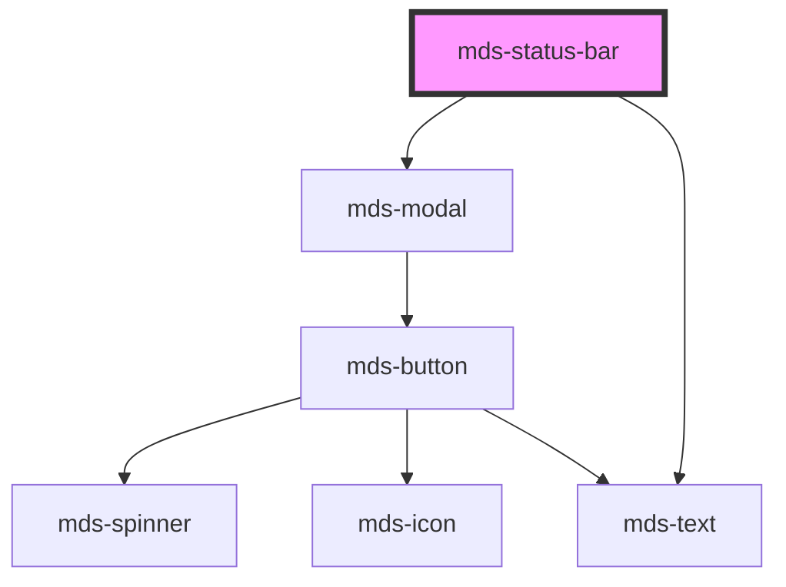

# mds-status-bar

<!-- Auto Generated Below -->

## Properties

| Property      | Attribute     | Description                                                                             | Type                   | Default     |
| ------------- | ------------- | --------------------------------------------------------------------------------------- | ---------------------- | ----------- |
| `description` | `description` | Specifies the description near the slotted actions                                      | `string \| undefined`  | `undefined` |
| `overflow`    | `overflow`    | Specifies if the component prevents the body from scrolling when modal window is opened | `"auto" \| "manual"`   | `'manual'`  |
| `visible`     | `visible`     | Specifies if the component is visible                                                   | `boolean \| undefined` | `undefined` |

## Methods

### `hide() => Promise<void>`

#### Returns

Type: `Promise<void>`

## Slots

| Slot        | Description                                                                             |
| ----------- | --------------------------------------------------------------------------------------- |
| `"default"` | Add `HTML elements` or `components`, it is **recommended** to use `mds-button` element. |

## Shadow Parts

| Part                | Description                                                                                   |
| ------------------- | --------------------------------------------------------------------------------------------- |
| `"status-bar"`      | Selects the `status-bar` window component wrapped in shadowDOM.                               |
| `"status-bar-area"` | Selects the `status-bar-area` which wraps `status-bar` element with darker area in shadowDOM. |

## Dependencies

### Depends on

- [mds-modal](../mds-modal)
- [mds-text](../mds-text)

### Graph

----------------------------------------------

Built with love @ [Gruppo Maggioli](https://www.maggioli.com) from [R&D Department](https://www.maggioli.com/it-it/chi-siamo/ricerca-sviluppo)
