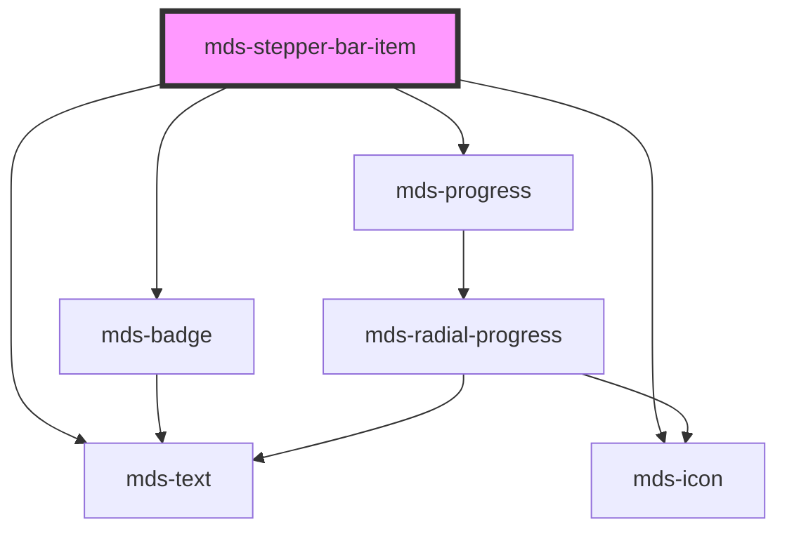

# mds-stepper-bar-item


This is a web-component from Maggioli Design System [Magma](https://magma.maggiolicloud.it), built with StencilJS, TypeScript, Storybook. It's based on the web-component standard and it's designed to be agnostic from the JavaScript framework you are using.

<!-- Auto Generated Below -->


## Usage

### 1. Description

The `<mds-stepper-bar-item>` web component represents a single step inside a [`<mds-stepper-bar>`](../../mds-stepper-bar) progress indicator, rendering the step's icon, optional ordinal label, descriptive text and status badge. It has no standalone meaning: it is the unit the parent stepper orchestrates to express a sequential, multi-step flow.

#### Semantic Behavior

- **Compound child only**: Must be placed as a direct default-slot child of `<mds-stepper-bar>`; it is not used standalone or mixed with other child types in that slot.
- **State driven by the parent**: The `done` and `current` props are not set per item by the consumer - the parent's `itemsDone` prop drives `done`/`current` on each child, so an item's visual state is a function of its position relative to the active step.
- **Index resolution**: The item computes its own ordinal from its position among the parent's children; this index feeds the localized "step N" caption rendered when `step` is enabled.
- **Three-way status badge**: When `badge` is true the item renders a status badge whose variant and localized text reflect the resolved state - `success`/done, `info`/current, or `dark`/queued.
- **Icon swap on completion**: The displayed icon switches from `icon` to `iconChecked` once the item is done and no longer current.
- **Selection event bubbles up**: It emits `mdsStepperBarItemDone` (detail `{ value }`), which the parent listens for to mark this item current and recompute the flow. The item is keyboard-activatable.
- **Localization**: Step, badge and status strings are localized (el/en/es/it).

#### Properties & Visual Configurations

Most state props are managed by the parent rather than the consumer. The props worth configuring directly on each item are:

- **`icon` / `iconChecked`**: Set `icon` for the default and current appearance; set `iconChecked` only when the completed step should show a different glyph (it defaults to `icon`).
- **`step`**: Enable to surface the auto-numbered "step N" caption above the label - use it for explicitly ordered flows where the number aids orientation.
- **`badge`**: Enable to show the queued/current/done status pill; prefer it when status legibility matters more than horizontal compactness.
- **`value`**: The token carried in the `mdsStepperBarItemDone` event detail; set it so the parent can aggregate which steps have been completed.
- **`typography`**: Overrides the label's typography token (defaults to `h6`); lower it for denser bars.


### 2. Pattern

Correct and idiomatic ways to use the `<mds-stepper-bar-item>` component, ordered from most common to most specialized. Patterns assume a working knowledge of the compound component rules documented in [`docs/COMPONENTS.md`](../../../../../../docs/COMPONENTS.md) and the generic stencil rules in [`projects/stencil/SPEC.md`](../../../../SPEC.md).

#### Minimal Step Inside a Stepper Bar

Place `<mds-stepper-bar-item>` elements as direct children of [`<mds-stepper-bar>`](../../mds-stepper-bar). Each item requires `label` and `icon`. `items-done` on the parent drives the `done` and `current` state of each child automatically.

```html
<mds-stepper-bar items-done="1">
  <mds-stepper-bar-item
    icon="mi/baseline/person"
    label="Dati personali"
  ></mds-stepper-bar-item>
  <mds-stepper-bar-item
    icon="mi/baseline/location-on"
    label="Indirizzo"
  ></mds-stepper-bar-item>
  <mds-stepper-bar-item
    icon="mi/baseline/payment"
    label="Pagamento"
  ></mds-stepper-bar-item>
</mds-stepper-bar>
```

#### Distinct Icon for the Completed State

Set `icon-checked` to a different slug when the done state should show a different glyph - for example a checkmark. When omitted, `icon-checked` defaults to `icon`.

```html
<mds-stepper-bar items-done="2">
  <mds-stepper-bar-item
    icon="mi/baseline/person"
    icon-checked="mi/baseline/done"
    label="Dati personali"
  ></mds-stepper-bar-item>
  <mds-stepper-bar-item
    icon="mi/baseline/location-on"
    icon-checked="mi/baseline/done"
    label="Indirizzo"
  ></mds-stepper-bar-item>
  <mds-stepper-bar-item
    icon="mi/baseline/payment"
    icon-checked="mi/baseline/done"
    label="Pagamento"
  ></mds-stepper-bar-item>
</mds-stepper-bar>
```

#### Showing the Ordinal Caption with `step`

Set the boolean `step` attribute to surface an auto-numbered "Step N" caption above the label. Use this for explicitly ordered flows where the ordinal number aids orientation.

```html
<mds-stepper-bar items-done="1">
  <mds-stepper-bar-item
    step
    icon="mi/baseline/person"
    icon-checked="mi/baseline/done"
    label="Dati personali"
  ></mds-stepper-bar-item>
  <mds-stepper-bar-item
    step
    icon="mi/baseline/location-on"
    icon-checked="mi/baseline/done"
    label="Indirizzo"
  ></mds-stepper-bar-item>
  <mds-stepper-bar-item
    step
    icon="mi/baseline/payment"
    icon-checked="mi/baseline/done"
    label="Pagamento"
  ></mds-stepper-bar-item>
</mds-stepper-bar>
```

#### Status Badge via `badge`

Set `badge` to show the localized status pill (Completato / In corso / In coda). Prefer this when status legibility matters more than horizontal compactness.

```html
<mds-stepper-bar items-done="2">
  <mds-stepper-bar-item
    badge
    icon="mi/baseline/person"
    icon-checked="mi/baseline/done"
    label="Dati personali"
  ></mds-stepper-bar-item>
  <mds-stepper-bar-item
    badge
    icon="mi/baseline/location-on"
    icon-checked="mi/baseline/done"
    label="Indirizzo"
  ></mds-stepper-bar-item>
  <mds-stepper-bar-item
    badge
    icon="mi/baseline/payment"
    label="Pagamento"
  ></mds-stepper-bar-item>
</mds-stepper-bar>
```

#### Carrying a Value for Event Handling

Set `value` on each item so the `mdsStepperBarItemDone` event carries a meaningful identifier. Listen to the event on the parent or a common ancestor.

```html
<mds-stepper-bar id="stepper" items-done="1">
  <mds-stepper-bar-item
    value="dati-personali"
    icon="mi/baseline/person"
    icon-checked="mi/baseline/done"
    label="Dati personali"
  ></mds-stepper-bar-item>
  <mds-stepper-bar-item
    value="indirizzo"
    icon="mi/baseline/location-on"
    icon-checked="mi/baseline/done"
    label="Indirizzo"
  ></mds-stepper-bar-item>
  <mds-stepper-bar-item
    value="pagamento"
    icon="mi/baseline/payment"
    icon-checked="mi/baseline/done"
    label="Pagamento"
  ></mds-stepper-bar-item>
</mds-stepper-bar>

<script>
  document.getElementById('stepper').addEventListener('mdsStepperBarChange', (e) => {
    console.log('step completati:', e.detail.value, 'step corrente:', e.detail.step);
  });
</script>
```

#### Pairing Step Content via the `content` Slot

Place panel elements with `slot="content"` inside `<mds-stepper-bar>` - one per item in order. The parent shows only the panel matching the current step.

```html
<mds-stepper-bar items-done="1">
  <mds-stepper-bar-item icon="mi/baseline/person" icon-checked="mi/baseline/done" label="Dati personali"></mds-stepper-bar-item>
  <mds-stepper-bar-item icon="mi/baseline/location-on" icon-checked="mi/baseline/done" label="Indirizzo"></mds-stepper-bar-item>
  <mds-stepper-bar-item icon="mi/baseline/payment" label="Pagamento"></mds-stepper-bar-item>

  <div slot="content">
    <p>Inserisci il tuo nome e cognome.</p>
  </div>
  <div slot="content">
    <p>Inserisci il tuo indirizzo di spedizione.</p>
  </div>
  <div slot="content">
    <p>Scegli il metodo di pagamento.</p>
  </div>
</mds-stepper-bar>
```

#### Reducing Label Typography for Dense Bars

Lower the `typography` prop (default `h6`) when horizontal space is tight or when the label must blend with smaller surrounding text.

```html
<mds-stepper-bar items-done="1">
  <mds-stepper-bar-item
    typography="label"
    icon="mi/baseline/person"
    icon-checked="mi/baseline/done"
    label="Dati personali"
  ></mds-stepper-bar-item>
  <mds-stepper-bar-item
    typography="label"
    icon="mi/baseline/location-on"
    icon-checked="mi/baseline/done"
    label="Indirizzo"
  ></mds-stepper-bar-item>
  <mds-stepper-bar-item
    typography="label"
    icon="mi/baseline/payment"
    label="Pagamento"
  ></mds-stepper-bar-item>
</mds-stepper-bar>
```

#### Styling Customization

Style items only through the documented `--mds-stepper-bar-item-*` CSS custom properties. Use Magma color tokens via `rgb(var(--<token>))` so dark mode and high-contrast modes keep working. Target the `::part(badge)` surface only when a deep visual override of the badge wrapper is required.

```css
.checkout-flow mds-stepper-bar-item {
  --mds-stepper-bar-item-icon-background-current: rgb(var(--variant-secondary-04));
  --mds-stepper-bar-item-icon-color-current: rgb(var(--tone-neutral));
  --mds-stepper-bar-item-icon-background-done: rgb(var(--status-success-05));
  --mds-stepper-bar-item-progress-color: rgb(var(--status-success-04));
  --mds-stepper-bar-item-min-width: 160px;
}
```


### 3. Antipattern

Common incorrect uses of `<mds-stepper-bar-item>`. Each entry pairs the wrong form with the right one and a one-line reason. System-wide rules (boolean-as-string, shadow piercing, Tailwind color utilities, raw native event listening) live in [`docs/COMPONENTS.md`](../../../../../../docs/COMPONENTS.md#system-level-anti-patterns) - they apply here too but are not repeated.

#### Do Not Use Outside `<mds-stepper-bar>`

`<mds-stepper-bar-item>` is a compound child - its state (`done`, `current`, index) is resolved by the parent. Using it standalone leaves `isDone`, `isCurrent` and `index` at their defaults and produces broken visual output.

```html
<!-- 🚫 INCORRECT -->
<mds-stepper-bar-item icon="mi/baseline/person" label="Dati personali"></mds-stepper-bar-item>

<!-- ✅ CORRECT -->
<mds-stepper-bar items-done="1">
  <mds-stepper-bar-item icon="mi/baseline/person" icon-checked="mi/baseline/done" label="Dati personali"></mds-stepper-bar-item>
  <mds-stepper-bar-item icon="mi/baseline/location-on" icon-checked="mi/baseline/done" label="Indirizzo"></mds-stepper-bar-item>
</mds-stepper-bar>
```

#### Do Not Set `done="false"` or `current="false"` as Strings

`done` and `current` are boolean props; any non-empty string value is truthy in HTML. To turn them off, remove the attribute or let the parent manage state via `items-done`.

```html
<!-- 🚫 INCORRECT -->
<mds-stepper-bar-item done="false" current="false" icon="mi/baseline/payment" label="Pagamento"></mds-stepper-bar-item>

<!-- ✅ CORRECT -->
<mds-stepper-bar-item icon="mi/baseline/payment" label="Pagamento"></mds-stepper-bar-item>
```

#### Do Not Override State Manually When the Parent Manages It

`done` and `current` are driven by `<mds-stepper-bar>`'s `items-done` prop. Setting them on individual items and also setting `items-done` creates conflicting state that the parent overwrites on each render cycle.

```html
<!-- 🚫 INCORRECT -->
<mds-stepper-bar items-done="2">
  <mds-stepper-bar-item done current icon="mi/baseline/person" label="Dati personali"></mds-stepper-bar-item>
  <mds-stepper-bar-item icon="mi/baseline/location-on" label="Indirizzo"></mds-stepper-bar-item>
</mds-stepper-bar>

<!-- ✅ CORRECT -->
<mds-stepper-bar items-done="2">
  <mds-stepper-bar-item icon="mi/baseline/person" icon-checked="mi/baseline/done" label="Dati personali"></mds-stepper-bar-item>
  <mds-stepper-bar-item icon="mi/baseline/location-on" icon-checked="mi/baseline/done" label="Indirizzo"></mds-stepper-bar-item>
</mds-stepper-bar>
```

#### Do Not Wrap Items in Extra HTML Elements

The parent queries `mds-stepper-bar-item` elements directly; a wrapper `<div>` or `<li>` breaks the parent-child communication, index resolution and scroll alignment.

```html
<!-- 🚫 INCORRECT -->
<mds-stepper-bar items-done="1">
  <div>
    <mds-stepper-bar-item icon="mi/baseline/person" label="Dati personali"></mds-stepper-bar-item>
  </div>
  <div>
    <mds-stepper-bar-item icon="mi/baseline/location-on" label="Indirizzo"></mds-stepper-bar-item>
  </div>
</mds-stepper-bar>

<!-- ✅ CORRECT -->
<mds-stepper-bar items-done="1">
  <mds-stepper-bar-item icon="mi/baseline/person" icon-checked="mi/baseline/done" label="Dati personali"></mds-stepper-bar-item>
  <mds-stepper-bar-item icon="mi/baseline/location-on" icon-checked="mi/baseline/done" label="Indirizzo"></mds-stepper-bar-item>
</mds-stepper-bar>
```

#### Do Not Use Undocumented `::part()` Targets to Style the Icon or Progress

The only documented shadow part is `badge`. Targeting internals such as `::part(icon)` or `::part(progress)` couples code to the private Shadow DOM structure and will break on minor releases. Use the `--mds-stepper-bar-item-*` CSS custom properties instead.

```css
/* 🚫 INCORRECT */
mds-stepper-bar-item::part(icon) {
  background-color: purple;
}
mds-stepper-bar-item::part(progress) {
  height: 6px;
}

/* ✅ CORRECT */
mds-stepper-bar-item {
  --mds-stepper-bar-item-icon-background-current: rgb(var(--variant-primary-04));
  --mds-stepper-bar-item-progress-thickness: var(--height-200);
}
```

#### Do Not Omit `label` or `icon`

Both are required props. An item without `label` has no accessible or visual description; an item without `icon` leaves the icon area empty and breaks the progress-line layout.

```html
<!-- 🚫 INCORRECT -->
<mds-stepper-bar items-done="1">
  <mds-stepper-bar-item label="Dati personali"></mds-stepper-bar-item>
  <mds-stepper-bar-item icon="mi/baseline/location-on"></mds-stepper-bar-item>
</mds-stepper-bar>

<!-- ✅ CORRECT -->
<mds-stepper-bar items-done="1">
  <mds-stepper-bar-item icon="mi/baseline/person" label="Dati personali"></mds-stepper-bar-item>
  <mds-stepper-bar-item icon="mi/baseline/location-on" label="Indirizzo"></mds-stepper-bar-item>
</mds-stepper-bar>
```


## Properties

| Property             | Attribute      | Description                                                                           | Type                                                                                                                                                                   | Default     |
| -------------------- | -------------- | ------------------------------------------------------------------------------------- | ---------------------------------------------------------------------------------------------------------------------------------------------------------------------- | ----------- |
| `badge`              | `badge`        | Specifies if the badge status is displayed                                            | `boolean`                                                                                                                                                              | `undefined` |
| `current`            | `current`      | Specifies if the component is the current or not                                      | `boolean`                                                                                                                                                              | `false`     |
| `done`               | `done`         | Specifies if the component is checked or not                                          | `boolean`                                                                                                                                                              | `false`     |
| `icon` _(required)_  | `icon`         | Specifies the icon displayed of the component when is not checked or the current item | `string`                                                                                                                                                               | `undefined` |
| `iconChecked`        | `icon-checked` | Specifies the icon displayed of the component when is checked                         | `string \| undefined`                                                                                                                                                  | `this.icon` |
| `label` _(required)_ | `label`        | Specifies a short description of the component                                        | `string`                                                                                                                                                               | `undefined` |
| `step`               | `step`         | Specifies if the step is displayed                                                    | `boolean`                                                                                                                                                              | `undefined` |
| `typography`         | `typography`   | Specifies the typography of the element                                               | `"action" \| "caption" \| "detail" \| "h1" \| "h2" \| "h3" \| "h4" \| "h5" \| "h6" \| "hack" \| "label" \| "option" \| "paragraph" \| "snippet" \| "tip" \| undefined` | `'h6'`      |
| `value`              | `value`        | Specifies the value the component will return mdsStepperBarItemSelect event           | `string \| undefined`                                                                                                                                                  | `undefined` |


## Events

| Event                   | Description                          | Type                                        |
| ----------------------- | ------------------------------------ | ------------------------------------------- |
| `mdsStepperBarItemDone` | Emits when the accordion is selected | `CustomEvent<MdsStepperBarItemEventDetail>` |


## Methods

### `updateLang() => Promise<void>`

Updates the component's texts to the locale currently set on the host element.

#### Returns

Type: `Promise<void>`


## Shadow Parts

| Part      | Description       |
| --------- | ----------------- |
| `"badge"` | The badge wrapper |


## CSS Custom Properties

| Name                                             | Description                                                         |
| ------------------------------------------------ | ------------------------------------------------------------------- |
| `--mds-stepper-bar-item-color`                   | Sets the color of the text                                          |
| `--mds-stepper-bar-item-duaration`               | Sets the duration of the animation                                  |
| `--mds-stepper-bar-item-icon-background`         | Sets the background-color of the icon                               |
| `--mds-stepper-bar-item-icon-background-current` | Sets the background-color of the icon when the component is current |
| `--mds-stepper-bar-item-icon-background-done`    | Sets the background-color of the icon when the component is done    |
| `--mds-stepper-bar-item-icon-color`              | Sets the color of the icon                                          |
| `--mds-stepper-bar-item-icon-color-current`      | Sets the color of the icon when the component is current            |
| `--mds-stepper-bar-item-icon-color-done`         | Sets the color of the icon when the component is done               |
| `--mds-stepper-bar-item-min-width`               | Sets the minimum width of the component                             |
| `--mds-stepper-bar-item-progress-background`     | Sets the background color of the progress bar                       |
| `--mds-stepper-bar-item-progress-color`          | Sets the color of the progress bar                                  |
| `--mds-stepper-bar-item-progress-thickness`      | Sets the thickness of the progress bar                              |


## Dependencies

### Depends on

- [mds-badge](../mds-badge)
- [mds-icon](../mds-icon)
- [mds-progress](../mds-progress)
- [mds-text](../mds-text)

### Graph


----------------------------------------------

Built with love @ [Gruppo Maggioli](https://www.maggioli.com) from [R&D Department](https://www.maggioli.com/it-it/chi-siamo/ricerca-sviluppo)
