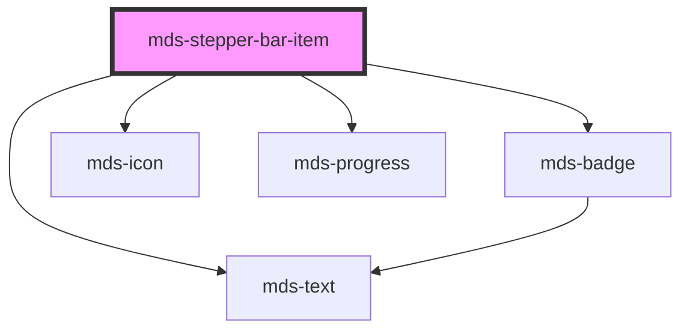

# mds-stepper-bar-item

<!-- Auto Generated Below -->

## Properties

| Property            | Attribute      | Description                                                                           | Type                                                                                                                                                      | Default     |
| ------------------- | -------------- | ------------------------------------------------------------------------------------- | --------------------------------------------------------------------------------------------------------------------------------------------------------- | ----------- |
| `badge`             | `badge`        | Specifies if the badge status is displayed                                            | `boolean`                                                                                                                                                 | `undefined` |
| `checked`           | `checked`      | Specifies if the component is checked or not                                          | `boolean`                                                                                                                                                 | `undefined` |
| `current`           | `current`      | Specifies if the component is the current or not                                      | `boolean`                                                                                                                                                 | `undefined` |
| `icon` _(required)_ | `icon`         | Specifies the icon displayed of the component when is not checked or the current item | `string`                                                                                                                                                  | `undefined` |
| `iconChecked`       | `icon-checked` | Specifies the icon displayed of the component when is checked                         | `string`                                                                                                                                                  | `this.icon` |
| `step`              | `step`         | Specifies if the step is displayed                                                    | `boolean`                                                                                                                                                 | `undefined` |
| `text` _(required)_ | `text`         | Specifies a short description of the component                                        | `string`                                                                                                                                                  | `undefined` |
| `typography`        | `typography`   | Specifies the typography of the element                                               | `"action" \| "caption" \| "detail" \| "h1" \| "h2" \| "h3" \| "h4" \| "h5" \| "h6" \| "hack" \| "label" \| "option" \| "paragraph" \| "snippet" \| "tip"` | `'h6'`      |

## Events

| Event          | Description                         | Type                  |
| -------------- | ----------------------------------- | --------------------- |
| `currentEvent` | Emits when the accordion is current | `CustomEvent<string>` |

## CSS Custom Properties

| Name                        | Description                                                         |
| --------------------------- | ------------------------------------------------------------------- |
| `--color`                   | Sets the color of the text                                          |
| `--duaration`               | Sets the duration of the animation                                  |
| `--icon-background`         | Sets the background-color of the icon                               |
| `--icon-background-checked` | Sets the background-color of the icon when the component is checked |
| `--icon-background-current` | Sets the background-color of the icon when the component is current |
| `--icon-color`              | Sets the color of the icon                                          |
| `--icon-color-checked`      | Sets the color of the icon when the component is checked            |
| `--icon-color-current`      | Sets the color of the icon when the component is current            |
| `--icon-ring-size`          | Sets the size of the icon circle when the component is current      |
| `--min-width`               | Sets the minimum width of the component                             |
| `--progress-background`     | Sets the background color of the progress bar                       |
| `--progress-color`          | Sets the color of the progress bar                                  |
| `--progress-thickness`      | Sets the thickness of the progress bar                              |

## Dependencies

### Depends on

- [mds-badge](../mds-badge)
- [mds-icon](../mds-icon)
- [mds-progress](../mds-progress)
- [mds-text](../mds-text)

### Graph

----------------------------------------------

Built with love @ **Maggioli Informatica / R&D Department**
