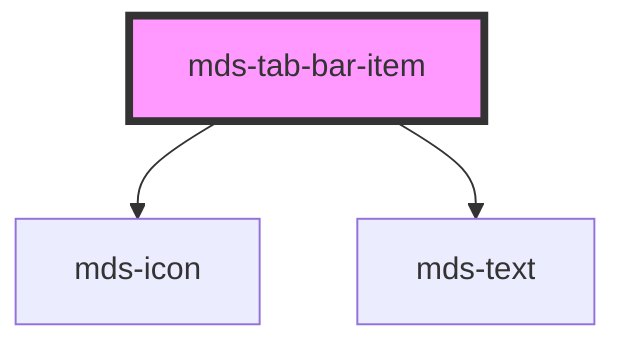

# mds-tab-bar-item

<!-- Auto Generated Below -->

## Properties

| Property     | Attribute    | Description                                   | Type                             | Default     |
| ------------ | ------------ | --------------------------------------------- | -------------------------------- | ----------- |
| `icon`       | `icon`       |                                               | `string`                         | `''`        |
| `selected`   | `selected`   | Specifies if the component is selected or not | `boolean`                        | `undefined` |
| `typography` | `typography` | Specifies the typography of the element       | `"option" \| "tip" \| undefined` | `'tip'`     |

## Events

| Event                 | Description                          | Type                  |
| --------------------- | ------------------------------------ | --------------------- |
| `mdsTabBarItemSelect` | Emits when the component is selected | `CustomEvent<string>` |

## Slots

| Slot        | Description                                                                            |
| ----------- | -------------------------------------------------------------------------------------- |
| `"default"` | Add `text string` to this slot, **avoid** to add `HTML elements` or `components` here. |

## CSS Custom Properties

| Name                                     | Description                                                   |
| ---------------------------------------- | ------------------------------------------------------------- |
| `--mds-tab-bar-item-background`          | Sets the background-color of the component                    |
| `--mds-tab-bar-item-background-selected` | Sets the background-color of the component when it's selected |
| `--mds-tab-bar-item-color`               | Sets the text color of the component                          |
| `--mds-tab-bar-item-color-selected`      | Sets the text color of the component when it's selected       |

## Dependencies

### Depends on

- [mds-icon](../mds-icon)
- [mds-text](../mds-text)

### Graph

----------------------------------------------

Built with love @ [Gruppo Maggioli](https://www.maggioli.com) from [R&D Department](https://www.maggioli.com/it-it/chi-siamo/ricerca-sviluppo)
