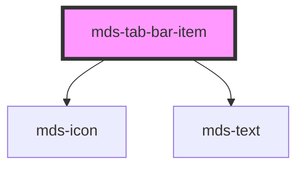

# mds-tab-bar-item


This is a web-component from Maggioli Design System [Magma](https://magma.maggiolicloud.it), built with StencilJS, TypeScript, Storybook. It's based on the web-component standard and it's designed to be agnostic from the JavaScript framework you are using.

<!-- Auto Generated Below -->


## Usage

### 1. Description

The `<mds-tab-bar-item>` web component is a single selectable tab within the [`<mds-tab-bar>`](../../mds-tab-bar) container. It renders an icon stacked over a text label and acts as one option in the bar's mutually-exclusive selection group.

#### Semantic Behavior

- **Compound child only**: Must be placed as a direct default-slot child of `<mds-tab-bar>`; it is not used standalone or mixed with other child types.
- **Parent-coordinated selection**: Clicking the item, when becoming selected, emits `mdsTabBarItemSelect` carrying its own `id`. The parent re-drives every sibling's `selected` so exactly one item is active at a time - items do not deselect each other on their own.
- **Whole-host click target**: The entire item (icon + label) is the click surface, not just the text.
- **Label is text**: Set the visible text with the `label` prop. The default slot is a **deprecated** fallback kept for backward compatibility - slotted text is read into `label` and a console warning is emitted; avoid placing HTML elements or other components there.

#### Properties & Visual Configurations

- **`icon`**: Icon name shown above the label; use it to give the tab a recognizable glyph. Optional - defaults to empty.
- **`label`**: The tab's visible text. This is the preferred and idiomatic way to set the text, matching the `label` prop on [`mds-button`](../../mds-button) and other Magma components.
- **`selected`**: Marks this item as the active tab. You typically do not toggle it manually at runtime - the parent manages it - but you can set it on one item as the initial active tab.
- **`typography`**: Controls the label's text style, constrained to the smaller typography set (`tip` by default, or `option`). Pick `option` for a slightly more prominent label.

The active vs. resting appearance is configured through the `--mds-tab-bar-item-*` CSS custom properties (background and color, each with a `-selected` variant) listed in `readme.md`.


### 2. Pattern

Correct and idiomatic ways to use the `<mds-tab-bar-item>` component, ordered from most common to most specialized. Patterns assume a working knowledge of the compound component rules documented in [`docs/COMPONENTS.md`](../../../../../../docs/COMPONENTS.md) and the generic stencil rules in [`projects/stencil/SPEC.md`](../../../../SPEC.md).

#### Basic Tab Bar

The canonical form. Place all items directly inside `<mds-tab-bar>`. Give each item an `icon` and set its text with the `label` prop. The parent assigns `id`s automatically and coordinates selection.

```html
<mds-tab-bar>
  <mds-tab-bar-item icon="mi/baseline/home" label="Home"></mds-tab-bar-item>
  <mds-tab-bar-item icon="mi/baseline/search" label="Cerca"></mds-tab-bar-item>
  <mds-tab-bar-item icon="mi/baseline/notifications" label="Notifiche"></mds-tab-bar-item>
  <mds-tab-bar-item icon="mi/baseline/person" label="Profilo"></mds-tab-bar-item>
</mds-tab-bar>
```

#### Setting the Initial Active Tab

Mark one item as pre-selected on first render with the `selected` boolean attribute. Do not set more than one item as `selected` - the parent enforces mutual exclusivity once the first click event fires.

```html
<mds-tab-bar>
  <mds-tab-bar-item icon="mi/baseline/home" label="Home" selected></mds-tab-bar-item>
  <mds-tab-bar-item icon="mi/baseline/search" label="Cerca"></mds-tab-bar-item>
  <mds-tab-bar-item icon="mi/baseline/notifications" label="Notifiche"></mds-tab-bar-item>
</mds-tab-bar>
```

#### Listening for Selection Changes

Listen to `mdsTabBarItemSelect` on the item to react when a specific tab becomes active, or listen to `mdsTabBarChange` on the parent to receive the zero-based index of the newly selected item.

```html
<mds-tab-bar id="main-nav">
  <mds-tab-bar-item icon="mi/baseline/home" label="Home"></mds-tab-bar-item>
  <mds-tab-bar-item icon="mi/baseline/search" label="Cerca"></mds-tab-bar-item>
  <mds-tab-bar-item icon="mi/baseline/person" label="Profilo"></mds-tab-bar-item>
</mds-tab-bar>

<script>
  document.querySelector('#main-nav').addEventListener('mdsTabBarChange', (e) => {
    console.log('tab selezionato:', e.detail.index);
  });
</script>
```

#### Driving Selection Programmatically

Set the `selected` prop on the desired item from JavaScript. The `@Watch('selected')` on the item syncs the visual state; the parent picks it up on the next interaction.

```html
<mds-tab-bar id="wizard-nav">
  <mds-tab-bar-item id="step-profilo" icon="mi/baseline/person" label="Profilo"></mds-tab-bar-item>
  <mds-tab-bar-item id="step-sicurezza" icon="mi/baseline/lock" label="Sicurezza"></mds-tab-bar-item>
  <mds-tab-bar-item
    id="step-notifiche"
    icon="mi/baseline/notifications"
    label="Notifiche"
  ></mds-tab-bar-item>
</mds-tab-bar>

<script>
  document.querySelector('#step-sicurezza').selected = true;
</script>
```

#### Larger Label Typography

Use `typography="option"` for a slightly more prominent label when the tab bar sits in a layout where `tip` (the default) reads too small.

```html
<mds-tab-bar>
  <mds-tab-bar-item
    icon="mi/baseline/dashboard"
    label="Dashboard"
    typography="option"
    selected
  ></mds-tab-bar-item>
  <mds-tab-bar-item
    icon="mi/baseline/bar-chart"
    label="Statistiche"
    typography="option"
  ></mds-tab-bar-item>
  <mds-tab-bar-item
    icon="mi/baseline/settings"
    label="Impostazioni"
    typography="option"
  ></mds-tab-bar-item>
</mds-tab-bar>
```

#### Styling Customization

Override colors through the four documented `--mds-tab-bar-item-*` CSS custom properties. Set them on the host or a parent selector; use Magma color tokens via `rgb(var(--<token>))` so dark mode keeps working.

```css
.app-bottom-nav mds-tab-bar-item {
  --mds-tab-bar-item-background: rgb(var(--tone-neutral-09));
  --mds-tab-bar-item-color: rgb(var(--tone-neutral-05));
  --mds-tab-bar-item-background-selected: rgb(var(--variant-primary-10));
  --mds-tab-bar-item-color-selected: rgb(var(--variant-primary-02));
}
```


### 3. Antipattern

Common incorrect uses of `<mds-tab-bar-item>`. Each entry pairs the wrong form with the right one and a one-line reason. System-wide rules (boolean-as-string, shadow piercing, Tailwind color utilities, raw native event listening) live in [`docs/COMPONENTS.md`](../../../../../../docs/COMPONENTS.md#system-level-anti-patterns) - they apply here too but are not repeated.

#### Do Not Use Outside `<mds-tab-bar>`

`<mds-tab-bar-item>` relies on the parent to assign its `id`, listen for `mdsTabBarItemSelect`, and drive mutual exclusivity. Without the parent, the item has no stable id, selection does not propagate, and no other item is deselected when this one is clicked.

```html
<!-- 🚫 INCORRECT -->
<mds-tab-bar-item icon="mi/baseline/home" label="Home" selected></mds-tab-bar-item>

<!-- ✅ CORRECT -->
<mds-tab-bar>
  <mds-tab-bar-item icon="mi/baseline/home" label="Home" selected></mds-tab-bar-item>
  <mds-tab-bar-item icon="mi/baseline/search" label="Cerca"></mds-tab-bar-item>
</mds-tab-bar>
```

#### Do Not Use the Deprecated Default Slot for Text

Setting the text via the default slot is deprecated. Slotted text is read into `label` with a console warning, and any nested HTML is stripped. Use the `label` prop instead.

```html
<!-- 🚫 INCORRECT -->
<mds-tab-bar>
  <mds-tab-bar-item icon="mi/baseline/home">Home</mds-tab-bar-item>
  <mds-tab-bar-item icon="mi/baseline/search"><strong>Cerca</strong></mds-tab-bar-item>
</mds-tab-bar>

<!-- ✅ CORRECT -->
<mds-tab-bar>
  <mds-tab-bar-item icon="mi/baseline/home" label="Home"></mds-tab-bar-item>
  <mds-tab-bar-item icon="mi/baseline/search" label="Cerca"></mds-tab-bar-item>
</mds-tab-bar>
```

#### Do Not Slot `<mds-icon>` to Add an Icon

The `icon` prop renders the glyph through the shared icon service and positions it above the label automatically. Slotting `<mds-icon>` puts it in the deprecated default slot, where it is stripped and misaligns.

```html
<!-- 🚫 INCORRECT -->
<mds-tab-bar>
  <mds-tab-bar-item>
    <mds-icon name="mi/baseline/home"></mds-icon>
    Home
  </mds-tab-bar-item>
</mds-tab-bar>

<!-- ✅ CORRECT -->
<mds-tab-bar>
  <mds-tab-bar-item icon="mi/baseline/home" label="Home"></mds-tab-bar-item>
</mds-tab-bar>
```

#### Do Not Set `selected="false"` to Deselect

`selected` is a boolean attribute. Any non-empty string value - including `"false"` - is truthy in HTML and keeps the item selected. Remove the attribute or set the property to `undefined` to deselect.

```html
<!-- 🚫 INCORRECT -->
<mds-tab-bar>
  <mds-tab-bar-item icon="mi/baseline/home" label="Home" selected="false"></mds-tab-bar-item>
</mds-tab-bar>

<!-- ✅ CORRECT -->
<mds-tab-bar>
  <mds-tab-bar-item icon="mi/baseline/home" label="Home"></mds-tab-bar-item>
</mds-tab-bar>
```

#### Do Not Listen to Raw Click Events for Tab Changes

`<mds-tab-bar-item>` emits `mdsTabBarItemSelect` when selected; `<mds-tab-bar>` re-emits `mdsTabBarChange` with the resolved index. Listening to the native `click` event bypasses the parent's mutual-exclusivity logic and may fire before `selected` is updated.

```html
<!-- 🚫 INCORRECT -->
<mds-tab-bar id="nav">
  <mds-tab-bar-item icon="mi/baseline/home" label="Home"></mds-tab-bar-item>
</mds-tab-bar>
<script>
  document.querySelector('mds-tab-bar-item').addEventListener('click', handler);
</script>

<!-- ✅ CORRECT -->
<mds-tab-bar id="nav">
  <mds-tab-bar-item icon="mi/baseline/home" label="Home"></mds-tab-bar-item>
</mds-tab-bar>
<script>
  document.querySelector('#nav').addEventListener('mdsTabBarChange', handler);
</script>
```

#### Do Not Use an Invalid `typography` Value

`typography` accepts only `"tip"` (default) or `"option"`. Passing any other value - such as `"caption"` or `"label"` - is outside the typed `TypographySmallerType` and silently falls back to the default.

```html
<!-- 🚫 INCORRECT -->
<mds-tab-bar>
  <mds-tab-bar-item icon="mi/baseline/home" label="Home" typography="caption"></mds-tab-bar-item>
</mds-tab-bar>

<!-- ✅ CORRECT -->
<mds-tab-bar>
  <mds-tab-bar-item icon="mi/baseline/home" label="Home" typography="option"></mds-tab-bar-item>
</mds-tab-bar>
```


## Properties

| Property     | Attribute    | Description                                   | Type                             | Default     |
| ------------ | ------------ | --------------------------------------------- | -------------------------------- | ----------- |
| `icon`       | `icon`       | The icon displayed in the tab bar item.       | `string`                         | `''`        |
| `label`      | `label`      | Sets the label of the tab bar item            | `string \| undefined`            | `undefined` |
| `selected`   | `selected`   | Specifies if the component is selected or not | `boolean`                        | `undefined` |
| `typography` | `typography` | Specifies the typography of the element       | `"option" \| "tip" \| undefined` | `'tip'`     |


## Events

| Event                 | Description                          | Type                  |
| --------------------- | ------------------------------------ | --------------------- |
| `mdsTabBarItemSelect` | Emits when the component is selected | `CustomEvent<string>` |


## Slots

| Slot | Description                                                                                                                              |
| ---- | ---------------------------------------------------------------------------------------------------------------------------------------- |
|      | **Deprecated**, use the `label` property instead. Add `text string` to this slot, **avoid** to add `HTML elements` or `components` here. |


## CSS Custom Properties

| Name                                     | Description                                                   |
| ---------------------------------------- | ------------------------------------------------------------- |
| `--mds-tab-bar-item-background`          | Sets the background-color of the component                    |
| `--mds-tab-bar-item-background-selected` | Sets the background-color of the component when it's selected |
| `--mds-tab-bar-item-color`               | Sets the text color of the component                          |
| `--mds-tab-bar-item-color-selected`      | Sets the text color of the component when it's selected       |


## Dependencies

### Depends on

- [mds-icon](../mds-icon)
- [mds-text](../mds-text)

### Graph


----------------------------------------------

Built with love @ [Gruppo Maggioli](https://www.maggioli.com) from [R&D Department](https://www.maggioli.com/it-it/chi-siamo/ricerca-sviluppo)
