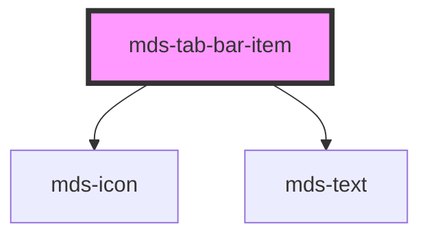

# mds-tab-bar-item

<!-- Auto Generated Below -->

## Properties

| Property     | Attribute    | Description                                   | Type                | Default     |
| ------------ | ------------ | --------------------------------------------- | ------------------- | ----------- |
| `icon`       | `icon`       |                                               | `string`            | `undefined` |
| `selected`   | `selected`   | Specifies if the component is selected or not | `boolean`           | `undefined` |
| `typography` | `typography` | Specifies the typography of the element       | `"option" \| "tip"` | `'tip'`     |

## Events

| Event           | Description                          | Type                  |
| --------------- | ------------------------------------ | --------------------- |
| `selectedEvent` | Emits when the component is selected | `CustomEvent<string>` |

## Dependencies

### Depends on

- [mds-icon](../mds-icon)
- [mds-text](../mds-text)

### Graph

----------------------------------------------

Built with love @ **Maggioli Informatica / R&D Department**
