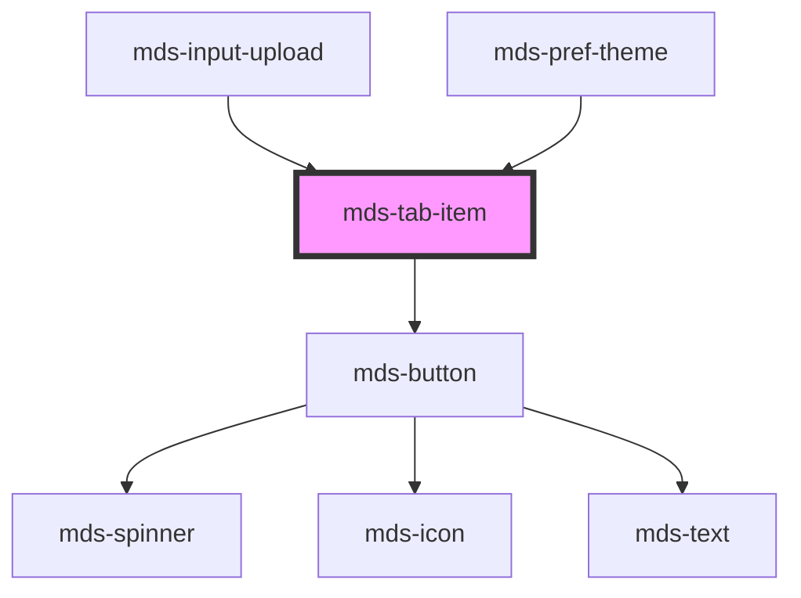

# mds-tab-item

This is a web-component from Maggioli Design System [Magma](https://magma.maggiolicloud.it), built with StencilJS, TypeScript, Storybook. It's based on the web-component standard and it's designed to be agnostic from the JavaScirpt framework you are using.

<!-- Auto Generated Below -->

## Properties

| Property       | Attribute       | Description                                                             | Type                                                  | Default     |
| -------------- | --------------- | ----------------------------------------------------------------------- | ----------------------------------------------------- | ----------- |
| `icon`         | `icon`          | The icon displayed in the tab item                                      | `string \| undefined`                                 | `undefined` |
| `iconPosition` | `icon-position` | Specifies the horizontal position of the icon displayed in the tab item | `"left" \| "right" \| undefined`                      | `'left'`    |
| `selected`     | `selected`      | Specifies if the tab item is selected or not                            | `boolean \| undefined`                                | `undefined` |
| `size`         | `size`          | Specifies the size for the tab item                                     | `"lg" \| "md" \| "sm" \| "xl" \| undefined`           | `'md'`      |
| `type`         | `type`          | The type of the tab item element                                        | `"a" \| "button" \| "reset" \| "submit" \| undefined` | `'submit'`  |
| `value`        | `value`         | Specifies an optional value to get from mdsTabItemSelect event          | `string \| undefined`                                 | `undefined` |

## Events

| Event              | Description                         | Type                                 |
| ------------------ | ----------------------------------- | ------------------------------------ |
| `mdsTabItemSelect` | Emits when the tab item is selected | `CustomEvent<MdsTabItemEventDetail>` |

## Slots

| Slot        | Description                          |
| ----------- | ------------------------------------ |
| `"default"` | Put text string here, avoid elements |

## Shadow Parts

| Part       | Description |
| ---------- | ----------- |
| `"button"` |             |

## CSS Custom Properties

| Name                                 | Description                                              |
| ------------------------------------ | -------------------------------------------------------- |
| `--mds-tab-item-background`          | Sets the background color of the component               |
| `--mds-tab-item-background-hover`    | Sets the background when the mouse is over the component |
| `--mds-tab-item-background-selected` | Sets the background when the component is selected       |
| `--mds-tab-item-color`               | Sets the color of the component                          |
| `--mds-tab-item-color-hover`         | Sets the color when the mouse is over the component      |
| `--mds-tab-item-color-selected`      | Sets the color when the component is selected            |
| `--mds-tab-item-radius`              | Sets the border-radius of the component                  |
| `--mds-tab-item-shadow-selected`     | Sets the box-shadow when the component is selected       |

## Dependencies

### Used by

 - [mds-input-upload](../mds-input-upload)
 - [mds-pref-theme](../mds-pref-theme)

### Depends on

- [mds-button](../mds-button)

### Graph

----------------------------------------------

Built with love @ [Gruppo Maggioli](https://www.maggioli.com) from [R&D Department](https://www.maggioli.com/it-it/chi-siamo/ricerca-sviluppo)
