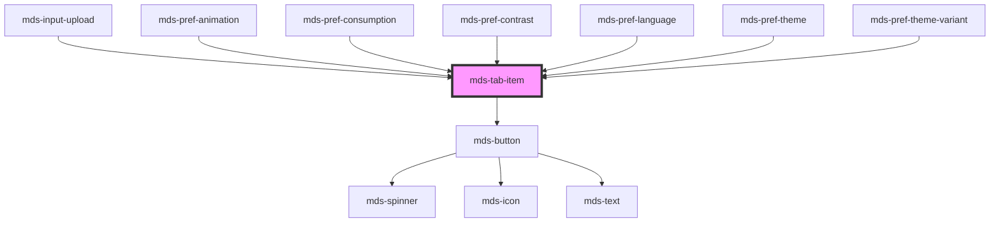

# mds-tab-item


This is a web-component from Maggioli Design System [Magma](https://magma.maggiolicloud.it), built with StencilJS, TypeScript, Storybook. It's based on the web-component standard and it's designed to be agnostic from the JavaScript framework you are using.

<!-- Auto Generated Below -->


## Usage

### 1. Description

The `<mds-tab-item>` web component is the individual, clickable tab control of the Magma Design System, designed to be slotted into the default slot of its parent [`<mds-tab>`](../../mds-tab). It acts as the trigger that switches the matching `content`-slotted panel inside the tab group.

#### Semantic Behavior

- **Compound child only**: Must be a direct child of `<mds-tab>` placed in its default slot; it is not used standalone, and the matching panel content is added separately into the parent's `content` slot (one per `<mds-tab-item>`). Mixing it with other child types breaks the parent's pairing.
- **Selection driven by the parent**: Clicking the item emits `mdsTabItemSelect`; `<mds-tab>` sets `selected` on the chosen item, clears it on the others, and reveals the corresponding panel.
- **Initial selection**: Marking one item `selected` in markup tells the parent which tab is active on load.
- **Focus reporting**: A key press emits `mdsTabItemFocus`, which the parent uses to scroll the focused tab into view; both events carry `{ target, value }` so the parent can resolve the item even with a custom `id`.
- **Disabled guard**: When `disabled`, the item cannot be selected via pointer or keyboard.
- **Sizing managed upstream**: `size` is pushed down from `<mds-tab>`, overriding the item's own `size` prop.

#### Properties & Visual Configurations

This child does not use the shared `variant`/`tone` ladders; its props mirror the underlying `<mds-button>`.

- **`value`**: Set this to identify the tab in the `mdsTabItemSelect` payload (and the parent's `mdsTabChange`) when you need to react to selection without relying on DOM index or `id`.
- **`type`**: Defaults to `submit`; pick `button` for a plain tab that does not interact with a surrounding form, or `a` together with `href` when the tab should navigate.
- **`icon`** / **`iconPosition`**: Add a leading (`left`, default) or trailing (`right`) glyph; use the trailing position for affordances like an external-link or dismiss hint.
- **`await`**: Reflects the button's awaiting/loading state for tabs whose activation triggers an async operation.
- **`size`**: Defaults to `md`, but is normally controlled by the parent's `size` prop, so set it on `<mds-tab>` for consistent sizing across all items.


### 2. Pattern

Correct and idiomatic ways to use the `<mds-tab-item>` component, ordered from most common to most specialized. Patterns assume a working knowledge of the compound component rules documented in [`docs/COMPONENTS.md`](../../../../../../docs/COMPONENTS.md) and the generic stencil rules in [`projects/stencil/SPEC.md`](../../../../SPEC.md).

#### Basic Tab Group

The canonical form. Place `<mds-tab-item>` elements in the default slot of [`<mds-tab>`](../../mds-tab), with one matching panel element per item in the `content` slot. Mark the initially active tab with `selected`.

```html
<mds-tab>
  <mds-tab-item label="Dettagli" selected></mds-tab-item>
  <mds-tab-item label="Allegati"></mds-tab-item>
  <mds-tab-item label="Cronologia"></mds-tab-item>

  <div slot="content">
    <p>Contenuto della scheda Dettagli.</p>
  </div>
  <div slot="content">
    <p>Elenco degli allegati.</p>
  </div>
  <div slot="content">
    <p>Cronologia delle modifiche.</p>
  </div>
</mds-tab>
```

#### Tabs with Icons

Use the `icon` prop to add a glyph. `icon-position` defaults to `left`; set it to `right` for affordance glyphs such as external-link hints.

```html
<mds-tab>
  <mds-tab-item label="Profilo" icon="mi/baseline/person" selected></mds-tab-item>
  <mds-tab-item label="Impostazioni" icon="mi/baseline/settings"></mds-tab-item>
  <mds-tab-item label="Apri in nuova finestra" icon="mi/baseline/open-in-new" icon-position="right"></mds-tab-item>

  <div slot="content"><p>Sezione profilo.</p></div>
  <div slot="content"><p>Sezione impostazioni.</p></div>
  <div slot="content"><p>Sezione apertura esterna.</p></div>
</mds-tab>
```

#### Disabled Tab

Set the `disabled` boolean attribute to block selection via pointer and keyboard.

```html
<mds-tab>
  <mds-tab-item label="Attivo" selected></mds-tab-item>
  <mds-tab-item label="Non disponibile" disabled></mds-tab-item>

  <div slot="content"><p>Contenuto attivo.</p></div>
  <div slot="content"><p>Contenuto non ancora disponibile.</p></div>
</mds-tab>
```

#### Controlled Selection via `value` and Event

Use `value` to identify which tab was activated in the `mdsTabItemSelect` (or the parent's `mdsTabChange`) payload, instead of relying on DOM index.

```html
<mds-tab id="schede-pratica">
  <mds-tab-item label="Dati generali" value="dati" selected></mds-tab-item>
  <mds-tab-item label="Documenti" value="documenti"></mds-tab-item>
  <mds-tab-item label="Note" value="note"></mds-tab-item>

  <div slot="content"><p>Dati generali.</p></div>
  <div slot="content"><p>Documenti allegati.</p></div>
  <div slot="content"><p>Note operative.</p></div>
</mds-tab>

<script>
  document.getElementById('schede-pratica').addEventListener('mdsTabChange', (e) => {
    console.log('Tab attiva:', e.detail.value); // 'dati' | 'documenti' | 'note'
  });
</script>
```

#### Consistent Sizing via the Parent

Set `size` on `<mds-tab>` once; the parent propagates it to every child item automatically. Do not set `size` on individual items when they all share the same parent.

```html
<!-- Tutti i tab usano size="sm" -->
<mds-tab size="sm">
  <mds-tab-item label="Riepilogo" selected></mds-tab-item>
  <mds-tab-item label="Dettaglio"></mds-tab-item>

  <div slot="content"><p>Riepilogo.</p></div>
  <div slot="content"><p>Dettaglio.</p></div>
</mds-tab>
```

#### Link Tab via `href`

Set `href` (and `type="a"`) to make a tab navigate to a URL instead of switching a panel. Pair with a target attribute on the `<mds-tab-item>` if needed.

```html
<mds-tab>
  <mds-tab-item label="Locale" selected></mds-tab-item>
  <mds-tab-item label="Portale" href="https://portale.example.com" type="a"></mds-tab-item>

  <div slot="content"><p>Vista locale.</p></div>
  <div slot="content"></div>
</mds-tab>
```

#### Async Loading Tab via `await`

Set `await` while the tab's content is loading. The item renders an inline spinner and blocks interaction until you remove the attribute.

```html
<mds-tab>
  <mds-tab-item label="Anteprima" await selected></mds-tab-item>
  <mds-tab-item label="Sorgente"></mds-tab-item>

  <div slot="content"><p>Caricamento in corso...</p></div>
  <div slot="content"><p>Sorgente del documento.</p></div>
</mds-tab>
```

#### Vertical Layout

Set `direction="vertical"` on the parent to stack the tabs alongside the panels.

```html
<mds-tab direction="vertical">
  <mds-tab-item label="Generale" selected></mds-tab-item>
  <mds-tab-item label="Sicurezza"></mds-tab-item>
  <mds-tab-item label="Notifiche"></mds-tab-item>

  <div slot="content"><p>Impostazioni generali.</p></div>
  <div slot="content"><p>Impostazioni di sicurezza.</p></div>
  <div slot="content"><p>Preferenze notifiche.</p></div>
</mds-tab>
```

#### CSS Customization

Style items only through the documented `--mds-tab-item-*` CSS custom properties. Set them on the host or a parent selector; use Magma color tokens via `rgb(var(--<token>))` so dark mode keeps working.

```css
.schede-contratto mds-tab-item {
  --mds-tab-item-default-background: rgb(var(--tone-neutral-02));
  --mds-tab-item-hover-background: rgb(var(--tone-neutral-03));
  --mds-tab-item-selected-background: rgb(var(--variant-primary-01));
}
```


### 3. Antipattern

Common incorrect uses of `<mds-tab-item>`. Each entry pairs the wrong form with the right one and a one-line reason. System-wide rules (boolean-as-string, shadow piercing, Tailwind color utilities, raw native event listening) live in [`docs/COMPONENTS.md`](../../../../../../docs/COMPONENTS.md#system-level-anti-patterns) - they apply here too but are not repeated.

#### Do Not Use `<mds-tab-item>` Outside `<mds-tab>`

The item communicates with its parent through Stencil's internal listener (`mdsTabItemSelect`); used standalone it has no tab-switching behavior and no aria context.

```html
<!-- 🚫 INCORRECT -->
<mds-tab-item label="Dettagli" selected></mds-tab-item>

<!-- ✅ CORRECT -->
<mds-tab>
  <mds-tab-item label="Dettagli" selected></mds-tab-item>
  <div slot="content"><p>Contenuto dei dettagli.</p></div>
</mds-tab>
```

#### Do Not Wrap `<mds-tab-item>` in a Div or Other Element

The parent queries direct children with `querySelectorAll('mds-tab-item')`; a wrapper breaks the slot pairing between items and content panels.

```html
<!-- 🚫 INCORRECT -->
<mds-tab>
  <div class="tab-group">
    <mds-tab-item label="Uno" selected></mds-tab-item>
    <mds-tab-item label="Due"></mds-tab-item>
  </div>
  <div slot="content">...</div>
  <div slot="content">...</div>
</mds-tab>

<!-- ✅ CORRECT -->
<mds-tab>
  <mds-tab-item label="Uno" selected></mds-tab-item>
  <mds-tab-item label="Due"></mds-tab-item>
  <div slot="content">...</div>
  <div slot="content">...</div>
</mds-tab>
```

#### Do Not Set `selected="false"` to Deselect

`selected` is a boolean attribute; the string `"false"` is truthy in HTML and will keep the item selected. Remove the attribute entirely to deselect.

```html
<!-- 🚫 INCORRECT -->
<mds-tab-item label="Archivio" selected="false"></mds-tab-item>

<!-- ✅ CORRECT -->
<mds-tab-item label="Archivio"></mds-tab-item>
```

#### Do Not Slot `<mds-icon>` or HTML to Add an Icon

`<mds-tab-item>` has no documented default slot for content; it is a button-like leaf element. Use the `icon` prop to add a glyph.

```html
<!-- 🚫 INCORRECT -->
<mds-tab-item>
  <mds-icon name="mi/baseline/settings"></mds-icon>
  Impostazioni
</mds-tab-item>

<!-- ✅ CORRECT -->
<mds-tab-item label="Impostazioni" icon="mi/baseline/settings"></mds-tab-item>
```

#### Do Not Override `size` on Individual Items When a Parent Size Is Set

The parent pushes its `size` down to every child item on load and whenever `size` changes. Setting `size` on individual items is overwritten and creates confusion about the source of truth.

```html
<!-- 🚫 INCORRECT -->
<mds-tab size="sm">
  <mds-tab-item label="Uno" size="lg" selected></mds-tab-item>
  <mds-tab-item label="Due" size="sm"></mds-tab-item>
  <div slot="content">...</div>
  <div slot="content">...</div>
</mds-tab>

<!-- ✅ CORRECT -->
<mds-tab size="sm">
  <mds-tab-item label="Uno" selected></mds-tab-item>
  <mds-tab-item label="Due"></mds-tab-item>
  <div slot="content">...</div>
  <div slot="content">...</div>
</mds-tab>
```

#### Do Not Pierce the Shadow DOM to Style the Inner Button

The only supported customization surface is the `--mds-tab-item-*` CSS custom properties and the documented `button` shadow part. Targeting internals via `::part(button) >>> .button` or undocumented selectors couples your code to the implementation.

```css
/* 🚫 INCORRECT */
mds-tab-item::part(button) >>> .text {
  font-weight: 900;
}

/* ✅ CORRECT */
mds-tab-item {
  --mds-tab-item-selected-background: rgb(var(--variant-primary-02));
}
mds-tab-item::part(button) {
  border-radius: var(--radius-lg);
}
```

#### Do Not Mix Content Panels and Tab Items Without a 1-to-1 Pairing

The parent resolves each content panel by index, matching it to the `mds-tab-item` at the same position. A mismatch (more or fewer `slot="content"` elements than tab items) silently shows the wrong panel.

```html
<!-- 🚫 INCORRECT - two items, one content panel -->
<mds-tab>
  <mds-tab-item label="Uno" selected></mds-tab-item>
  <mds-tab-item label="Due"></mds-tab-item>
  <div slot="content"><p>Contenuto unico.</p></div>
</mds-tab>

<!-- ✅ CORRECT - one content panel per tab item -->
<mds-tab>
  <mds-tab-item label="Uno" selected></mds-tab-item>
  <mds-tab-item label="Due"></mds-tab-item>
  <div slot="content"><p>Contenuto del tab Uno.</p></div>
  <div slot="content"><p>Contenuto del tab Due.</p></div>
</mds-tab>
```


## Properties

| Property       | Attribute       | Description                                                                                                          | Type                                                  | Default     |
| -------------- | --------------- | -------------------------------------------------------------------------------------------------------------------- | ----------------------------------------------------- | ----------- |
| `animation`    | `animation`     | Reflects the parent tab selection animation (set by mds-tab); drives the slide-variant styling without :host-context | `"fade" \| "slide" \| undefined`                      | `undefined` |
| `await`        | `await`         | Specifies if the button is awaiting for a response                                                                   | `boolean`                                             | `undefined` |
| `direction`    | `direction`     | Reflects the parent tab layout direction (set by mds-tab); drives the vertical layout without :host-context          | `"horizontal" \| "vertical" \| undefined`             | `undefined` |
| `disabled`     | `disabled`      | Specifies if the tab item is disabled or not                                                                         | `boolean \| undefined`                                | `undefined` |
| `href`         | `href`          | Specifies the URL target of the button                                                                               | `string \| undefined`                                 | `undefined` |
| `icon`         | `icon`          | The icon displayed in the tab item                                                                                   | `string \| undefined`                                 | `undefined` |
| `iconPosition` | `icon-position` | Specifies the horizontal position of the icon displayed in the tab item                                              | `"left" \| "right" \| undefined`                      | `'left'`    |
| `label`        | `label`         | The label of the tab item                                                                                            | `string \| undefined`                                 | `undefined` |
| `selected`     | `selected`      | Specifies if the tab item is selected or not                                                                         | `boolean \| undefined`                                | `undefined` |
| `size`         | `size`          | Specifies the size for the tab item                                                                                  | `"lg" \| "md" \| "sm" \| "xl" \| undefined`           | `'md'`      |
| `type`         | `type`          | The type of the tab item element                                                                                     | `"a" \| "button" \| "reset" \| "submit" \| undefined` | `'submit'`  |
| `value`        | `value`         | Specifies an optional value to get from mdsTabItemSelect event                                                       | `string \| undefined`                                 | `undefined` |


## Events

| Event              | Description                         | Type                                 |
| ------------------ | ----------------------------------- | ------------------------------------ |
| `mdsTabItemFocus`  | Emits when the tab item is selected | `CustomEvent<MdsTabItemEventDetail>` |
| `mdsTabItemSelect` | Emits when the tab item is selected | `CustomEvent<MdsTabItemEventDetail>` |


## Shadow Parts

| Part       | Description |
| ---------- | ----------- |
| `"button"` |             |


## CSS Custom Properties

| Name                                 | Description                                |
| ------------------------------------ | ------------------------------------------ |
| `--mds-tab-item-default-background`  | Default background color of a tab item.    |
| `--mds-tab-item-default-shadow`      | Default shadow of a tab item.              |
| `--mds-tab-item-hover-background`    | Background color when hovering a tab item. |
| `--mds-tab-item-selected-background` | Background color of a selected tab item.   |
| `--mds-tab-item-selected-shadow`     | Shadow of a selected tab item.             |


## Dependencies

### Used by

 - [mds-input-upload](../mds-input-upload)
 - [mds-pref-animation](../mds-pref-animation)
 - [mds-pref-consumption](../mds-pref-consumption)
 - [mds-pref-contrast](../mds-pref-contrast)
 - [mds-pref-language](../mds-pref-language)
 - [mds-pref-theme](../mds-pref-theme)
 - [mds-pref-theme-variant](../mds-pref-theme-variant)

### Depends on

- [mds-button](../mds-button)

### Graph


----------------------------------------------

Built with love @ [Gruppo Maggioli](https://www.maggioli.com) from [R&D Department](https://www.maggioli.com/it-it/chi-siamo/ricerca-sviluppo)
