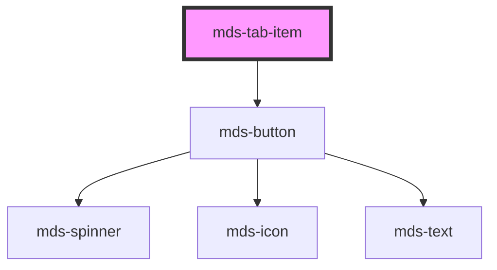

# mds-tab-item

<!-- Auto Generated Below -->

## Properties

| Property       | Attribute       | Description                                                             | Type                                                  | Default     |
| -------------- | --------------- | ----------------------------------------------------------------------- | ----------------------------------------------------- | ----------- |
| `icon`         | `icon`          | The icon displayed in the tab item                                      | `string \| undefined`                                 | `undefined` |
| `iconPosition` | `icon-position` | Specifies the horizontal position of the icon displayed in the tab item | `"left" \| "right" \| undefined`                      | `'left'`    |
| `label`        | `label`         | Specifies the tab button item label                                     | `string \| undefined`                                 | `undefined` |
| `selected`     | `selected`      | Specifies if the tab item is selected or not                            | `boolean \| undefined`                                | `undefined` |
| `size`         | `size`          | Specifies the size for the tab item                                     | `"lg" \| "md" \| "sm" \| "xl" \| undefined`           | `'md'`      |
| `type`         | `type`          | The type of the tab item element                                        | `"a" \| "button" \| "reset" \| "submit" \| undefined` | `'submit'`  |

## Events

| Event              | Description                         | Type                  |
| ------------------ | ----------------------------------- | --------------------- |
| `mdsTabItemSelect` | Emits when the tab item is selected | `CustomEvent<string>` |

## Shadow Parts

| Part       | Description |
| ---------- | ----------- |
| `"button"` |             |

## Dependencies

### Depends on

- [mds-button](../mds-button)

### Graph

----------------------------------------------

Built with love @ **Maggioli Informatica / R&D Department**
