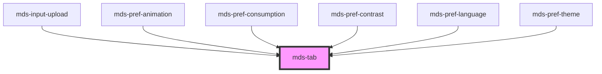

# mds-tab

This is a web-component from Maggioli Design System [Magma](https://magma.maggiolicloud.it), built with StencilJS, TypeScript, Storybook. It's based on the web-component standard and it's designed to be agnostic from the JavaScript framework you are using.

<!-- Auto Generated Below -->

## Properties

| Property    | Attribute   | Description                                                                         | Type                             | Default     |
| ----------- | ----------- | ----------------------------------------------------------------------------------- | -------------------------------- | ----------- |
| `animation` | `animation` | Sets the animation type of the selection transition between `mds-tab-item` elements | `"fade" \| "slide" \| undefined` | `'slide'`   |
| `scrollbar` | `scrollbar` | Shows the horizontal scrollbar to maximize accessibility                            | `boolean \| undefined`           | `undefined` |

## Events

| Event          | Description                      | Type                             |
| -------------- | -------------------------------- | -------------------------------- |
| `mdsTabChange` | Emits when a children is changed | `CustomEvent<MdsTabEventDetail>` |

## Slots

| Slot        | Description                                                      |
| ----------- | ---------------------------------------------------------------- |
| `"content"` | Add `HTML elements` or `components`, one per mds-tab-item added. |
| `"default"` | Add `mds-tab-item` element/s.                                    |

## Shadow Parts

| Part         | Description                                                                               |
| ------------ | ----------------------------------------------------------------------------------------- |
| `"contents"` | Selects the container of the tabbed contents elements.                                    |
| `"slider"`   | Selects the slider element which is visible when attribute `animation` is set to `slide`. |
| `"tabs"`     | Selects the container of `mds-tab-item` list elements.                                    |

## CSS Custom Properties

| Name                                          | Description                                                                                                                           |
| --------------------------------------------- | ------------------------------------------------------------------------------------------------------------------------------------- |
| `--mds-tab-item-default-background`           | Sets the `background-color` of `mds-tab-item` or `mds-tab::part(slider)` depending on attribute `animation`                           |
| `--mds-tab-item-default-color`                | Sets the `color` of `mds-tab-item` or `mds-tab::part(slider)` depending on attribute `animation`                                      |
| `--mds-tab-item-default-shadow`               | Sets the `box-shadow` of `mds-tab-item` or `mds-tab::part(slider)` depending on attribute `animation`                                 |
| `--mds-tab-item-hover-background`             | Sets the `background-color` when the mouse is over of `mds-tab-item` or `mds-tab::part(slider)` depending on attribute `animation`    |
| `--mds-tab-item-hover-color`                  | Sets the `color` when the mouse is over of `mds-tab-item` or `mds-tab::part(slider)` depending on attribute `animation`               |
| `--mds-tab-item-hover-shadow`                 | Sets the `box-shadow` when the mouse is over of `mds-tab-item` or `mds-tab::part(slider)` depending on attribute `animation`          |
| `--mds-tab-item-radius`                       | Sets the `border-radius` of `mds-tab-item` or `mds-tab::part(slider)` depending on attribute `animation`.                             |
| `--mds-tab-item-selected-background`          | Sets the `background-color` when the item is selected of `mds-tab-item` or `mds-tab::part(slider)` depending on attribute `animation` |
| `--mds-tab-item-selected-color`               | Sets the `color` when the item is selected of `mds-tab-item` or `mds-tab::part(slider)` depending on attribute `animation`            |
| `--mds-tab-item-selected-shadow`              | Sets the `box-shadow` when the item is selected of `mds-tab-item` or `mds-tab::part(slider)` depending on attribute `animation`       |
| `--mds-tab-item-transition-duration`          | Sets the animation duration on how the contents height is resized when the component switch from a content to another one             |
| `--mds-tab-item-transition-timing-function`   | Sets the animation timing function on how the contents height is resized when the component switch from a content to another one      |
| `--mds-tab-scroll-scrollbar-margin`           | Sets the margin of the browser scroll bar (if supported)                                                                              |
| `--mds-tab-scroll-scrollbar-radius`           | Sets the border-radius of the browser scroll bar (if supported)                                                                       |
| `--mds-tab-scroll-scrollbar-size`             | Sets the height and width of the browser scroll bar (if supported)                                                                    |
| `--mds-tab-scroll-scrollbar-thumb-background` | Sets the background-color of the browser scroll bar thumb (if supported)                                                              |
| `--mds-tab-scroll-scrollbar-track-background` | Sets the background-color of the browser scroll bar track (if supported)                                                              |
| `--mds-tab-tabs-background`                   | Sets the `background-color` of `mds-tab::part(tabs)`                                                                                  |
| `--mds-tab-tabs-gap`                          | Sets the `gap` of `mds-tab::part(tabs)`                                                                                               |
| `--mds-tab-tabs-outline-opacity`              | Sets the `opacity` of outline border which holds                                                                                      |
| `--mds-tab-tabs-padding`                      | Sets the `padding` of `mds-tab::part(tabs)`                                                                                           |
| `--mds-tab-tabs-radius`                       | Sets the `border-radius` of `mds-tab::part(tabs)`                                                                                     |

## Dependencies

### Used by

 - [mds-input-upload](../mds-input-upload)
 - [mds-pref-animation](../mds-pref-animation)
 - [mds-pref-consumption](../mds-pref-consumption)
 - [mds-pref-contrast](../mds-pref-contrast)
 - [mds-pref-language](../mds-pref-language)
 - [mds-pref-theme](../mds-pref-theme)

### Graph

----------------------------------------------

Built with love @ [Gruppo Maggioli](https://www.maggioli.com) from [R&D Department](https://www.maggioli.com/it-it/chi-siamo/ricerca-sviluppo)
