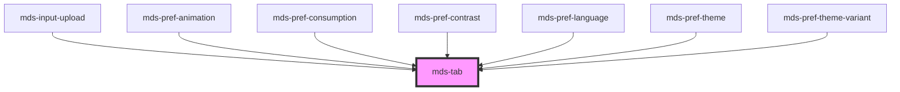

# mds-tab

This is a web-component from Maggioli Design System [Magma](https://magma.maggiolicloud.it), built with StencilJS, TypeScript, Storybook. It's based on the web-component standard and it's designed to be agnostic from the JavaScript framework you are using.

<!-- Auto Generated Below -->

## Properties

| Property    | Attribute   | Description                                                                             | Type                                      | Default        |
| ----------- | ----------- | --------------------------------------------------------------------------------------- | ----------------------------------------- | -------------- |
| `animation` | `animation` | Sets the animation type of the selection transition between `mds-tab-item` elements     | `"fade" \| "slide" \| undefined`          | `'slide'`      |
| `direction` | `direction` | Sets if the component distributes item vertically or horzontally                        | `"horizontal" \| "vertical" \| undefined` | `'horizontal'` |
| `fill`      | `fill`      | Sets if the tab area should fill the entire width                                       | `boolean \| undefined`                    | `undefined`    |
| `overflow`  | `overflow`  | Sets if the tab area should show an inset shadow when the tabs overflows it's container | `boolean \| undefined`                    | `undefined`    |
| `scrollbar` | `scrollbar` | Shows the horizontal scrollbar to maximize accessibility                                | `boolean \| undefined`                    | `undefined`    |
| `size`      | `size`      | Sets the size of the component items nested inside it                                   | `"md" \| "sm" \| undefined`               | `undefined`    |

## Events

| Event          | Description                      | Type                             |
| -------------- | -------------------------------- | -------------------------------- |
| `mdsTabChange` | Emits when a children is changed | `CustomEvent<MdsTabEventDetail>` |

## Slots

| Slot        | Description                                                      |
| ----------- | ---------------------------------------------------------------- |
| `"content"` | Add `HTML elements` or `components`, one per mds-tab-item added. |
| `"default"` | Add `mds-tab-item` element/s.                                    |

## Shadow Parts

| Part         | Description                                                                               |
| ------------ | ----------------------------------------------------------------------------------------- |
| `"contents"` | Selects the container of the tabbed contents elements.                                    |
| `"slider"`   | Selects the slider element which is visible when attribute `animation` is set to `slide`. |
| `"tabs"`     | Selects the container of `mds-tab-item` list elements.                                    |

## CSS Custom Properties

| Name                                          | Description                                   |
| --------------------------------------------- | --------------------------------------------- |
| `--mds-tab-direction-vertical-columns`        | Defines the column layout for vertical tabs.  |
| `--mds-tab-item-default-background`           | Background color for default tab items.       |
| `--mds-tab-item-default-color`                | Text color for default tab items.             |
| `--mds-tab-item-default-shadow`               | Shadow for default tab items.                 |
| `--mds-tab-item-hover-background`             | Background color for hovered tab items.       |
| `--mds-tab-item-hover-color`                  | Text color for hovered tab items.             |
| `--mds-tab-item-hover-shadow`                 | Shadow for hovered tab items.                 |
| `--mds-tab-item-radius`                       | Border radius for tab items.                  |
| `--mds-tab-item-selected-background`          | Background color for selected tab items.      |
| `--mds-tab-item-selected-color`               | Text color for selected tab items.            |
| `--mds-tab-item-selected-shadow`              | Shadow for selected tab items.                |
| `--mds-tab-scroll-behavior`                   | Scroll behavior for tab container.            |
| `--mds-tab-scroll-scrollbar-margin`           | Margin for scrollbar.                         |
| `--mds-tab-scroll-scrollbar-radius`           | Radius of scrollbar.                          |
| `--mds-tab-scroll-scrollbar-size`             | Size of scrollbar.                            |
| `--mds-tab-scroll-scrollbar-thumb-background` | Background color of scrollbar thumb.          |
| `--mds-tab-scroll-scrollbar-track-background` | Background color of scrollbar track.          |
| `--mds-tab-slide-delay`                       | Delay before tab slide animation.             |
| `--mds-tab-tabs-background`                   | Background color of the tabs container.       |
| `--mds-tab-tabs-gap`                          | Gap between tabs.                             |
| `--mds-tab-tabs-overflow-shadow`              | Shadow applied to overflowed tabs.            |
| `--mds-tab-tabs-overflow-shadow-size`         | Size of the overflow shadow.                  |
| `--mds-tab-tabs-padding`                      | Padding inside the tabs container.            |
| `--mds-tab-tabs-radius`                       | Border radius of the tabs container.          |
| `--mds-tab-tabs-wrapper-margin`               | Margin for the tabs wrapper.                  |
| `--mds-tab-tabs-wrapper-outline-opacity`      | Opacity of the wrapper outline.               |
| `--mds-tab-tabs-wrapper-shadow`               | Shadow for the tabs wrapper.                  |
| `--mds-tab-tabs-wrapper-shadow-color`         | Color of the wrapper shadow.                  |
| `--mds-tab-transition-duration`               | Duration of tab transition animation.         |
| `--mds-tab-transition-timing-function`        | Timing function for tab transition animation. |

## Dependencies

### Used by

 - [mds-input-upload](../mds-input-upload)
 - [mds-pref-animation](../mds-pref-animation)
 - [mds-pref-consumption](../mds-pref-consumption)
 - [mds-pref-contrast](../mds-pref-contrast)
 - [mds-pref-language](../mds-pref-language)
 - [mds-pref-theme](../mds-pref-theme)
 - [mds-pref-theme-variant](../mds-pref-theme-variant)

### Graph

----------------------------------------------

Built with love @ [Gruppo Maggioli](https://www.maggioli.com) from [R&D Department](https://www.maggioli.com/it-it/chi-siamo/ricerca-sviluppo)
