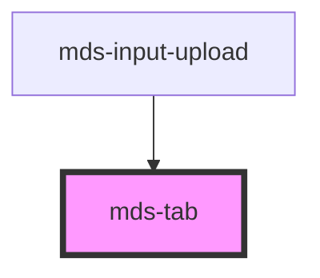

# mds-tab

This is a web-component from Maggioli Design System [Magma](https://magma.maggiolicloud.it), built with StencilJS, TypeScript, Storybook. It's based on the web-component standard and it's designed to be agnostic from the JavaScirpt framework you are using.

<!-- Auto Generated Below -->

## Events

| Event          | Description                      | Type                             |
| -------------- | -------------------------------- | -------------------------------- |
| `mdsTabChange` | Emits when a children is changed | `CustomEvent<MdsTabEventDetail>` |

## Slots

| Slot        | Description                                                      |
| ----------- | ---------------------------------------------------------------- |
| `"content"` | Add `HTML elements` or `components`, one per mds-tab-item added. |
| `"default"` | Add `mds-tab-item` element/s.                                    |

## Shadow Parts

| Part         | Description |
| ------------ | ----------- |
| `"contents"` |             |
| `"tabs"`     |             |

## Dependencies

### Used by

 - [mds-input-upload](../mds-input-upload)

### Graph

----------------------------------------------

Built with love @ [Gruppo Maggioli](https://www.maggioli.com) from [R&D Department](https://www.maggioli.com/it-it/chi-siamo/ricerca-sviluppo)
