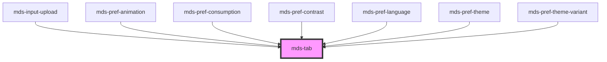

# mds-tab


This is a web-component from Maggioli Design System [Magma](https://magma.maggiolicloud.it), built with StencilJS, TypeScript, Storybook. It's based on the web-component standard and it's designed to be agnostic from the JavaScript framework you are using.

<!-- Auto Generated Below -->


## Usage

### 1. Description

The `<mds-tab>` web component is the compound container that orchestrates a tabbed navigation in the Magma Design System. It is the parent wrapper around a set of `<mds-tab-item>` triggers and their associated content panels, providing the ARIA `tablist` structure, selection state, scrolling and the animated selection indicator.

#### Semantic Behavior

- **Compound parent**: Expects `<mds-tab-item>` elements in the default slot; each panel in the named `content` slot is wired up automatically and paired by document order.
- **Selection ownership**: The active tab is whichever `<mds-tab-item>` carries `selected`; the parent flips `selected` across siblings, shows the corresponding content panel and hides the rest.
- **Change event**: Emits `mdsTabChange` with the selected item's index (`id`) and `value` whenever the active child changes.
- **Focus restoration**: After a keyboard activation it re-focuses the selected item's button, so the user does not have to re-locate the tab.
- **Auto-scroll into view**: On selection or child focus, the active tab is scrolled to the center of its strip.
- **Overflow tracking**: When `overflow` is enabled, left/right inset shadows appear while the tabs overflow their container.
- **Size propagation**: The parent `size` is pushed down onto every nested `<mds-tab-item>`, so children should not be sized individually.

#### Properties & Visual Configurations

- **`direction`** chooses whether the tab strip is laid out `'horizontal'` (default) or `'vertical'`.
- **`animation`** governs the transition between active items: `'slide'` (default) renders the moving slider indicator, while `'fade'` cross-fades without the slider.
- **`fill`** makes the tab strip stretch to occupy the full available width rather than hugging its content.
- **`overflow`** enables the inset-shadow affordance that signals more tabs exist beyond the visible edges; **`scrollbar`** instead exposes the native horizontal scrollbar for accessibility.

#### Other behavioral props

- **`size`** sets the scale (`'sm'` / `'md'`) for the whole group and is forwarded to the child items; it is the only way to size the tabs consistently.


### 2. Pattern

Correct and idiomatic ways to use the `<mds-tab>` component, ordered from most common to most specialized. Patterns assume a working knowledge of the compound-component rules documented in [`docs/COMPONENTS.md`](../../../../../../docs/COMPONENTS.md) and the generic stencil rules in [`projects/stencil/SPEC.md`](../../../../SPEC.md).

#### Basic Tab Group with Managed Panels

The canonical form. Put `<mds-tab-item>` elements in the default slot and one content element per tab in the named `content` slot. Mark the initially-visible tab with `selected`. Panels are wired up by document order - the first `[slot=content]` element is paired with the first `<mds-tab-item>`.

```html
<mds-tab>
  <mds-tab-item label="Panoramica" selected></mds-tab-item>
  <mds-tab-item label="Dettagli"></mds-tab-item>
  <mds-tab-item label="Allegati"></mds-tab-item>

  <div slot="content">
    <mds-text>Contenuto della scheda Panoramica.</mds-text>
  </div>
  <div slot="content">
    <mds-text>Contenuto della scheda Dettagli.</mds-text>
  </div>
  <div slot="content">
    <mds-text>Contenuto della scheda Allegati.</mds-text>
  </div>
</mds-tab>
```

#### Listening to Tab Changes

Listen to the `mdsTabChange` event to react when the active panel changes. The event detail carries the zero-based `id` (index) and the optional `value` of the newly selected `<mds-tab-item>`.

```html
<mds-tab id="schede-pratica">
  <mds-tab-item label="Anagrafica" value="anagrafica" selected></mds-tab-item>
  <mds-tab-item label="Documenti" value="documenti"></mds-tab-item>
  <mds-tab-item label="Pagamenti" value="pagamenti"></mds-tab-item>
</mds-tab>

<script>
  document.querySelector('#schede-pratica').addEventListener('mdsTabChange', (e) => {
    console.log('scheda attiva:', e.detail.id, e.detail.value);
  });
</script>
```

#### Tab Items with Icons

Pass an icon slug to `<mds-tab-item>` via the `icon` prop. Icon position defaults to `left`; use `icon-position="right"` for forward-navigation tabs.

```html
<mds-tab>
  <mds-tab-item label="Utente" icon="mi/baseline/person" selected></mds-tab-item>
  <mds-tab-item label="Impostazioni" icon="mi/baseline/settings"></mds-tab-item>
  <mds-tab-item label="Notifiche" icon="mi/baseline/notifications"></mds-tab-item>

  <div slot="content"><mds-text>Profilo utente.</mds-text></div>
  <div slot="content"><mds-text>Impostazioni account.</mds-text></div>
  <div slot="content"><mds-text>Cronologia notifiche.</mds-text></div>
</mds-tab>
```

#### Fill the Available Width

Set `fill` when the tab strip should stretch to occupy the full container width instead of hugging its content.

```html
<mds-tab fill>
  <mds-tab-item label="Riepilogo" selected></mds-tab-item>
  <mds-tab-item label="Cronologia"></mds-tab-item>
  <mds-tab-item label="Statistiche"></mds-tab-item>

  <div slot="content"><mds-text>Riepilogo pratica.</mds-text></div>
  <div slot="content"><mds-text>Registro modifiche.</mds-text></div>
  <div slot="content"><mds-text>Dati statistici.</mds-text></div>
</mds-tab>
```

#### Vertical Direction

Use `direction="vertical"` to stack the tab strip on the side. Pair it with `--mds-tab-direction-vertical-columns` to control the column widths of the sidebar and the content area.

```html
<mds-tab direction="vertical">
  <mds-tab-item label="Dati generali" selected></mds-tab-item>
  <mds-tab-item label="Indirizzi"></mds-tab-item>
  <mds-tab-item label="Contatti"></mds-tab-item>

  <div slot="content"><mds-text>Dati generali.</mds-text></div>
  <div slot="content"><mds-text>Indirizzi registrati.</mds-text></div>
  <div slot="content"><mds-text>Recapiti di contatto.</mds-text></div>
</mds-tab>
```

#### Fade Animation

Switch to `animation="fade"` to cross-fade between panels without the moving slider indicator.

```html
<mds-tab animation="fade">
  <mds-tab-item label="Prima" selected></mds-tab-item>
  <mds-tab-item label="Seconda"></mds-tab-item>

  <div slot="content"><mds-text>Pannello 1.</mds-text></div>
  <div slot="content"><mds-text>Pannello 2.</mds-text></div>
</mds-tab>
```

#### Overflow Shadow for Many Tabs

Enable `overflow` when the tab strip can contain more items than the viewport permits. Left and right inset shadows appear whenever tabs overflow their container, signalling that scrolling is possible.

```html
<mds-tab overflow>
  <mds-tab-item label="Gennaio" selected></mds-tab-item>
  <mds-tab-item label="Febbraio"></mds-tab-item>
  <mds-tab-item label="Marzo"></mds-tab-item>
  <mds-tab-item label="Aprile"></mds-tab-item>
  <mds-tab-item label="Maggio"></mds-tab-item>
  <mds-tab-item label="Giugno"></mds-tab-item>
  <mds-tab-item label="Luglio"></mds-tab-item>
  <mds-tab-item label="Agosto"></mds-tab-item>
  <mds-tab-item label="Settembre"></mds-tab-item>
  <mds-tab-item label="Ottobre"></mds-tab-item>
  <mds-tab-item label="Novembre"></mds-tab-item>
  <mds-tab-item label="Dicembre"></mds-tab-item>
</mds-tab>
```

#### Scrollbar for Accessible Overflow

Use `scrollbar` instead of (or alongside) `overflow` to expose the native horizontal scrollbar. This is the accessible complement for users who navigate via keyboard or who have motor difficulties.

```html
<mds-tab scrollbar overflow>
  <mds-tab-item label="Sezione A" selected></mds-tab-item>
  <mds-tab-item label="Sezione B"></mds-tab-item>
  <mds-tab-item label="Sezione C"></mds-tab-item>
  <mds-tab-item label="Sezione D"></mds-tab-item>
  <mds-tab-item label="Sezione E"></mds-tab-item>
</mds-tab>
```

#### Sizing

Set `size` on the parent to scale all tabs uniformly. Do not set `size` on individual `<mds-tab-item>` elements - the parent propagates the value automatically.

```html
<!-- Compact strip, e.g. inside a sidebar or dense toolbar -->
<mds-tab size="sm">
  <mds-tab-item label="Vista elenco" selected></mds-tab-item>
  <mds-tab-item label="Vista griglia"></mds-tab-item>
</mds-tab>
```

#### Navigation Links (href on Tab Items)

When each tab should navigate to an anchor or a separate URL, set `href` on `<mds-tab-item>`. The tab item then renders as a link. Omit the `content` slot - the page content is driven by navigation, not by the managed-panels mechanism.

```html
<mds-tab>
  <mds-tab-item href="#sezione-1" label="Introduzione" selected></mds-tab-item>
  <mds-tab-item href="#sezione-2" label="Requisiti"></mds-tab-item>
  <mds-tab-item href="#sezione-3" label="Conclusioni"></mds-tab-item>
</mds-tab>
```

#### Disabled Tab Item

Mark an individual tab as unavailable with `disabled`. The parent's selection mechanism skips it; the tab is removed from the tab order automatically.

```html
<mds-tab>
  <mds-tab-item label="Attivo" selected></mds-tab-item>
  <mds-tab-item label="Non disponibile" disabled></mds-tab-item>
  <mds-tab-item label="Altro"></mds-tab-item>

  <div slot="content"><mds-text>Contenuto disponibile.</mds-text></div>
  <div slot="content"><mds-text>Contenuto non disponibile.</mds-text></div>
  <div slot="content"><mds-text>Altro contenuto.</mds-text></div>
</mds-tab>
```

#### Styling Customization

Style the component only through its documented `--mds-tab-*` CSS custom properties. Set them on the host or a parent selector; use Magma color tokens via `rgb(var(--<token>))` so dark mode and high-contrast modes keep working.

```css
.scheda-primaria mds-tab {
  --mds-tab-tabs-background: rgb(var(--variant-primary-09));
  --mds-tab-tabs-radius: var(--radius-xl);
  --mds-tab-item-selected-background: rgb(var(--variant-primary-05));
  --mds-tab-item-selected-color: rgb(var(--tone-kaolin-10));
  --mds-tab-transition-duration: 0.3s;
}
```


### 3. Antipattern

Common incorrect uses of `<mds-tab>`. Each entry pairs the wrong form with the right one and a one-line reason. System-wide rules (boolean-as-string, shadow piercing, Tailwind color utilities, raw native event listening) live in [`docs/COMPONENTS.md`](../../../../../../docs/COMPONENTS.md#system-level-anti-patterns) - they apply here too but are not repeated.

#### Do Not Size Individual Tab Items

Setting `size` on a `<mds-tab-item>` directly is overridden by the parent at render time. Use the `size` prop on `<mds-tab>` to size all tabs uniformly.

```html
<!-- 🚫 INCORRECT -->
<mds-tab>
  <mds-tab-item label="Elenco" size="sm" selected></mds-tab-item>
  <mds-tab-item label="Griglia" size="sm"></mds-tab-item>
</mds-tab>

<!-- ✅ CORRECT -->
<mds-tab size="sm">
  <mds-tab-item label="Elenco" selected></mds-tab-item>
  <mds-tab-item label="Griglia"></mds-tab-item>
</mds-tab>
```

#### Do Not Mix Tab Items and Content Panels Out of Order

Panels in `slot="content"` are wired to `<mds-tab-item>` elements by document order. A mismatched count or wrong ordering shows the wrong panel when a tab is selected.

```html
<!-- 🚫 INCORRECT: only two content panels for three tab items -->
<mds-tab>
  <mds-tab-item label="A" selected></mds-tab-item>
  <mds-tab-item label="B"></mds-tab-item>
  <mds-tab-item label="C"></mds-tab-item>

  <div slot="content"><mds-text>Pannello A.</mds-text></div>
  <div slot="content"><mds-text>Pannello B.</mds-text></div>
</mds-tab>

<!-- ✅ CORRECT: one content panel per tab item, same order -->
<mds-tab>
  <mds-tab-item label="A" selected></mds-tab-item>
  <mds-tab-item label="B"></mds-tab-item>
  <mds-tab-item label="C"></mds-tab-item>

  <div slot="content"><mds-text>Pannello A.</mds-text></div>
  <div slot="content"><mds-text>Pannello B.</mds-text></div>
  <div slot="content"><mds-text>Pannello C.</mds-text></div>
</mds-tab>
```

#### Do Not Put Tab Items Outside `<mds-tab>`

`<mds-tab-item>` communicates with its parent through internal Stencil events. Used outside `<mds-tab>` it renders as an inert button with no selection, panel, or keyboard management.

```html
<!-- 🚫 INCORRECT -->
<div class="my-tab-wrapper">
  <mds-tab-item label="Scheda uno" selected></mds-tab-item>
  <mds-tab-item label="Scheda due"></mds-tab-item>
</div>
<div>...</div>

<!-- ✅ CORRECT -->
<mds-tab>
  <mds-tab-item label="Scheda uno" selected></mds-tab-item>
  <mds-tab-item label="Scheda due"></mds-tab-item>
  <div slot="content">...</div>
  <div slot="content">...</div>
</mds-tab>
```

#### Do Not Listen to the Native `mdsTabItemSelect` Event from Outside

`mdsTabItemSelect` is the internal event that `<mds-tab-item>` fires to its parent `<mds-tab>`. It is not part of the public API. Listen to `mdsTabChange` on `<mds-tab>` instead.

```html
<!-- 🚫 INCORRECT -->
<mds-tab id="schede">
  <mds-tab-item label="Prima" selected></mds-tab-item>
  <mds-tab-item label="Seconda"></mds-tab-item>
</mds-tab>

<script>
  document.querySelector('#schede').addEventListener('mdsTabItemSelect', handler);
</script>

<!-- ✅ CORRECT -->
<mds-tab id="schede">
  <mds-tab-item label="Prima" selected></mds-tab-item>
  <mds-tab-item label="Seconda"></mds-tab-item>
</mds-tab>

<script>
  document.querySelector('#schede').addEventListener('mdsTabChange', handler);
</script>
```

#### Do Not Use `scrollbar="false"` or `overflow="false"` to Turn Off Boolean Props

In HTML any non-empty attribute string is truthy. Setting `scrollbar="false"` keeps the scrollbar visible. Remove the attribute entirely to disable it.

```html
<!-- 🚫 INCORRECT -->
<mds-tab scrollbar="false" overflow="false">
  <mds-tab-item label="Prima" selected></mds-tab-item>
</mds-tab>

<!-- ✅ CORRECT -->
<mds-tab>
  <mds-tab-item label="Prima" selected></mds-tab-item>
</mds-tab>
```

#### Do Not Place Raw HTML Instead of `<mds-tab-item>` in the Default Slot

The default slot expects `<mds-tab-item>` elements only. Placing a raw `<button>` or `<a>` there bypasses the ARIA `tablist` structure, selection management, and keyboard handling that `<mds-tab>` provides.

```html
<!-- 🚫 INCORRECT -->
<mds-tab>
  <button class="tab">Documenti</button>
  <button class="tab">Messaggi</button>
  <div slot="content">...</div>
  <div slot="content">...</div>
</mds-tab>

<!-- ✅ CORRECT -->
<mds-tab>
  <mds-tab-item label="Documenti" selected></mds-tab-item>
  <mds-tab-item label="Messaggi"></mds-tab-item>
  <div slot="content">...</div>
  <div slot="content">...</div>
</mds-tab>
```

#### Do Not Customize via Undocumented Shadow Parts or Internal Selectors

The supported customization surface is the `--mds-tab-*` CSS custom properties and the documented shadow parts (`tabs`, `contents`, `slider`). Targeting other internals via `>>>`, `/deep/`, or undocumented class names couples your code to the shadow DOM implementation and will break on minor releases.

```css
/* 🚫 INCORRECT */
mds-tab >>> .tabs-wrapper {
  background: red;
}
mds-tab::part(tabs-wrapper) {
  padding: 0;
}

/* ✅ CORRECT */
mds-tab {
  --mds-tab-tabs-background: rgb(var(--variant-primary-09));
  --mds-tab-tabs-padding: var(--spacing-400);
  --mds-tab-tabs-radius: var(--radius-xl);
}
mds-tab::part(tabs) {
  outline: 2px solid rgb(var(--variant-primary-05));
}
```


## Properties

| Property    | Attribute   | Description                                                                             | Type                                      | Default        |
| ----------- | ----------- | --------------------------------------------------------------------------------------- | ----------------------------------------- | -------------- |
| `animation` | `animation` | Sets the animation type of the selection transition between `mds-tab-item` elements     | `"fade" \| "slide" \| undefined`          | `'slide'`      |
| `direction` | `direction` | Sets if the component distributes item vertically or horzontally                        | `"horizontal" \| "vertical" \| undefined` | `'horizontal'` |
| `fill`      | `fill`      | Sets if the tab area should fill the entire width                                       | `boolean \| undefined`                    | `undefined`    |
| `overflow`  | `overflow`  | Sets if the tab area should show an inset shadow when the tabs overflows it's container | `boolean \| undefined`                    | `undefined`    |
| `scrollbar` | `scrollbar` | Shows the horizontal scrollbar to maximize accessibility                                | `boolean \| undefined`                    | `undefined`    |
| `size`      | `size`      | Sets the size of the component items nested inside it                                   | `"md" \| "sm" \| undefined`               | `undefined`    |


## Events

| Event          | Description                      | Type                             |
| -------------- | -------------------------------- | -------------------------------- |
| `mdsTabChange` | Emits when a children is changed | `CustomEvent<MdsTabEventDetail>` |


## Slots

| Slot        | Description                                                      |
| ----------- | ---------------------------------------------------------------- |
|             | Add `mds-tab-item` element/s.                                    |
| `"content"` | Add `HTML elements` or `components`, one per mds-tab-item added. |


## Shadow Parts

| Part         | Description                                                                               |
| ------------ | ----------------------------------------------------------------------------------------- |
| `"contents"` | Selects the container of the tabbed contents elements.                                    |
| `"slider"`   | Selects the slider element which is visible when attribute `animation` is set to `slide`. |
| `"tabs"`     | Selects the container of `mds-tab-item` list elements.                                    |


## CSS Custom Properties

| Name                                          | Description                                   |
| --------------------------------------------- | --------------------------------------------- |
| `--mds-tab-direction-vertical-columns`        | Defines the column layout for vertical tabs.  |
| `--mds-tab-item-default-background`           | Background color for default tab items.       |
| `--mds-tab-item-default-color`                | Text color for default tab items.             |
| `--mds-tab-item-default-shadow`               | Shadow for default tab items.                 |
| `--mds-tab-item-hover-background`             | Background color for hovered tab items.       |
| `--mds-tab-item-hover-color`                  | Text color for hovered tab items.             |
| `--mds-tab-item-hover-shadow`                 | Shadow for hovered tab items.                 |
| `--mds-tab-item-radius`                       | Border radius for tab items.                  |
| `--mds-tab-item-selected-background`          | Background color for selected tab items.      |
| `--mds-tab-item-selected-color`               | Text color for selected tab items.            |
| `--mds-tab-item-selected-shadow`              | Shadow for selected tab items.                |
| `--mds-tab-scroll-behavior`                   | Scroll behavior for tab container.            |
| `--mds-tab-scroll-scrollbar-margin`           | Margin for scrollbar.                         |
| `--mds-tab-scroll-scrollbar-radius`           | Radius of scrollbar.                          |
| `--mds-tab-scroll-scrollbar-size`             | Size of scrollbar.                            |
| `--mds-tab-scroll-scrollbar-thumb-background` | Background color of scrollbar thumb.          |
| `--mds-tab-scroll-scrollbar-track-background` | Background color of scrollbar track.          |
| `--mds-tab-slide-delay`                       | Delay before tab slide animation.             |
| `--mds-tab-tabs-background`                   | Background color of the tabs container.       |
| `--mds-tab-tabs-gap`                          | Gap between tabs.                             |
| `--mds-tab-tabs-overflow-shadow`              | Shadow applied to overflowed tabs.            |
| `--mds-tab-tabs-overflow-shadow-size`         | Size of the overflow shadow.                  |
| `--mds-tab-tabs-padding`                      | Padding inside the tabs container.            |
| `--mds-tab-tabs-radius`                       | Border radius of the tabs container.          |
| `--mds-tab-tabs-wrapper-margin`               | Margin for the tabs wrapper.                  |
| `--mds-tab-tabs-wrapper-outline-opacity`      | Opacity of the wrapper outline.               |
| `--mds-tab-tabs-wrapper-shadow`               | Shadow for the tabs wrapper.                  |
| `--mds-tab-tabs-wrapper-shadow-color`         | Color of the wrapper shadow.                  |
| `--mds-tab-transition-duration`               | Duration of tab transition animation.         |
| `--mds-tab-transition-timing-function`        | Timing function for tab transition animation. |


## Dependencies

### Used by

 - [mds-input-upload](../mds-input-upload)
 - [mds-pref-animation](../mds-pref-animation)
 - [mds-pref-consumption](../mds-pref-consumption)
 - [mds-pref-contrast](../mds-pref-contrast)
 - [mds-pref-language](../mds-pref-language)
 - [mds-pref-theme](../mds-pref-theme)
 - [mds-pref-theme-variant](../mds-pref-theme-variant)

### Graph


----------------------------------------------

Built with love @ [Gruppo Maggioli](https://www.maggioli.com) from [R&D Department](https://www.maggioli.com/it-it/chi-siamo/ricerca-sviluppo)
