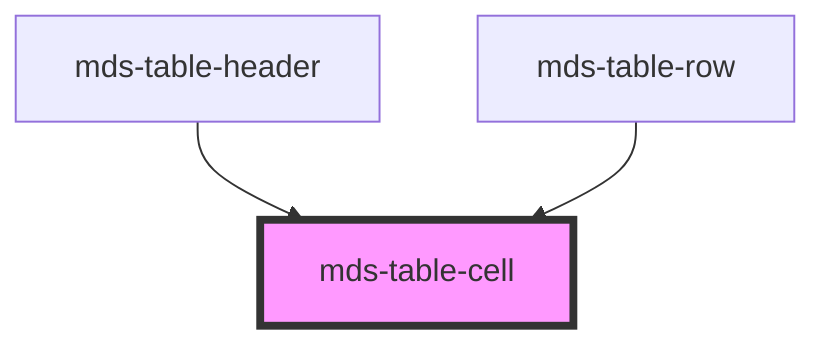

# mds-table-cell


This is a web-component from Maggioli Design System [Magma](https://magma.maggiolicloud.it), built with StencilJS, TypeScript, Storybook. It's based on the web-component standard and it's designed to be agnostic from the JavaScript framework you are using.

<!-- Auto Generated Below -->


## Usage

### 1. Description

The `<mds-table-cell>` web component is the data-cell building block of the Magma table, designed to be slotted inside [`<mds-table-row>`](../../mds-table-row). It plays the role of a single table cell (the equivalent of an HTML `<td>`) and wraps arbitrary content with the correct table semantics and styling.

#### Semantic Behavior

- **Compound child only**: Must be placed as a direct slot child of `<mds-table-row>`. It is not used standalone, and a row should not mix cells with unrelated child types. The parent also injects its own `mds-table-cell` instances for the selection checkbox and row actions.
- **Sorting contribution**: The cell does not sort anything itself, but its `value` is read by `mds-table-header-cell` when sorting a column. If `value` is unset, the header cell falls back to the cell's trimmed text content.
- **Default slot passthrough**: Any text, HTML or component placed inside is projected as-is; there is no internal layout beyond styling.

#### Properties & Visual Configurations

This component is essentially a layout/semantic child and exposes a single non-obvious prop:

- **`value`**: Provide this when the cell's visible content is not directly comparable for sorting, when the displayed text differs from the value you want to sort by (e.g. a formatted date or currency string), or to force a numeric sort by passing a `number`. When omitted, the column sort uses the rendered text content instead.

There are no `variant` or `tone` props; visual presentation is controlled through the documented CSS custom properties (background, alternate background, and text colors) defined in the readme.


### 2. Pattern

Correct and idiomatic ways to use the `<mds-table-cell>` component, ordered from most common to most specialized. Patterns assume a working knowledge of the table composition model documented in [`docs/COMPONENTS.md`](../../../../../../docs/COMPONENTS.md) and the generic stencil rules in [`projects/stencil/SPEC.md`](../../../../SPEC.md).

#### Plain Text Cell

The most common form. Wrap the text in [`<mds-text>`](../../mds-text) to apply the correct typography style; do not put a bare string directly if you need semantic styling.

```html
<mds-table-row>
  <mds-table-cell>
    <mds-text typography="detail">Mario Rossi</mds-text>
  </mds-table-cell>
  <mds-table-cell>
    <mds-text typography="detail">mario.rossi@esempio.it</mds-text>
  </mds-table-cell>
  <mds-table-cell>
    <mds-text typography="detail">12 ottobre 1985</mds-text>
  </mds-table-cell>
</mds-table-row>
```

#### Sortable Column - Value Matches Displayed Text

When the column header is `sortable` and the displayed text is directly sortable as a string, no `value` prop is needed - the sort reads the cell's rendered text content automatically.

```html
<mds-table-header>
  <mds-table-header-cell sortable label="Cognome"></mds-table-header-cell>
  <mds-table-header-cell sortable label="Nome"></mds-table-header-cell>
</mds-table-header>
<mds-table-body>
  <mds-table-row>
    <mds-table-cell><mds-text typography="detail">Rossi</mds-text></mds-table-cell>
    <mds-table-cell><mds-text typography="detail">Mario</mds-text></mds-table-cell>
  </mds-table-row>
  <mds-table-row>
    <mds-table-cell><mds-text typography="detail">Verdi</mds-text></mds-table-cell>
    <mds-table-cell><mds-text typography="detail">Luigi</mds-text></mds-table-cell>
  </mds-table-row>
</mds-table-body>
```

#### Sortable Column - Explicit `value` for Formatted Data

When the cell displays a formatted string (currency, localized date, percentage) that does not sort lexicographically, set `value` to the raw comparable form. Pass a `number` to force numeric sort order.

```html
<mds-table-header>
  <mds-table-header-cell sortable label="Importo"></mds-table-header-cell>
  <mds-table-header-cell sortable label="Data registrazione"></mds-table-header-cell>
</mds-table-header>
<mds-table-body>
  <mds-table-row>
    <!-- value as number for numeric sort -->
    <mds-table-cell value="1250.50">
      <mds-text typography="detail">1.250,50 EUR</mds-text>
    </mds-table-cell>
    <!-- value as ISO date string for correct chronological sort -->
    <mds-table-cell value="2024-03-15">
      <mds-text typography="detail">15 marzo 2024</mds-text>
    </mds-table-cell>
  </mds-table-row>
  <mds-table-row>
    <mds-table-cell value="340.00">
      <mds-text typography="detail">340,00 EUR</mds-text>
    </mds-table-cell>
    <mds-table-cell value="2023-11-02">
      <mds-text typography="detail">2 novembre 2023</mds-text>
    </mds-table-cell>
  </mds-table-row>
</mds-table-body>
```

#### Cell Containing a Component

The default slot accepts any HTML or component. Use this to embed status badges, avatars, buttons, or other Magma components inside a cell.

```html
<mds-table-row>
  <mds-table-cell>
    <mds-text typography="detail">Piano Pro</mds-text>
  </mds-table-cell>
  <mds-table-cell>
    <mds-badge variant="success" tone="weak" label="Attivo"></mds-badge>
  </mds-table-cell>
  <mds-table-cell>
    <mds-avatar label="MR" size="sm"></mds-avatar>
  </mds-table-cell>
</mds-table-row>
```

#### Footer Cell

`<mds-table-cell>` is used inside [`<mds-table-footer>`](../../mds-table-footer) for summary rows (totals, counts). The same `value` sorting prop can be set here too if the footer participates in column alignment logic.

```html
<mds-table-footer>
  <mds-table-cell>
    <mds-text typography="action">Totale</mds-text>
  </mds-table-cell>
  <mds-table-cell>
    <mds-text typography="action">42 record</mds-text>
  </mds-table-cell>
</mds-table-footer>
```

#### Full Table Composition

The canonical structure. Each cell sits inside a row, which sits inside a section (`mds-table-body`, `mds-table-header`, `mds-table-footer`), all wrapped by [`<mds-table>`](../../mds-table).

```html
<mds-table>
  <mds-table-header>
    <mds-table-header-cell sortable label="Utente"></mds-table-header-cell>
    <mds-table-header-cell sortable label="Email"></mds-table-header-cell>
    <mds-table-header-cell label="Stato"></mds-table-header-cell>
  </mds-table-header>
  <mds-table-body>
    <mds-table-row>
      <mds-table-cell value="Mario Rossi">
        <mds-text typography="detail">Mario Rossi</mds-text>
      </mds-table-cell>
      <mds-table-cell value="mario.rossi@esempio.it">
        <mds-text typography="detail">mario.rossi@esempio.it</mds-text>
      </mds-table-cell>
      <mds-table-cell>
        <mds-badge variant="success" tone="weak" label="Attivo"></mds-badge>
      </mds-table-cell>
    </mds-table-row>
    <mds-table-row>
      <mds-table-cell value="Luigi Verdi">
        <mds-text typography="detail">Luigi Verdi</mds-text>
      </mds-table-cell>
      <mds-table-cell value="luigi.verdi@esempio.it">
        <mds-text typography="detail">luigi.verdi@esempio.it</mds-text>
      </mds-table-cell>
      <mds-table-cell>
        <mds-badge variant="error" tone="weak" label="Disabilitato"></mds-badge>
      </mds-table-cell>
    </mds-table-row>
  </mds-table-body>
  <mds-table-footer>
    <mds-table-cell><mds-text typography="action">2 utenti</mds-text></mds-table-cell>
    <mds-table-cell></mds-table-cell>
    <mds-table-cell></mds-table-cell>
  </mds-table-footer>
</mds-table>
```

#### Styling Customization

Customize cell colors through the documented `--mds-table-cell-*` CSS custom properties. Set them on the host or on a parent selector; use Magma color tokens via `rgb(var(--<token>))` so dark mode keeps working.

```css
/* Highlight a column of cells with a custom background */
.tabella-fatture mds-table-cell.colonna-importo {
  --mds-table-cell-background: rgb(var(--variant-info-01));
  --mds-table-cell-color: rgb(var(--tone-kaolin-10));
}

/* Override the alternate (selected/striped) background */
.tabella-fatture mds-table-cell {
  --mds-table-cell-background-alt: rgb(var(--variant-primary-01));
  --mds-table-cell-color-alt: rgb(var(--tone-kaolin-10));
}
```


### 3. Antipattern

Common incorrect uses of `<mds-table-cell>`. Each entry pairs the wrong form with the right one and a one-line reason. System-wide rules (boolean-as-string, shadow piercing, Tailwind color utilities, raw native event listening) live in [`docs/COMPONENTS.md`](../../../../../../docs/COMPONENTS.md#system-level-anti-patterns) - they apply here too but are not repeated.

#### Do Not Use `<mds-table-cell>` Outside Its Parent Hierarchy

`<mds-table-cell>` is a compound child; it must be placed inside `<mds-table-row>` or `<mds-table-footer>` (themselves inside `<mds-table>`). Rendering it standalone breaks the table layout and ARIA semantics entirely.

```html
<!-- 🚫 INCORRECT -->
<div class="my-grid">
  <mds-table-cell>Nome</mds-table-cell>
  <mds-table-cell>Email</mds-table-cell>
</div>

<!-- ✅ CORRECT -->
<mds-table>
  <mds-table-body>
    <mds-table-row>
      <mds-table-cell><mds-text typography="detail">Nome</mds-text></mds-table-cell>
      <mds-table-cell><mds-text typography="detail">Email</mds-text></mds-table-cell>
    </mds-table-row>
  </mds-table-body>
</mds-table>
```

#### Do Not Use `<td>` in Place of `<mds-table-cell>`

Using raw `<td>` inside `<mds-table-row>` bypasses Magma theming, the `selected`/`sorted` state styles, and the sort-value integration. Always use `<mds-table-cell>`.

```html
<!-- 🚫 INCORRECT -->
<mds-table-row>
  <td>Mario Rossi</td>
  <td>mario.rossi@esempio.it</td>
</mds-table-row>

<!-- ✅ CORRECT -->
<mds-table-row>
  <mds-table-cell><mds-text typography="detail">Mario Rossi</mds-text></mds-table-cell>
  <mds-table-cell><mds-text typography="detail">mario.rossi@esempio.it</mds-text></mds-table-cell>
</mds-table-row>
```

#### Do Not Skip `value` When Displaying Formatted Data in a Sortable Column

If a cell shows a formatted value (localized date, currency, percentage) and the column is sortable, omitting `value` causes the sort to compare the human-readable strings lexicographically, producing wrong order.

```html
<!-- 🚫 INCORRECT: "12 marzo 2024" sorts before "2 gennaio 2024" lexicographically -->
<mds-table-cell>
  <mds-text typography="detail">12 marzo 2024</mds-text>
</mds-table-cell>

<!-- ✅ CORRECT: ISO date in value drives sort; display string is for humans -->
<mds-table-cell value="2024-03-12">
  <mds-text typography="detail">12 marzo 2024</mds-text>
</mds-table-cell>
```

#### Do Not Style Cells by Piercing Shadow DOM

`<mds-table-cell>` does not expose named `::part()` targets; the documented customization surface is `--mds-table-cell-background`, `--mds-table-cell-background-alt`, `--mds-table-cell-color`, and `--mds-table-cell-color-alt`. Targeting internals via `>>>` or undocumented selectors couples your code to implementation details that can change.

```css
/* 🚫 INCORRECT */
mds-table-cell >>> span {
  color: red;
}

/* ✅ CORRECT */
mds-table-cell {
  --mds-table-cell-color: rgb(var(--status-error-05));
}
```

#### Do Not Wrap `<mds-table-cell>` in Extra Structural Elements

Inserting a `<div>` or `<span>` wrapper around `<mds-table-cell>` inside `<mds-table-row>` breaks the `display: table-cell` layout model and disrupts the column alignment.

```html
<!-- 🚫 INCORRECT -->
<mds-table-row>
  <div class="cell-wrapper">
    <mds-table-cell><mds-text typography="detail">Cognome</mds-text></mds-table-cell>
  </div>
</mds-table-row>

<!-- ✅ CORRECT -->
<mds-table-row>
  <mds-table-cell><mds-text typography="detail">Cognome</mds-text></mds-table-cell>
</mds-table-row>
```


## Properties

| Property | Attribute | Description                                                                                                                 | Type                            | Default     |
| -------- | --------- | --------------------------------------------------------------------------------------------------------------------------- | ------------------------------- | ----------- |
| `value`  | `value`   | Sets a value to help the sorting function from `mds-table-header-cell`, if not set it will be used the content of the cell. | `number \| string \| undefined` | `undefined` |


## Slots

| Slot | Description                                                      |
| ---- | ---------------------------------------------------------------- |
|      | Add `text string`, `HTML elements` or `components` to this slot. |


## CSS Custom Properties

| Name                              | Description                                 |
| --------------------------------- | ------------------------------------------- |
| `--mds-table-cell-background`     | Default background color of table cells.    |
| `--mds-table-cell-background-alt` | Alternate background color for table cells. |
| `--mds-table-cell-color`          | Default text color of table cells.          |
| `--mds-table-cell-color-alt`      | Text color for alternate table cells.       |


## Dependencies

### Used by

 - [mds-table-header](../mds-table-header)
 - [mds-table-row](../mds-table-row)

### Graph


----------------------------------------------

Built with love @ [Gruppo Maggioli](https://www.maggioli.com) from [R&D Department](https://www.maggioli.com/it-it/chi-siamo/ricerca-sviluppo)
