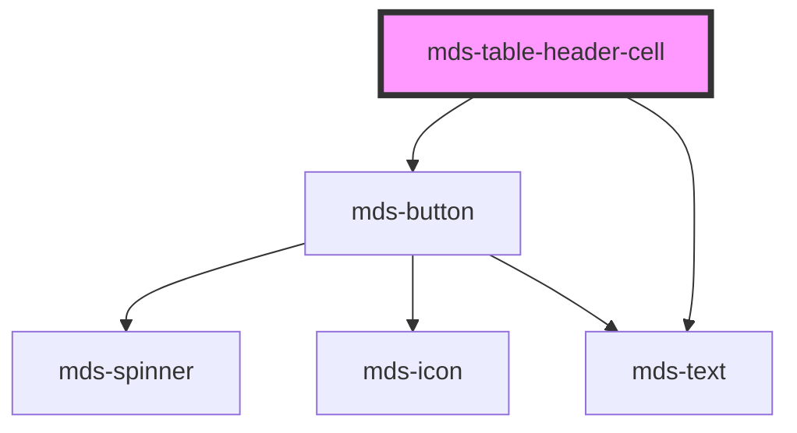

# mds-table-header-cell

<!-- Auto Generated Below -->

## Properties

| Property    | Attribute   | Description                                                               | Type                        | Default     |
| ----------- | ----------- | ------------------------------------------------------------------------- | --------------------------- | ----------- |
| `direction` | `direction` |                                                                           | `"asc" \| "desc" \| "none"` | `'none'`    |
| `label`     | `label`     | Sets a label for the cell                                                 | `string \| undefined`       | `undefined` |
| `sortable`  | `sortable`  | Tells the component to make the cell able to sort the table columns items | `boolean \| undefined`      | `undefined` |

## Shadow Parts

| Part       | Description |
| ---------- | ----------- |
| `"action"` |             |
| `"label"`  |             |

## Dependencies

### Depends on

- [mds-button](../mds-button)
- [mds-text](../mds-text)

### Graph

----------------------------------------------

Built with love @ [Gruppo Maggioli](https://www.maggioli.com) from [R&D Department](https://www.maggioli.com/it-it/chi-siamo/ricerca-sviluppo)
