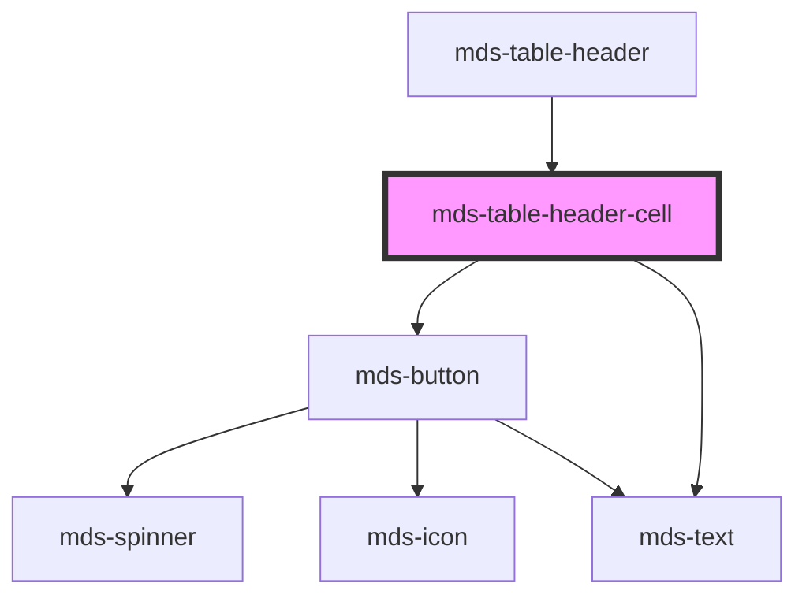

# mds-table-header-cell


<!-- Auto Generated Below -->


## Usage

### 1. Description

The `<mds-table-header-cell>` web component is the column-header cell of a Magma data table. It is a compound child of [`<mds-table-header>`](../../mds-table-header) and plays the role of a native `<th>` (`columnheader`), rendering the column label and, when enabled, acting as the interactive sort control for its column.

#### Semantic Behavior

- **Compound child only**: Must be placed as a direct slot child of `<mds-table-header>`; it is not used standalone, and its sorting acts on the body rows within the enclosing `mds-table`.
- **Header role and ARIA sort**: Reflects its current sort state through `aria-sort`, mirroring the `direction` prop (`none` / `ascending` / `descending`).
- **Position-based sorting**: The cell sorts the matching `mds-table-cell` of every body row by column position; values come from each cell's `value` (falling back to trimmed text), with numeric values compared numerically and others compared alphabetically.
- **Tri-state sort cycle**: Each activation advances the column through `none` → `ascending` → `descending` and back to `none`; the `none` state restores the original row order.
- **Single active sort column**: Sorting a column resets every sibling header cell to `none`, so only one column drives the order at a time.
- **Conditional rendering**: When `sortable` is set the cell renders a clickable sorter (with an up / down / unfold-more icon reflecting `direction`); otherwise it renders a plain label with no interaction.

#### Properties & Visual Configurations

- **`sortable`**: Opt a column into interactive sorting. Leave it unset for purely descriptive columns (label only); set it when the column's values should be reorderable by the user.
- **`direction`**: The reflected sort state of the column (`none`, `ascending`, `descending`). It is self-managed by the click cycle, but can be set externally - for example to clear a column to `none` - and drives both the rendered sort icon and the `aria-sort` value.


### 2. Pattern

Correct and idiomatic ways to use the `<mds-table-header-cell>` component, ordered from most common to most specialized. Patterns assume a working knowledge of the compound table structure documented in [`docs/COMPONENTS.md`](../../../../../../docs/COMPONENTS.md) and the generic stencil rules in [`projects/stencil/SPEC.md`](../../../../SPEC.md).

#### Plain Header Cell

The simplest form: a non-sortable column header that renders a styled label. Omit `sortable` for columns whose values should not be reordered.

```html
<mds-table>
  <mds-table-header>
    <mds-table-header-cell label="Nome"></mds-table-header-cell>
    <mds-table-header-cell label="Ruolo"></mds-table-header-cell>
    <mds-table-header-cell label="Stato"></mds-table-header-cell>
  </mds-table-header>
  <mds-table-body>
    <mds-table-row>
      <mds-table-cell>Mario Rossi</mds-table-cell>
      <mds-table-cell>Amministratore</mds-table-cell>
      <mds-table-cell>Attivo</mds-table-cell>
    </mds-table-row>
  </mds-table-body>
</mds-table>
```

#### Sortable Column Header

Add the `sortable` boolean attribute to enable the tri-state click cycle (`none` -> `ascending` -> `descending` -> `none`). The component manages sorting internally - no JavaScript wiring is required.

```html
<mds-table>
  <mds-table-header>
    <mds-table-header-cell label="Cognome" sortable></mds-table-header-cell>
    <mds-table-header-cell label="Dipartimento" sortable></mds-table-header-cell>
    <mds-table-header-cell label="Note"></mds-table-header-cell>
  </mds-table-header>
  <mds-table-body>
    <mds-table-row>
      <mds-table-cell>Bianchi</mds-table-cell>
      <mds-table-cell>Risorse Umane</mds-table-cell>
      <mds-table-cell>-</mds-table-cell>
    </mds-table-row>
    <mds-table-row>
      <mds-table-cell>Amendola</mds-table-cell>
      <mds-table-cell>Informatica</mds-table-cell>
      <mds-table-cell>-</mds-table-cell>
    </mds-table-row>
  </mds-table-body>
</mds-table>
```

#### Mixing Sortable and Non-Sortable Columns

Place `sortable` only on columns whose values are meaningfully orderable. Action columns or complex-content columns should remain non-sortable.

```html
<mds-table>
  <mds-table-header>
    <mds-table-header-cell label="ID" sortable></mds-table-header-cell>
    <mds-table-header-cell label="Descrizione" sortable></mds-table-header-cell>
    <mds-table-header-cell label="Importo" sortable></mds-table-header-cell>
    <mds-table-header-cell label="Azioni"></mds-table-header-cell>
  </mds-table-header>
  <mds-table-body>
    <mds-table-row>
      <mds-table-cell value="1">1</mds-table-cell>
      <mds-table-cell>Abbonamento annuale</mds-table-cell>
      <mds-table-cell value="120">120,00 EUR</mds-table-cell>
      <mds-table-cell><mds-button label="Modifica" tone="text" variant="primary"></mds-button></mds-table-cell>
    </mds-table-row>
    <mds-table-row>
      <mds-table-cell value="2">2</mds-table-cell>
      <mds-table-cell>Licenza mensile</mds-table-cell>
      <mds-table-cell value="15">15,00 EUR</mds-table-cell>
      <mds-table-cell><mds-button label="Modifica" tone="text" variant="primary"></mds-button></mds-table-cell>
    </mds-table-row>
  </mds-table-body>
</mds-table>
```

#### Providing Numeric Values for Correct Sort Order

When a column displays formatted text (currency, percentages) but should sort numerically, set the `value` prop on each `<mds-table-cell>` to the raw numeric string. The header cell reads `value` first and falls back to text content.

```html
<mds-table>
  <mds-table-header>
    <mds-table-header-cell label="Prodotto"></mds-table-header-cell>
    <mds-table-header-cell label="Punteggio" sortable></mds-table-header-cell>
  </mds-table-header>
  <mds-table-body>
    <mds-table-row>
      <mds-table-cell>Prodotto A</mds-table-cell>
      <mds-table-cell value="8.5">8,5 / 10</mds-table-cell>
    </mds-table-row>
    <mds-table-row>
      <mds-table-cell>Prodotto B</mds-table-cell>
      <mds-table-cell value="10">10 / 10</mds-table-cell>
    </mds-table-row>
    <mds-table-row>
      <mds-table-cell>Prodotto C</mds-table-cell>
      <mds-table-cell value="2.3">2,3 / 10</mds-table-cell>
    </mds-table-row>
  </mds-table-body>
</mds-table>
```

#### Programmatically Resetting Sort Direction

Set `direction="none"` from outside to clear a column's active sort - for example when the user applies a server-side filter that invalidates the current order. Only the `none` value can be set externally; the component manages `ascending` / `descending` itself through click cycles.

```html
<!-- Mark the column as sorted ascending on initial render -->
<mds-table>
  <mds-table-header>
    <mds-table-header-cell label="Data" sortable direction="ascending" id="col-data"></mds-table-header-cell>
    <mds-table-header-cell label="Categoria" sortable></mds-table-header-cell>
  </mds-table-header>
  <mds-table-body>
    <!-- rows -->
  </mds-table-body>
</mds-table>
```

```js
// Reset to unsorted when a new server response arrives
document.querySelector('#col-data').direction = 'none';
```

#### Styling Customization

Adjust cell padding through the documented `--mds-table-header-cell-padding` CSS custom property. Target the `label` or `action` shadow parts for glyph-level overrides. Set properties on the host or a parent selector.

```css
mds-table-header mds-table-header-cell {
  --mds-table-header-cell-padding: var(--spacing-200) var(--spacing-300);
}

mds-table-header-cell::part(label) {
  font-weight: var(--font-weight-semibold);
}
```


### 3. Antipattern

Common incorrect uses of `<mds-table-header-cell>`. Each entry pairs the wrong form with the right one and a one-line reason. System-wide rules (boolean-as-string, shadow piercing, Tailwind color utilities, raw native event listening) live in [`docs/COMPONENTS.md`](../../../../../../docs/COMPONENTS.md#system-level-anti-patterns) - they apply here too but are not repeated.

#### Do Not Use Outside `mds-table-header`

`<mds-table-header-cell>` is a compound child component and relies on traversing the DOM to locate its sibling cells and the `<mds-table-body>` for sorting. Using it outside `<mds-table-header>` breaks both the layout and the sort logic.

```html
<!-- 🚫 INCORRECT -->
<div class="table-head">
  <mds-table-header-cell label="Nome" sortable></mds-table-header-cell>
</div>

<!-- ✅ CORRECT -->
<mds-table>
  <mds-table-header>
    <mds-table-header-cell label="Nome" sortable></mds-table-header-cell>
  </mds-table-header>
  <mds-table-body><!-- rows --></mds-table-body>
</mds-table>
```

#### Do Not Set `direction` to Drive the Sort Cycle

The `ascending` / `descending` states are managed by the internal click cycle; setting them from outside does not trigger a re-sort. Only `direction="none"` is safe to set externally - use it to clear a column back to the unsorted state.

```html
<!-- 🚫 INCORRECT -->
<mds-table-header-cell label="Data" sortable direction="ascending"></mds-table-header-cell>

<!-- ✅ CORRECT - let the user click to enter the sort cycle, or reset to none programmatically -->
<mds-table-header-cell label="Data" sortable></mds-table-header-cell>
```

```js
// Only resetting to none is a safe external write
document.querySelector('mds-table-header-cell').direction = 'none';
```

#### Do Not Use `sortable="false"` to Disable Sorting

`sortable` is a boolean attribute. Any non-empty string value - including `"false"` - is treated as `true` in HTML and Stencil. Remove the attribute entirely to produce a non-sortable header cell.

```html
<!-- 🚫 INCORRECT -->
<mds-table-header-cell label="Stato" sortable="false"></mds-table-header-cell>

<!-- ✅ CORRECT -->
<mds-table-header-cell label="Stato"></mds-table-header-cell>
```

#### Do Not Slot Content Instead of Using the `label` Prop

The component renders its label through the `label` prop; there is no documented slot. Placing text or elements as children of the host puts them in an unsupported slot and they will not appear.

```html
<!-- 🚫 INCORRECT -->
<mds-table-header-cell sortable>
  <span>Cognome</span>
</mds-table-header-cell>

<!-- ✅ CORRECT -->
<mds-table-header-cell label="Cognome" sortable></mds-table-header-cell>
```

#### Do Not Pierce Shadow DOM to Style the Sort Button

The sort button is an internal `<mds-button>` inside the shadow root. Use the documented `::part(action)` or `--mds-table-header-cell-padding` CSS custom property instead of undocumented selectors.

```css
/* 🚫 INCORRECT */
mds-table-header-cell >>> .action {
  background-color: red;
}

/* ✅ CORRECT */
mds-table-header-cell::part(action) {
  /* use only documented part-level overrides */
}
mds-table-header-cell {
  --mds-table-header-cell-padding: var(--spacing-300);
}
```

#### Do Not Wrap the Cell in a Native `<th>`

`<mds-table-header-cell>` already carries `role="columnheader"` and manages `aria-sort`. Wrapping it inside a native `<th>` doubles the ARIA semantics and produces invalid table structure.

```html
<!-- 🚫 INCORRECT -->
<thead>
  <tr>
    <th><mds-table-header-cell label="Nome"></mds-table-header-cell></th>
  </tr>
</thead>

<!-- ✅ CORRECT -->
<mds-table>
  <mds-table-header>
    <mds-table-header-cell label="Nome"></mds-table-header-cell>
  </mds-table-header>
</mds-table>
```


## Properties

| Property    | Attribute   | Description                                                               | Type                                    | Default     |
| ----------- | ----------- | ------------------------------------------------------------------------- | --------------------------------------- | ----------- |
| `direction` | `direction` |                                                                           | `"ascending" \| "descending" \| "none"` | `'none'`    |
| `label`     | `label`     | Sets a label for the cell                                                 | `string \| undefined`                   | `undefined` |
| `sortable`  | `sortable`  | Tells the component to make the cell able to sort the table columns items | `boolean \| undefined`                  | `undefined` |


## Shadow Parts

| Part       | Description |
| ---------- | ----------- |
| `"action"` |             |
| `"label"`  |             |


## CSS Custom Properties

| Name                              | Description                   |
| --------------------------------- | ----------------------------- |
| `--mds-table-header-cell-padding` | The padding of the table cell |


## Dependencies

### Used by

 - [mds-table-header](../mds-table-header)

### Depends on

- [mds-button](../mds-button)
- [mds-text](../mds-text)

### Graph


----------------------------------------------

Built with love @ [Gruppo Maggioli](https://www.maggioli.com) from [R&D Department](https://www.maggioli.com/it-it/chi-siamo/ricerca-sviluppo)
