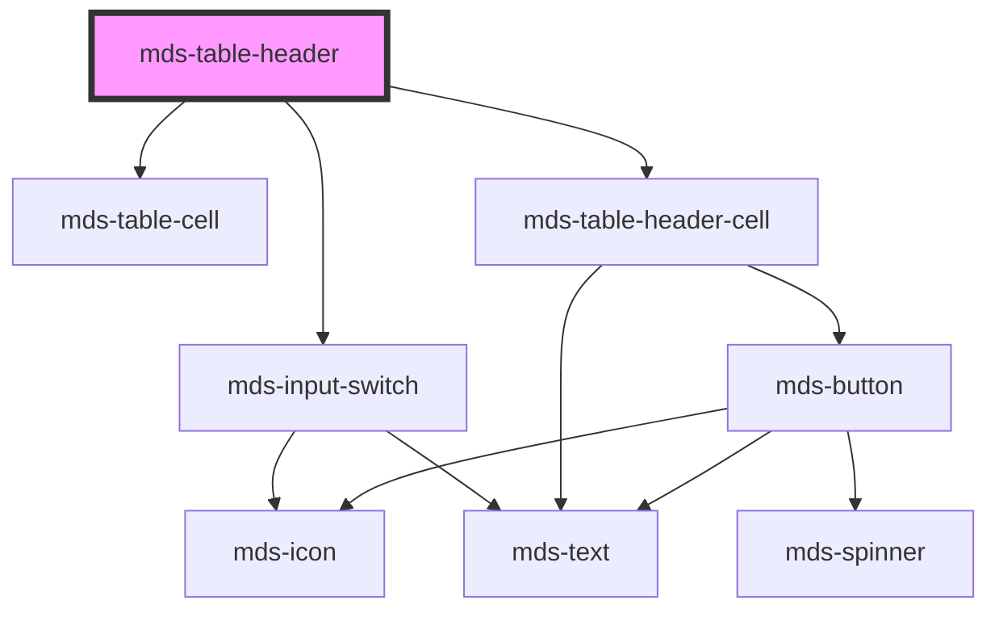

# mds-table-header


This is a web-component from Maggioli Design System [Magma](https://magma.maggiolicloud.it), built with StencilJS, TypeScript, Storybook. It's based on the web-component standard and it's designed to be agnostic from the JavaScript framework you are using.

<!-- Auto Generated Below -->


## Usage

### 1. Description

The `<mds-table-header>` web component is the header region of a Magma table, used exclusively as a direct slot child of its parent [`<mds-table>`](../../mds-table). It plays the role of an HTML `<thead>`/header row, hosting the column-header cells and, when selection is enabled, the master "select all" control.

#### Semantic Behavior

- **Compound child only**: Must be slotted directly inside `<mds-table>` alongside `mds-table-body` (and optionally `mds-table-footer`); it is not used standalone. Its own default slot accepts `mds-table-row` element(s).
- **Parent-driven selection state**: When `selectable` is true the header renders a master checkbox that the parent keeps in sync - `indeterminate` for partial selection and `checked` when all rows are selected.
- **Selection reported upward**: Toggling the master checkbox selects or deselects every row, after which the table re-emits its own `mdsTableSelectionChange` event.
- **Automatic actions column**: When any row exposes a `[slot="action"]`, the header appends an extra header cell (exposed as the `actions` shadow part) labelled with the localized "actions" string.
- **Localized labels**: The select-all/select-none switch title and the actions label are localized (el/en/es/it).

#### Properties & Visual Configurations

This child is configured almost entirely by its parent rather than by author-set attributes.

- **`selectable`**: Toggles rendering of the leading master-checkbox column. It is not normally set by hand - `<mds-table>` propagates its own `selectable` prop down to the header, so enabling selection on the table is what surfaces this control here.

Beyond `selectable`, content is provided through the default slot (`mds-table-row` / header cells); there are no shared `variant`/`tone` ladders on this component.


### 2. Pattern

Correct and idiomatic ways to use the `<mds-table-header>` component, ordered from most common to most specialized. Patterns assume a working knowledge of the table composition rules documented in [`docs/COMPONENTS.md`](../../../../../../docs/COMPONENTS.md) and the generic stencil rules in [`projects/stencil/SPEC.md`](../../../../SPEC.md).

#### Basic Column Headers

Place `<mds-table-header>` as a direct child of `<mds-table>` and fill its default slot with one `<mds-table-header-cell>` per column. Use the `label` prop on each cell - it is the only text source the cell needs.

```html
<mds-table>
  <mds-table-header>
    <mds-table-header-cell label="Nome"></mds-table-header-cell>
    <mds-table-header-cell label="Email"></mds-table-header-cell>
    <mds-table-header-cell label="Data registrazione"></mds-table-header-cell>
  </mds-table-header>
  <mds-table-body>
    <!-- mds-table-row elements -->
  </mds-table-body>
</mds-table>
```

#### Sortable Columns

Add the `sortable` attribute on the `<mds-table-header-cell>` elements whose column should be sortable. The cell cycles through `none`, `ascending`, and `descending` on each click and re-orders the corresponding body rows automatically.

```html
<mds-table>
  <mds-table-header>
    <mds-table-header-cell sortable label="Cognome"></mds-table-header-cell>
    <mds-table-header-cell sortable label="Data"></mds-table-header-cell>
    <mds-table-header-cell label="Note"></mds-table-header-cell>
  </mds-table-header>
  <mds-table-body>
    <!-- mds-table-row elements -->
  </mds-table-body>
</mds-table>
```

#### Selectable Table with Master Checkbox

Enable row selection by adding `selectable` on `<mds-table>`. The table propagates the prop down to `<mds-table-header>`, which automatically renders the master "select all" checkbox as the first column. Never set `selectable` directly on `<mds-table-header>` - drive it from the table.

```html
<mds-table selectable>
  <mds-table-header>
    <mds-table-header-cell label="Utente"></mds-table-header-cell>
    <mds-table-header-cell label="Ruolo"></mds-table-header-cell>
  </mds-table-header>
  <mds-table-body>
    <mds-table-row value="1">
      <mds-table-cell>Mario Rossi</mds-table-cell>
      <mds-table-cell>Amministratore</mds-table-cell>
    </mds-table-row>
    <mds-table-row value="2">
      <mds-table-cell>Giulia Bianchi</mds-table-cell>
      <mds-table-cell>Editor</mds-table-cell>
    </mds-table-row>
  </mds-table-body>
</mds-table>
```

#### Reacting to Selection Changes

Listen for `mdsTableSelectionChange` on `<mds-table>` to receive the array of selected rows whenever the master checkbox or any individual row checkbox changes.

```html
<mds-table selectable id="tabella-utenti">
  <mds-table-header>
    <mds-table-header-cell label="Utente"></mds-table-header-cell>
    <mds-table-header-cell label="Stato"></mds-table-header-cell>
  </mds-table-header>
  <mds-table-body>
    <mds-table-row value="alice">
      <mds-table-cell>Alice Verdi</mds-table-cell>
      <mds-table-cell>Attivo</mds-table-cell>
    </mds-table-row>
    <mds-table-row value="bob">
      <mds-table-cell>Bob Neri</mds-table-cell>
      <mds-table-cell>Sospeso</mds-table-cell>
    </mds-table-row>
  </mds-table-body>
</mds-table>

<script>
  document.getElementById('tabella-utenti').addEventListener('mdsTableSelectionChange', (e) => {
    console.log('Righe selezionate:', e.detail.rows);
  });
</script>
```

#### Actions Column - Automatic Header Cell

When any `<mds-table-row>` exposes a `[slot="action"]`, `<mds-table-header>` automatically appends a right-aligned "Azione" header cell. No extra markup is required in the header - just place your action buttons in the row slots.

```html
<mds-table>
  <mds-table-header>
    <mds-table-header-cell label="Documento"></mds-table-header-cell>
    <mds-table-header-cell label="Dimensione"></mds-table-header-cell>
  </mds-table-header>
  <mds-table-body>
    <mds-table-row>
      <mds-table-cell>Relazione annuale.pdf</mds-table-cell>
      <mds-table-cell>2,4 MB</mds-table-cell>
      <mds-button
        slot="action"
        icon="mi/baseline/download"
        title="Scarica"
        variant="primary"
        tone="text"
      ></mds-button>
    </mds-table-row>
  </mds-table-body>
</mds-table>
```

#### Batch Actions with Selection

When `selectable` is set and the table has a `batch-action` slot, a batch-actions toolbar slides in whenever rows are selected. The toolbar is owned by `<mds-table>`, but the master checkbox in `<mds-table-header>` drives the count and triggers the toolbar visibility.

```html
<mds-table selectable>
  <mds-table-header>
    <mds-table-header-cell label="Nome file"></mds-table-header-cell>
    <mds-table-header-cell label="Tipo"></mds-table-header-cell>
  </mds-table-header>
  <mds-table-body>
    <mds-table-row value="doc1">
      <mds-table-cell>contratto.pdf</mds-table-cell>
      <mds-table-cell>PDF</mds-table-cell>
    </mds-table-row>
    <mds-table-row value="doc2">
      <mds-table-cell>allegato.docx</mds-table-cell>
      <mds-table-cell>Word</mds-table-cell>
    </mds-table-row>
  </mds-table-body>
  <mds-button slot="batch-action" label="Elimina selezionati" variant="error" tone="text"></mds-button>
  <mds-button slot="batch-action" label="Esporta" variant="secondary" tone="outline"></mds-button>
</mds-table>
```

#### Styling the Actions Part

The auto-generated actions header cell is exposed as the `actions` shadow part. Target it with `::part(actions)` to adjust alignment or other visual properties.

```css
mds-table-header::part(actions) {
  text-align: center;
  min-width: 8rem;
}
```


### 3. Antipattern

Common incorrect uses of `<mds-table-header>`. Each entry pairs the wrong form with the right one and a one-line reason. System-wide rules (boolean-as-string, shadow piercing, Tailwind color utilities, raw native event listening) live in [`docs/COMPONENTS.md`](../../../../../../docs/COMPONENTS.md#system-level-anti-patterns) - they apply here too but are not repeated.

#### Do Not Use `<mds-table-header>` Outside `<mds-table>`

`<mds-table-header>` calls `this.host.closest('mds-table')` during load to wire up selection and action-column detection. Using it standalone or inside a raw `<table>` throws a runtime error and breaks every selection and sorting feature.

```html
<!-- 🚫 INCORRECT -->
<table>
  <mds-table-header>
    <mds-table-header-cell label="Nome"></mds-table-header-cell>
  </mds-table-header>
</table>

<!-- ✅ CORRECT -->
<mds-table>
  <mds-table-header>
    <mds-table-header-cell label="Nome"></mds-table-header-cell>
  </mds-table-header>
  <mds-table-body><!-- rows --></mds-table-body>
</mds-table>
```

#### Do Not Slot `<mds-table-row>` Inside `<mds-table-header>`

The default slot of `<mds-table-header>` expects `<mds-table-header-cell>` elements - one per column. Slotting `<mds-table-row>` (a body-row component) into the header produces broken layout and wrong ARIA roles.

```html
<!-- 🚫 INCORRECT -->
<mds-table>
  <mds-table-header>
    <mds-table-row>
      <mds-table-cell>Cognome</mds-table-cell>
      <mds-table-cell>Email</mds-table-cell>
    </mds-table-row>
  </mds-table-header>
  <mds-table-body><!-- rows --></mds-table-body>
</mds-table>

<!-- ✅ CORRECT -->
<mds-table>
  <mds-table-header>
    <mds-table-header-cell label="Cognome"></mds-table-header-cell>
    <mds-table-header-cell label="Email"></mds-table-header-cell>
  </mds-table-header>
  <mds-table-body><!-- rows --></mds-table-body>
</mds-table>
```

#### Do Not Set `selectable` Directly on `<mds-table-header>`

`selectable` on the header is an internal prop driven by `<mds-table>` - when the table's `@Watch('selectable')` fires, it pushes the value down. Setting it by hand on the header bypasses that synchronisation path and can leave rows and the master checkbox out of sync.

```html
<!-- 🚫 INCORRECT -->
<mds-table>
  <mds-table-header selectable>
    <mds-table-header-cell label="Utente"></mds-table-header-cell>
  </mds-table-header>
  <mds-table-body><!-- rows --></mds-table-body>
</mds-table>

<!-- ✅ CORRECT -->
<mds-table selectable>
  <mds-table-header>
    <mds-table-header-cell label="Utente"></mds-table-header-cell>
  </mds-table-header>
  <mds-table-body><!-- rows --></mds-table-body>
</mds-table>
```

#### Do Not Add a Manual "Actions" Header Cell

The component detects `[slot="action"]` children in the table body and appends the localized "Azione" header cell automatically. Adding your own header cell for actions doubles the column and misaligns the grid.

```html
<!-- 🚫 INCORRECT -->
<mds-table>
  <mds-table-header>
    <mds-table-header-cell label="Nome"></mds-table-header-cell>
    <mds-table-header-cell label="Azioni"></mds-table-header-cell>
  </mds-table-header>
  <mds-table-body>
    <mds-table-row>
      <mds-table-cell>Mario Rossi</mds-table-cell>
      <mds-button slot="action" icon="mi/baseline/delete" title="Elimina" variant="error" tone="text"></mds-button>
    </mds-table-row>
  </mds-table-body>
</mds-table>

<!-- ✅ CORRECT -->
<mds-table>
  <mds-table-header>
    <mds-table-header-cell label="Nome"></mds-table-header-cell>
  </mds-table-header>
  <mds-table-body>
    <mds-table-row>
      <mds-table-cell>Mario Rossi</mds-table-cell>
      <mds-button slot="action" icon="mi/baseline/delete" title="Elimina" variant="error" tone="text"></mds-button>
    </mds-table-row>
  </mds-table-body>
</mds-table>
```

#### Do Not Call `setSelection` from Application Code

`setSelection(selectedItems, totalItems)` is an internal method called by `<mds-table>` after each row selection change. Calling it from application code duplicates the table's internal bookkeeping and can leave the checkbox in an inconsistent state. React to selection results via the `mdsTableSelectionChange` event instead.

```html
<!-- 🚫 INCORRECT -->
<script>
  const header = document.querySelector('mds-table-header');
  header.setSelection(2, 5); // do not call this from app code
</script>

<!-- ✅ CORRECT -->
<script>
  document.querySelector('mds-table').addEventListener('mdsTableSelectionChange', (e) => {
    console.log('Selezione corrente:', e.detail.rows);
  });
</script>
```

#### Do Not Use Raw `<thead>` / `<th>` Instead of the Component

Mixing raw HTML table elements with the Magma compound disrupts the internal ResizeObserver, selection wiring, and localization that `<mds-table-header>` provides.

```html
<!-- 🚫 INCORRECT -->
<mds-table>
  <thead>
    <tr>
      <th>Nome</th>
      <th>Email</th>
    </tr>
  </thead>
  <mds-table-body><!-- rows --></mds-table-body>
</mds-table>

<!-- ✅ CORRECT -->
<mds-table>
  <mds-table-header>
    <mds-table-header-cell label="Nome"></mds-table-header-cell>
    <mds-table-header-cell label="Email"></mds-table-header-cell>
  </mds-table-header>
  <mds-table-body><!-- rows --></mds-table-body>
</mds-table>
```


## Properties

| Property     | Attribute    | Description | Type                   | Default     |
| ------------ | ------------ | ----------- | ---------------------- | ----------- |
| `selectable` | `selectable` |             | `boolean \| undefined` | `undefined` |


## Methods

### `setSelection(selectedItems: number, totalItems: number) => Promise<void>`


#### Parameters

| Name            | Type     | Description |
| --------------- | -------- | ----------- |
| `selectedItems` | `number` |             |
| `totalItems`    | `number` |             |

#### Returns

Type: `Promise<void>`


### `updateLang() => Promise<void>`


#### Returns

Type: `Promise<void>`


## Slots

| Slot        | Description                    |
| ----------- | ------------------------------ |
| `"default"` | Add `mds-table-row` element/s. |


## Shadow Parts

| Part        | Description |
| ----------- | ----------- |
| `"actions"` |             |


## Dependencies

### Depends on

- [mds-table-cell](../mds-table-cell)
- [mds-input-switch](../mds-input-switch)
- [mds-table-header-cell](../mds-table-header-cell)

### Graph


----------------------------------------------

Built with love @ [Gruppo Maggioli](https://www.maggioli.com) from [R&D Department](https://www.maggioli.com/it-it/chi-siamo/ricerca-sviluppo)
