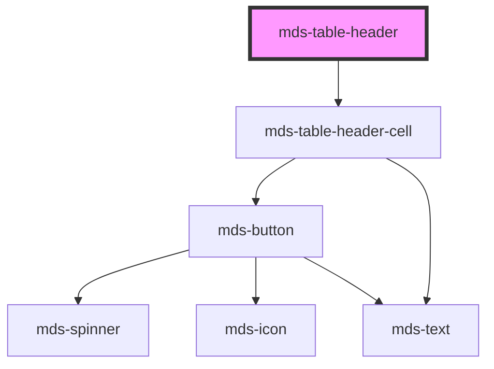

# mds-table-header

This is a web-component from Maggioli Design System [Magma](https://magma.maggiolicloud.it), built with StencilJS, TypeScript, Storybook. It's based on the web-component standard and it's designed to be agnostic from the JavaScript framework you are using.

<!-- Auto Generated Below -->

## Methods

### `updateLang() => Promise<void>`

#### Returns

Type: `Promise<void>`

## Slots

| Slot        | Description                    |
| ----------- | ------------------------------ |
| `"default"` | Add `mds-table-row` element/s. |

## Dependencies

### Depends on

- [mds-table-header-cell](../mds-table-header-cell)

### Graph

----------------------------------------------

Built with love @ [Gruppo Maggioli](https://www.maggioli.com) from [R&D Department](https://www.maggioli.com/it-it/chi-siamo/ricerca-sviluppo)
