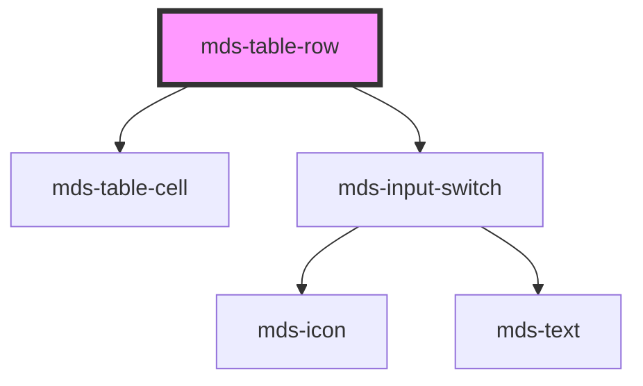

# mds-table-row

This is a web-component from Maggioli Design System [Magma](https://magma.maggiolicloud.it), built with StencilJS, TypeScript, Storybook. It's based on the web-component standard and it's designed to be agnostic from the JavaScript framework you are using.

<!-- Auto Generated Below -->

## Properties

| Property         | Attribute         | Description | Type                            | Default     |
| ---------------- | ----------------- | ----------- | ------------------------------- | ----------- |
| `interactive`    | `interactive`     |             | `boolean \| undefined`          | `undefined` |
| `overlayActions` | `overlay-actions` |             | `boolean`                       | `undefined` |
| `selectable`     | `selectable`      |             | `boolean \| undefined`          | `undefined` |
| `selected`       | `selected`        |             | `boolean \| undefined`          | `undefined` |
| `value`          | `value`           |             | `number \| string \| undefined` | `undefined` |

## Methods

### `updateLang() => Promise<void>`

#### Returns

Type: `Promise<void>`

## Slots

| Slot        | Description                                                                           |
| ----------- | ------------------------------------------------------------------------------------- |
| `"action"`  | Put `mds-button` element/s or other kind of actions as aside menu for the single row. |
| `"default"` | Put `mds-table-cell` element/s.                                                       |

## CSS Custom Properties

| Name                               | Description                                |
| ---------------------------------- | ------------------------------------------ |
| `--mds-table-row-actions-gap`      | Gap spacing for actions inside table rows. |
| `--mds-table-row-background-alt`   | Background color for alternate table rows. |
| `--mds-table-row-background-hover` | Background color for table row on hover.   |
| `--mds-table-row-color-alt`        | Text color for alternate table rows.       |
| `--mds-table-row-color-hover`      | Text color for table row on hover.         |

## Dependencies

### Depends on

- [mds-table-cell](../mds-table-cell)
- [mds-input-switch](../mds-input-switch)

### Graph

----------------------------------------------

Built with love @ [Gruppo Maggioli](https://www.maggioli.com) from [R&D Department](https://www.maggioli.com/it-it/chi-siamo/ricerca-sviluppo)
