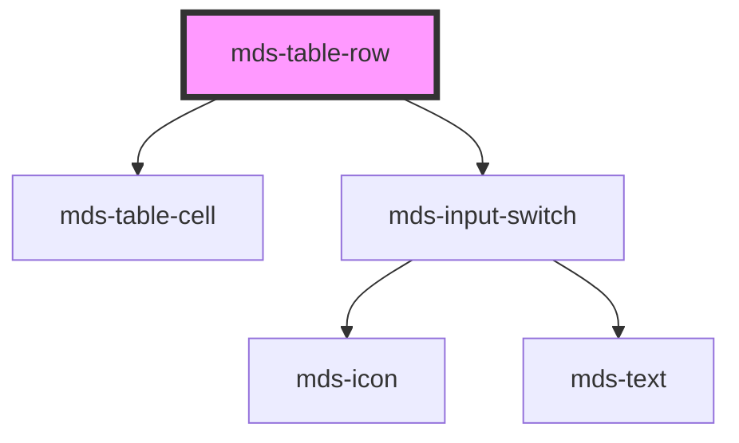

# mds-table-row


This is a web-component from Maggioli Design System [Magma](https://magma.maggiolicloud.it), built with StencilJS, TypeScript, Storybook. It's based on the web-component standard and it's designed to be agnostic from the JavaScript framework you are using.

<!-- Auto Generated Below -->


## Usage

### 1. Description

The `<mds-table-row>` web component represents a single data row inside a [`<mds-table>`](../../mds-table) (slotted through `mds-table-body`, `mds-table-header`, or `mds-table-footer`). It wraps a set of `mds-table-cell` children, and optionally exposes a per-row selection checkbox and an aside actions menu.

#### Semantic Behavior

- **Compound child only**: `<mds-table-row>` must be slotted inside an `<mds-table>` subtree (header/body/footer); it is not used standalone and its default slot must contain `mds-table-cell` elements, not arbitrary markup.
- **Parent-driven configuration**: `interactive`, `selectable`, and `overlayActions` are set by the parent `<mds-table>` on every row, so rows stay in sync with table state rather than being configured one by one.
- **Selection reporting**: When `selectable` is on, the row renders a leading selection checkbox; toggling it updates the row's `selected` prop and tells the table to recompute and emit the table-level selection event.
- **Selected as two-way state**: `selected` can be read and set by the parent to drive bulk select-all behavior.
- **Actions menu**: An `action`-named slot, when present, renders an actions cell that floats correctly over the scrolling row.
- **Localized accessibility labels**: The selection switch's title is localized (Select/Deselect row) across el/en/es/it.

#### Properties & Visual Configurations

Most props are orchestrated by the parent table rather than set directly by consumers:

- **`interactive`**: mirrors the table's interactive mode (hover highlight); normally inherited from `<mds-table>` rather than set per row.
- **`selectable`**: enables the leading selection switch; toggled by the table so all rows gain or lose selection together.
- **`overlayActions`**: set by the table when the row content overflows horizontally, switching the actions menu to an overlay rendering so it stays reachable while scrolling.
- **`selected`**: the row's current selection state; read and written by the parent for select-all and batch operations.
- **`value`**: the identifying payload reported back in the table's selection event for this row - set this to the business key (e.g. record id) you need when handling selections.


### 2. Pattern

Correct and idiomatic ways to use the `<mds-table-row>` component, ordered from most common to most specialized. Patterns assume a working knowledge of the table system documented in [`docs/COMPONENTS.md`](../../../../../../docs/COMPONENTS.md) and the generic stencil rules in [`projects/stencil/SPEC.md`](../../../../SPEC.md).

#### Basic Row with Data Cells

The minimal form: slot one or more [`mds-table-cell`](../../mds-table-cell) elements into the default slot. Always place `<mds-table-row>` inside [`mds-table-body`](../../mds-table-body) (or `mds-table-header` / `mds-table-footer`) - never standalone.

```html
<mds-table>
  <mds-table-header>
    <mds-table-header-cell label="Nome"></mds-table-header-cell>
    <mds-table-header-cell label="Email"></mds-table-header-cell>
    <mds-table-header-cell label="Data"></mds-table-header-cell>
  </mds-table-header>
  <mds-table-body>
    <mds-table-row>
      <mds-table-cell><mds-text typography="detail">Mario Rossi</mds-text></mds-table-cell>
      <mds-table-cell><mds-text typography="detail">mario.rossi@example.com</mds-text></mds-table-cell>
      <mds-table-cell><mds-text typography="detail">12 ottobre 1985</mds-text></mds-table-cell>
    </mds-table-row>
    <mds-table-row>
      <mds-table-cell><mds-text typography="detail">Luigi Verdi</mds-text></mds-table-cell>
      <mds-table-cell><mds-text typography="detail">luigi.verdi@example.com</mds-text></mds-table-cell>
      <mds-table-cell><mds-text typography="detail">3 marzo 1993</mds-text></mds-table-cell>
    </mds-table-row>
  </mds-table-body>
</mds-table>
```

#### Row with Per-Row Actions

Slot one or more [`mds-button`](../../mds-button) elements into the `action` slot to add a contextual actions menu that slides in on row hover. Use icon-only buttons with `aria-label` (or `title`) because the label has no space.

```html
<mds-table-row value="42">
  <mds-table-cell><mds-text typography="detail">Documento riservato.pdf</mds-text></mds-table-cell>
  <mds-table-cell><mds-text typography="detail">2 MB</mds-text></mds-table-cell>
  <mds-button
    slot="action"
    icon="mi/baseline/download"
    title="Scarica"
    variant="primary"
    tone="text"
  ></mds-button>
  <mds-button
    slot="action"
    icon="mi/baseline/delete"
    title="Elimina"
    variant="error"
    tone="text"
  ></mds-button>
</mds-table-row>
```

#### Row with Identifying `value`

Set `value` to the business key (record id or slug) that the parent table should include in the `mdsTableSelectionChange` event detail. This wires the visual row to the data layer without any manual DOM traversal.

```html
<mds-table selectable>
  <mds-table-body>
    <mds-table-row value="user-101">
      <mds-table-cell><mds-text typography="detail">Carla Bianchi</mds-text></mds-table-cell>
      <mds-table-cell><mds-text typography="detail">carla.bianchi@example.com</mds-text></mds-table-cell>
    </mds-table-row>
    <mds-table-row value="user-102">
      <mds-table-cell><mds-text typography="detail">Federica Neri</mds-text></mds-table-cell>
      <mds-table-cell><mds-text typography="detail">federica.neri@example.com</mds-text></mds-table-cell>
    </mds-table-row>
  </mds-table-body>
</mds-table>
```

#### Selectable Table - Reading the Selection Event

When the parent `<mds-table>` sets `selectable`, each row renders a leading checkbox automatically. Listen for `mdsTableSelectionChange` on the table - do not wire per-row events.

```html
<mds-table id="utenti" selectable>
  <mds-table-body>
    <mds-table-row value="101">
      <mds-table-cell><mds-text typography="detail">Mario Rossi</mds-text></mds-table-cell>
    </mds-table-row>
    <mds-table-row value="102">
      <mds-table-cell><mds-text typography="detail">Luigi Verdi</mds-text></mds-table-cell>
    </mds-table-row>
  </mds-table-body>
</mds-table>

<script>
  document.getElementById('utenti').addEventListener('mdsTableSelectionChange', (e) => {
    console.log('Righe selezionate:', e.detail.rows);
  });
</script>
```

#### Programmatic Selection

`selected` is mutable and reflected. Set it from JavaScript to drive bulk "select all" or restore a previously saved selection state.

```html
<mds-table-row id="riga-principale" value="rec-1">
  <mds-table-cell><mds-text typography="detail">Record principale</mds-text></mds-table-cell>
</mds-table-row>

<script>
  // Select the row programmatically (e.g. after restoring from storage)
  document.getElementById('riga-principale').selected = true;
</script>
```

#### Interactive Table (Hover Highlight)

Set `interactive` on the parent `<mds-table>` to enable per-row hover highlights. The prop is mirrored to each row by the table - do not set it on individual rows.

```html
<mds-table interactive>
  <mds-table-body>
    <mds-table-row value="p-01">
      <mds-table-cell><mds-text typography="detail">Pratica 01</mds-text></mds-table-cell>
      <mds-table-cell><mds-text typography="detail">In lavorazione</mds-text></mds-table-cell>
    </mds-table-row>
    <mds-table-row value="p-02">
      <mds-table-cell><mds-text typography="detail">Pratica 02</mds-text></mds-table-cell>
      <mds-table-cell><mds-text typography="detail">Completata</mds-text></mds-table-cell>
    </mds-table-row>
  </mds-table-body>
</mds-table>
```

#### Styling Customization

Override the documented `--mds-table-row-*` CSS custom properties on the row host or on a parent selector. Use Magma color tokens wrapped in `rgb(var(...))` so dark mode and high-contrast modes stay consistent.

```css
/* Customize hover and alternate-row colors for a branded table */
.tabella-brand mds-table-row {
  --mds-table-row-background-hover: rgb(var(--variant-primary-01));
  --mds-table-row-color-hover: rgb(var(--tone-kaolin-10));
  --mds-table-row-background-alt: rgb(var(--tone-neutral-01));
  --mds-table-row-color-alt: rgb(var(--tone-neutral-08));
  --mds-table-row-actions-gap: var(--spacing-200);
}
```


### 3. Antipattern

Common incorrect uses of `<mds-table-row>`. Each entry pairs the wrong form with the right one and a one-line reason. System-wide rules (boolean-as-string, shadow piercing, Tailwind color utilities, raw native event listening) live in [`docs/COMPONENTS.md`](../../../../../../docs/COMPONENTS.md#system-level-anti-patterns) - they apply here too but are not repeated.

#### Do Not Use `<mds-table-row>` Standalone

`<mds-table-row>` is a compound child component and must be slotted inside [`mds-table-body`](../../mds-table-body), `mds-table-header`, or `mds-table-footer` inside an [`mds-table`](../../mds-table). Using it outside the table subtree breaks layout and the internal parent-child communication that drives selection and interactive state.

```html
<!-- 🚫 INCORRECT -->
<div class="my-list">
  <mds-table-row>
    <mds-table-cell>Mario Rossi</mds-table-cell>
  </mds-table-row>
</div>

<!-- ✅ CORRECT -->
<mds-table>
  <mds-table-body>
    <mds-table-row>
      <mds-table-cell><mds-text typography="detail">Mario Rossi</mds-text></mds-table-cell>
    </mds-table-row>
  </mds-table-body>
</mds-table>
```

#### Do Not Put Arbitrary HTML in the Default Slot

The default slot of `<mds-table-row>` accepts only [`mds-table-cell`](../../mds-table-cell) elements. Slotting raw `<td>`, `<div>`, or other markup breaks the table layout model and the sort/selection logic that relies on `mds-table-cell` identity.

```html
<!-- 🚫 INCORRECT -->
<mds-table-row>
  <td>Mario Rossi</td>
  <div>mario.rossi@example.com</div>
</mds-table-row>

<!-- ✅ CORRECT -->
<mds-table-row>
  <mds-table-cell><mds-text typography="detail">Mario Rossi</mds-text></mds-table-cell>
  <mds-table-cell><mds-text typography="detail">mario.rossi@example.com</mds-text></mds-table-cell>
</mds-table-row>
```

#### Do Not Set `interactive` or `selectable` Directly on Individual Rows

Both props are orchestrated by the parent `<mds-table>` and propagated to every row automatically. Setting them per-row creates a desynchronized state where some rows behave differently from others, and the table's own state machine does not know about the override.

```html
<!-- 🚫 INCORRECT -->
<mds-table>
  <mds-table-body>
    <mds-table-row interactive selectable>
      <mds-table-cell><mds-text typography="detail">Pratica 01</mds-text></mds-table-cell>
    </mds-table-row>
  </mds-table-body>
</mds-table>

<!-- ✅ CORRECT -->
<mds-table interactive selectable>
  <mds-table-body>
    <mds-table-row value="p-01">
      <mds-table-cell><mds-text typography="detail">Pratica 01</mds-text></mds-table-cell>
    </mds-table-row>
  </mds-table-body>
</mds-table>
```

#### Do Not Listen for Row Events to Track Selection - Use the Table Event

`<mds-table-row>` does not emit a public selection event. The table-level `mdsTableSelectionChange` event is the single aggregated source of truth for which rows are selected. Polling each row's `selected` attribute via MutationObserver or querying the DOM on every click is fragile and bypasses the table's own selection bookkeeping.

```html
<!-- 🚫 INCORRECT -->
<script>
  document.querySelectorAll('mds-table-row').forEach((row) => {
    row.addEventListener('click', () => {
      console.log('selezionato:', row.selected);
    });
  });
</script>

<!-- ✅ CORRECT -->
<script>
  document.querySelector('mds-table').addEventListener('mdsTableSelectionChange', (e) => {
    console.log('Righe selezionate:', e.detail.rows);
  });
</script>
```

#### Do Not Slot Icon-Only Action Buttons Without an Accessible Name

Buttons in the `action` slot render without visible labels. A screen reader cannot announce the purpose of an `<mds-button>` that has neither `label` nor `aria-label` / `title`. Always provide `title` or `aria-label` on every action button.

```html
<!-- 🚫 INCORRECT -->
<mds-table-row>
  <mds-table-cell><mds-text typography="detail">Documento.pdf</mds-text></mds-table-cell>
  <mds-button slot="action" icon="mi/baseline/delete" variant="error" tone="text"></mds-button>
</mds-table-row>

<!-- ✅ CORRECT -->
<mds-table-row>
  <mds-table-cell><mds-text typography="detail">Documento.pdf</mds-text></mds-table-cell>
  <mds-button
    slot="action"
    icon="mi/baseline/delete"
    title="Elimina documento"
    variant="error"
    tone="text"
  ></mds-button>
</mds-table-row>
```

#### Do Not Override Row Appearance with Inline Styles or Undocumented Selectors

The only supported customization surface is the five `--mds-table-row-*` CSS custom properties. Targeting internal shadow parts or setting `background-color` / `color` directly on the host element bypasses the interactive and selected state logic and will break on minor releases.

```css
/* 🚫 INCORRECT */
mds-table-row {
  background-color: #fafafa;
  color: #333;
}
mds-table-row::part(actions) {
  gap: 4px;
}

/* ✅ CORRECT */
mds-table-row {
  --mds-table-row-background-alt: rgb(var(--tone-neutral-01));
  --mds-table-row-color-alt: rgb(var(--tone-neutral-08));
  --mds-table-row-actions-gap: var(--spacing-200);
}
```


## Properties

| Property         | Attribute         | Description | Type                            | Default     |
| ---------------- | ----------------- | ----------- | ------------------------------- | ----------- |
| `interactive`    | `interactive`     |             | `boolean \| undefined`          | `undefined` |
| `overlayActions` | `overlay-actions` |             | `boolean`                       | `undefined` |
| `selectable`     | `selectable`      |             | `boolean \| undefined`          | `undefined` |
| `selected`       | `selected`        |             | `boolean \| undefined`          | `undefined` |
| `value`          | `value`           |             | `number \| string \| undefined` | `undefined` |


## Methods

### `updateLang() => Promise<void>`


#### Returns

Type: `Promise<void>`


## Slots

| Slot        | Description                                                                           |
| ----------- | ------------------------------------------------------------------------------------- |
| `"action"`  | Put `mds-button` element/s or other kind of actions as aside menu for the single row. |
| `"default"` | Put `mds-table-cell` element/s.                                                       |


## Dependencies

### Depends on

- [mds-table-cell](../mds-table-cell)
- [mds-input-switch](../mds-input-switch)

### Graph


----------------------------------------------

Built with love @ [Gruppo Maggioli](https://www.maggioli.com) from [R&D Department](https://www.maggioli.com/it-it/chi-siamo/ricerca-sviluppo)
