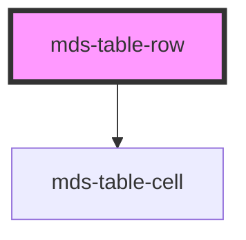

# mds-table-row

This is a web-component from Maggioli Design System [Magma](https://magma.maggiolicloud.it), built with StencilJS, TypeScript, Storybook. It's based on the web-component standard and it's designed to be agnostic from the JavaScript framework you are using.

<!-- Auto Generated Below -->

## Properties

| Property         | Attribute         | Description | Type      | Default     |
| ---------------- | ----------------- | ----------- | --------- | ----------- |
| `interactive`    | `interactive`     |             | `boolean` | `undefined` |
| `overlayActions` | `overlay-actions` |             | `boolean` | `undefined` |

## Slots

| Slot        | Description                     |
| ----------- | ------------------------------- |
| `"default"` | Put `mds-table-cell` element/s. |

## Dependencies

### Depends on

- [mds-table-cell](../mds-table-cell)

### Graph

----------------------------------------------

Built with love @ [Gruppo Maggioli](https://www.maggioli.com) from [R&D Department](https://www.maggioli.com/it-it/chi-siamo/ricerca-sviluppo)
