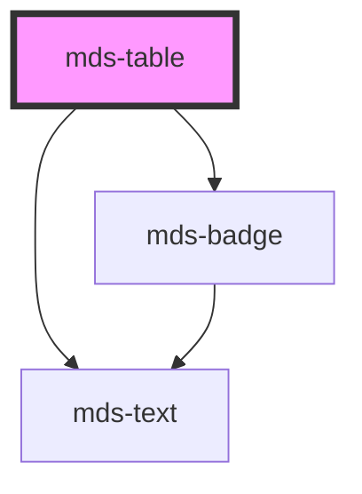

# mds-table


This is a web-component from Maggioli Design System [Magma](https://magma.maggiolicloud.it), built with StencilJS, TypeScript, Storybook. It's based on the web-component standard and it's designed to be agnostic from the JavaScript framework you are using.

<!-- Auto Generated Below -->


## Usage

### 1. Description

The `<mds-table>` web component is the root container of the Magma Design System tabular data system. It wraps a native `<table>` and orchestrates a family of compound children (`mds-table-header`, `mds-table-body`, `mds-table-footer`, `mds-table-row`, `mds-table-cell`), propagating interaction, selection, and overflow state down to them.

#### Semantic Behavior

- **Compound parent**: The default slot must hold `mds-table-header` / `mds-table-body` / `mds-table-footer`; `<mds-table>` pushes its own `interactive` and `selectable` state onto every `mds-table-row` and the header/body. It is not used standalone.
- **Selection model**: When `selectable` is set, rows expose a checkbox; the component aggregates the selected rows, mirrors the count to the header's tristate control, and flags that a selection exists so it is visible to CSS and consumers.
- **Selection event**: Emits `mdsTableSelectionChange` (bubbles, composed) carrying `{ rows }`, an array of `{ index, value }` for every selected row. Selection is driven via the `updateSelection()` and `selectAll(select?)` methods rather than DOM listeners; both are no-ops unless `selectable` is true.
- **Live children**: Rows added or removed at runtime are re-wired with the table's interactive and selectable state, so dynamically added rows behave consistently.
- **Action overflow**: When rows carry a `[slot="action"]`, rows flip into an overlaid-action mode once content exceeds the visible width.
- **Localization**: Resolves its display language from the host (`el`/`en`/`es`/`it`) for the batch-actions label.

#### Properties & Visual Configurations

- **`interactive`** highlights rows on mouseover; choose it for tables whose rows are clickable or navigable, not for purely static read-only data.
- **`selectable`** turns on per-row checkbox selection and the aggregated header/batch-actions machinery; without it the selection methods and the `batch-action` slot are inert.
- **`selection`** is a read-back flag that becomes true while at least one row is selected - it is managed internally, not something callers normally set.

#### Other behavioral props

- **`batch-action` slot** holds `mds-button` element/s; its bar renders only when `selectable` is on and at least one batch action is slotted, surfacing a live count badge of the current selection.


### 2. Pattern

Correct and idiomatic ways to use the `<mds-table>` component, ordered from most common to most specialized. Patterns assume a working knowledge of the compound-component rules documented in [`docs/COMPONENTS.md`](../../../../../../docs/COMPONENTS.md) and the generic stencil rules in [`projects/stencil/SPEC.md`](../../../../SPEC.md).

#### Basic Read-Only Table

The minimal structure: `mds-table-header` with one `mds-table-header-cell` per column, `mds-table-body` with `mds-table-row` children each containing `mds-table-cell` elements. All four subparts are required direct children - do not replace them with raw `<thead>`, `<tr>`, or `<td>` elements.

```html
<mds-table>
  <mds-table-header>
    <mds-table-header-cell label="Nome"></mds-table-header-cell>
    <mds-table-header-cell label="Email"></mds-table-header-cell>
    <mds-table-header-cell label="Data iscrizione"></mds-table-header-cell>
  </mds-table-header>
  <mds-table-body>
    <mds-table-row>
      <mds-table-cell><mds-text typography="detail">Mario Rossi</mds-text></mds-table-cell>
      <mds-table-cell><mds-text typography="detail">mario.rossi@example.com</mds-text></mds-table-cell>
      <mds-table-cell><mds-text typography="detail">12 ottobre 1985</mds-text></mds-table-cell>
    </mds-table-row>
    <mds-table-row>
      <mds-table-cell><mds-text typography="detail">Luigi Verdi</mds-text></mds-table-cell>
      <mds-table-cell><mds-text typography="detail">luigi.verdi@example.com</mds-text></mds-table-cell>
      <mds-table-cell><mds-text typography="detail">3 marzo 1993</mds-text></mds-table-cell>
    </mds-table-row>
  </mds-table-body>
</mds-table>
```

#### Table with Footer

Add `mds-table-footer` after `mds-table-body` to show totals or summaries. Each cell inside the footer is an `mds-table-cell` - the same component used in body rows.

```html
<mds-table>
  <mds-table-header>
    <mds-table-header-cell label="Voce"></mds-table-header-cell>
    <mds-table-header-cell label="Importo"></mds-table-header-cell>
  </mds-table-header>
  <mds-table-body>
    <mds-table-row>
      <mds-table-cell><mds-text typography="detail">Servizio A</mds-text></mds-table-cell>
      <mds-table-cell><mds-text typography="detail">120,00 EUR</mds-text></mds-table-cell>
    </mds-table-row>
    <mds-table-row>
      <mds-table-cell><mds-text typography="detail">Servizio B</mds-text></mds-table-cell>
      <mds-table-cell><mds-text typography="detail">80,00 EUR</mds-text></mds-table-cell>
    </mds-table-row>
  </mds-table-body>
  <mds-table-footer>
    <mds-table-cell><mds-text typography="action">Totale</mds-text></mds-table-cell>
    <mds-table-cell><mds-text typography="action">200,00 EUR</mds-text></mds-table-cell>
  </mds-table-footer>
</mds-table>
```

#### Interactive Rows

Set `interactive` when rows are clickable or navigable. The prop propagates to every `mds-table-row` and highlights the hovered row. Do not reach into rows directly to set `interactive` - set it once on the parent.

```html
<mds-table interactive>
  <mds-table-header>
    <mds-table-header-cell label="Utente"></mds-table-header-cell>
    <mds-table-header-cell label="Ruolo"></mds-table-header-cell>
  </mds-table-header>
  <mds-table-body>
    <mds-table-row>
      <mds-table-cell><mds-text typography="detail">Anna Bianchi</mds-text></mds-table-cell>
      <mds-table-cell><mds-text typography="detail">Amministratore</mds-text></mds-table-cell>
    </mds-table-row>
    <mds-table-row>
      <mds-table-cell><mds-text typography="detail">Carlo Neri</mds-text></mds-table-cell>
      <mds-table-cell><mds-text typography="detail">Operatore</mds-text></mds-table-cell>
    </mds-table-row>
  </mds-table-body>
</mds-table>
```

#### Row-Level Action Buttons

Slot `mds-button` elements with `slot="action"` directly inside `mds-table-row` (not inside `mds-table-cell`). The table detects the presence of action buttons and switches to overlay-action mode automatically when content overflows the visible width.

```html
<mds-table interactive>
  <mds-table-header>
    <mds-table-header-cell label="Documento"></mds-table-header-cell>
    <mds-table-header-cell label="Stato"></mds-table-header-cell>
  </mds-table-header>
  <mds-table-body>
    <mds-table-row>
      <mds-table-cell><mds-text typography="detail">Contratto 2024.pdf</mds-text></mds-table-cell>
      <mds-table-cell><mds-text typography="detail">Approvato</mds-text></mds-table-cell>
      <mds-button
        slot="action"
        icon="mi/baseline/download"
        title="Scarica documento"
        variant="dark"
        tone="text"
      ></mds-button>
      <mds-button
        slot="action"
        icon="mi/baseline/delete"
        title="Elimina documento"
        variant="error"
        tone="text"
      ></mds-button>
    </mds-table-row>
  </mds-table-body>
</mds-table>
```

#### Row Selection and Selection Event

Set `selectable` to add a checkbox to each row. Listen for `mdsTableSelectionChange` to receive the array of selected rows - each entry carries the row `index` and the optional `value` set on `mds-table-row`. Assign `value` to each row to distinguish selections in the event payload.

```html
<mds-table selectable id="tabella-utenti">
  <mds-table-header>
    <mds-table-header-cell label="Nome"></mds-table-header-cell>
    <mds-table-header-cell label="Reparto"></mds-table-header-cell>
  </mds-table-header>
  <mds-table-body>
    <mds-table-row value="usr-001">
      <mds-table-cell><mds-text typography="detail">Giulia Russo</mds-text></mds-table-cell>
      <mds-table-cell><mds-text typography="detail">Contabilita</mds-text></mds-table-cell>
    </mds-table-row>
    <mds-table-row value="usr-002">
      <mds-table-cell><mds-text typography="detail">Marco Ferrari</mds-text></mds-table-cell>
      <mds-table-cell><mds-text typography="detail">IT</mds-text></mds-table-cell>
    </mds-table-row>
  </mds-table-body>
</mds-table>

<script>
  document.getElementById('tabella-utenti').addEventListener('mdsTableSelectionChange', (e) => {
    console.log('Righe selezionate:', e.detail.rows);
    // e.detail.rows => [{ index: 0, value: 'usr-001' }, ...]
  });
</script>
```

#### Programmatic Select All

Call the `selectAll()` method to select all rows at once; pass `false` to deselect. This is a no-op unless `selectable` is set.

```html
<mds-button id="btn-seleziona-tutti" label="Seleziona tutti" variant="primary" tone="outline"></mds-button>
<mds-button id="btn-deseleziona" label="Deseleziona tutti" variant="dark" tone="text"></mds-button>

<mds-table selectable id="tabella-doc">
  <mds-table-header>
    <mds-table-header-cell label="Titolo"></mds-table-header-cell>
  </mds-table-header>
  <mds-table-body>
    <mds-table-row value="doc-1">
      <mds-table-cell><mds-text typography="detail">Verbale assemblea</mds-text></mds-table-cell>
    </mds-table-row>
    <mds-table-row value="doc-2">
      <mds-table-cell><mds-text typography="detail">Bilancio 2024</mds-text></mds-table-cell>
    </mds-table-row>
  </mds-table-body>
</mds-table>

<script>
  const table = document.getElementById('tabella-doc');
  document.getElementById('btn-seleziona-tutti').addEventListener('click', () => table.selectAll());
  document.getElementById('btn-deseleziona').addEventListener('click', () => table.selectAll(false));
</script>
```

#### Batch Actions Bar

Slot `mds-button` elements with `slot="batch-action"` as direct children of `mds-table` alongside the body. The bar renders only when `selectable` is set and at least one batch-action button is present; it shows a live count badge of the current selection and appears once a row is checked.

```html
<mds-table selectable>
  <mds-table-header>
    <mds-table-header-cell label="Pratica"></mds-table-header-cell>
    <mds-table-header-cell label="Stato"></mds-table-header-cell>
  </mds-table-header>
  <mds-table-body>
    <mds-table-row value="prat-001">
      <mds-table-cell><mds-text typography="detail">Pratica n. 1234</mds-text></mds-table-cell>
      <mds-table-cell><mds-text typography="detail">In lavorazione</mds-text></mds-table-cell>
    </mds-table-row>
    <mds-table-row value="prat-002">
      <mds-table-cell><mds-text typography="detail">Pratica n. 5678</mds-text></mds-table-cell>
      <mds-table-cell><mds-text typography="detail">Chiusa</mds-text></mds-table-cell>
    </mds-table-row>
  </mds-table-body>
  <mds-button
    slot="batch-action"
    icon="mi/outline/send"
    label="Invia selezionati"
    variant="dark"
    tone="text"
  ></mds-button>
  <mds-button
    slot="batch-action"
    icon="mi/outline/delete"
    label="Elimina selezionati"
    variant="error"
    tone="text"
  ></mds-button>
</mds-table>
```

#### Styling Customization

Customize the table appearance only through its documented `--mds-table-*` CSS custom properties. Set them on the host element or a parent selector; use Magma color tokens via `rgb(var(--<token>))` so dark mode keeps working.

```css
.tabella-contratti mds-table {
  --mds-table-background: rgb(var(--tone-neutral-09));
  --mds-table-background-alt: rgb(var(--tone-neutral-08));
  --mds-table-border-color: rgb(var(--variant-primary-07));
  --mds-table-border-width: 1px;
  --mds-table-cell-padding: var(--spacing-500);
  --mds-table-color: rgb(var(--tone-neutral-02));
}
```


### 3. Antipattern

Common incorrect uses of `<mds-table>`. Each entry pairs the wrong form with the right one and a one-line reason. System-wide rules (boolean-as-string, shadow piercing, Tailwind color utilities, raw native event listening) live in [`docs/COMPONENTS.md`](../../../../../../docs/COMPONENTS.md#system-level-anti-patterns) - they apply here too but are not repeated.

#### Do Not Replace Compound Subparts with Raw HTML Elements

`<mds-table>` orchestrates its children via internal Stencil mechanisms. Substituting any subpart (`mds-table-header`, `mds-table-body`, `mds-table-row`, `mds-table-cell`) with a raw `<thead>`, `<tbody>`, `<tr>`, or `<td>` breaks propagation of `interactive`, `selectable`, and overflow state.

```html
<!-- 🚫 INCORRECT -->
<mds-table>
  <thead>
    <tr><th>Nome</th><th>Email</th></tr>
  </thead>
  <tbody>
    <tr><td>Mario Rossi</td><td>mario.rossi@example.com</td></tr>
  </tbody>
</mds-table>

<!-- ✅ CORRECT -->
<mds-table>
  <mds-table-header>
    <mds-table-header-cell label="Nome"></mds-table-header-cell>
    <mds-table-header-cell label="Email"></mds-table-header-cell>
  </mds-table-header>
  <mds-table-body>
    <mds-table-row>
      <mds-table-cell><mds-text typography="detail">Mario Rossi</mds-text></mds-table-cell>
      <mds-table-cell><mds-text typography="detail">mario.rossi@example.com</mds-text></mds-table-cell>
    </mds-table-row>
  </mds-table-body>
</mds-table>
```

#### Do Not Slot Batch-Action Buttons Inside the Body

The `slot="batch-action"` must be a direct child of `<mds-table>`, not nested inside `mds-table-body` or any row. The component queries `:scope > [slot="batch-action"]` at load time and the bar will not appear if the slot is misplaced.

```html
<!-- 🚫 INCORRECT -->
<mds-table selectable>
  <mds-table-body>
    <mds-table-row>...</mds-table-row>
    <mds-button slot="batch-action" label="Elimina" variant="error" tone="text"></mds-button>
  </mds-table-body>
</mds-table>

<!-- ✅ CORRECT -->
<mds-table selectable>
  <mds-table-header>...</mds-table-header>
  <mds-table-body>
    <mds-table-row>...</mds-table-row>
  </mds-table-body>
  <mds-button slot="batch-action" label="Elimina" variant="error" tone="text"></mds-button>
</mds-table>
```

#### Do Not Slot Row Action Buttons Inside `mds-table-cell`

Per-row action buttons use `slot="action"` on a direct child of `mds-table-row`, not wrapped inside an `mds-table-cell`. Placing them in a cell breaks the overflow-detection logic that switches rows into overlay-action mode.

```html
<!-- 🚫 INCORRECT -->
<mds-table-row>
  <mds-table-cell><mds-text typography="detail">Contratto.pdf</mds-text></mds-table-cell>
  <mds-table-cell>
    <mds-button slot="action" icon="mi/baseline/delete" title="Elimina" variant="error" tone="text"></mds-button>
  </mds-table-cell>
</mds-table-row>

<!-- ✅ CORRECT -->
<mds-table-row>
  <mds-table-cell><mds-text typography="detail">Contratto.pdf</mds-text></mds-table-cell>
  <mds-button slot="action" icon="mi/baseline/delete" title="Elimina" variant="error" tone="text"></mds-button>
</mds-table-row>
```

#### Do Not Enable Batch Actions Without `selectable`

The batch-action bar only renders when `selectable` is set. Slotting batch-action buttons on a non-selectable table silently produces no bar and no selection count, causing the buttons to never appear.

```html
<!-- 🚫 INCORRECT -->
<mds-table>
  <mds-table-header>...</mds-table-header>
  <mds-table-body>...</mds-table-body>
  <mds-button slot="batch-action" label="Esporta" variant="primary"></mds-button>
</mds-table>

<!-- ✅ CORRECT -->
<mds-table selectable>
  <mds-table-header>...</mds-table-header>
  <mds-table-body>...</mds-table-body>
  <mds-button slot="batch-action" label="Esporta" variant="primary"></mds-button>
</mds-table>
```

#### Do Not Set `interactive` on Individual Rows

`interactive` is a table-level prop that propagates automatically to every `mds-table-row`. Setting it directly on individual rows bypasses the table's state management and leads to inconsistent behavior when rows are added or removed at runtime.

```html
<!-- 🚫 INCORRECT -->
<mds-table>
  <mds-table-body>
    <mds-table-row interactive>...</mds-table-row>
    <mds-table-row>...</mds-table-row>
  </mds-table-body>
</mds-table>

<!-- ✅ CORRECT -->
<mds-table interactive>
  <mds-table-body>
    <mds-table-row>...</mds-table-row>
    <mds-table-row>...</mds-table-row>
  </mds-table-body>
</mds-table>
```

#### Do Not Listen for Native `change` Events to Track Selection

Selection state is communicated via the `mdsTableSelectionChange` custom event. Native `change` events from the internal checkboxes do not bubble out of the shadow DOM reliably; always use the documented Magma event.

```html
<!-- 🚫 INCORRECT -->
<mds-table selectable id="tbl">...</mds-table>
<script>
  document.getElementById('tbl').addEventListener('change', (e) => {
    // unreliable - native events do not bubble from shadow DOM
  });
</script>

<!-- ✅ CORRECT -->
<mds-table selectable id="tbl">...</mds-table>
<script>
  document.getElementById('tbl').addEventListener('mdsTableSelectionChange', (e) => {
    console.log('Righe selezionate:', e.detail.rows);
  });
</script>
```

#### Do Not Set `selection` Manually

`selection` is a reflected read-back attribute managed internally by the table. It becomes `true` when at least one row is selected and is intended for CSS attribute selectors or conditional logic in the host app. Setting it from outside does not change which rows are selected and will be overwritten on the next selection update.

```html
<!-- 🚫 INCORRECT -->
<mds-table selectable selection>
  ...
</mds-table>

<!-- ✅ CORRECT - read it back, do not set it -->
<mds-table selectable id="tbl">
  ...
</mds-table>
<script>
  document.getElementById('tbl').addEventListener('mdsTableSelectionChange', (e) => {
    const hasSelection = e.target.hasAttribute('selection');
    document.getElementById('panel-azioni').hidden = !hasSelection;
  });
</script>
```


## Properties

| Property      | Attribute     | Description                                                   | Type                   | Default     |
| ------------- | ------------- | ------------------------------------------------------------- | ---------------------- | ----------- |
| `interactive` | `interactive` | Specifies if the table rows are higlighted on mouseover event | `boolean \| undefined` | `undefined` |
| `selectable`  | `selectable`  | Specifies if the table rows are selectable by a checkbox      | `boolean \| undefined` | `undefined` |
| `selection`   | `selection`   |                                                               | `boolean \| undefined` | `undefined` |


## Events

| Event                     | Description                                 | Type                                        |
| ------------------------- | ------------------------------------------- | ------------------------------------------- |
| `mdsTableSelectionChange` | Dispatces when interactive property changes | `CustomEvent<MdsTableSelectionEventDetail>` |


## Methods

### `selectAll(select?: boolean) => Promise<void>`

Selects all elements or none, works only if `selectable` is true.

#### Parameters

| Name     | Type      | Description |
| -------- | --------- | ----------- |
| `select` | `boolean` |             |

#### Returns

Type: `Promise<void>`


### `updateSelection() => Promise<void>`

`internal` Updates the selection data event and emits it, it's used to avoid add event listener to the dom and lower performance, works only if `selectable` is true.

#### Returns

Type: `Promise<void>`


## Slots

| Slot              | Description                                                             |
| ----------------- | ----------------------------------------------------------------------- |
| `"batch-actions"` | Put `mds-button` element/s.                                             |
| `"default"`       | Put `mds-table-header`, `mds-table-body`, `mds-table-footer` element/s. |


## Shadow Parts

| Part                      | Description                                       |
| ------------------------- | ------------------------------------------------- |
| `"batch-actions"`         | Selects the element which wraps the batch actions |
| `"batch-actions-wrapper"` |                                                   |
| `"table"`                 | Selects the table element                         |
| `"table-wrapper"`         | Selects the element which wraps the table         |


## Dependencies

### Depends on

- [mds-text](../mds-text)
- [mds-badge](../mds-badge)

### Graph


----------------------------------------------

Built with love @ [Gruppo Maggioli](https://www.maggioli.com) from [R&D Department](https://www.maggioli.com/it-it/chi-siamo/ricerca-sviluppo)
