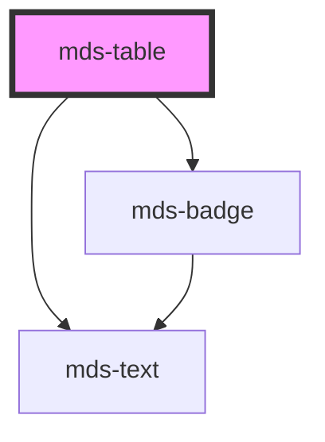

# mds-table

This is a web-component from Maggioli Design System [Magma](https://magma.maggiolicloud.it), built with StencilJS, TypeScript, Storybook. It's based on the web-component standard and it's designed to be agnostic from the JavaScript framework you are using.

<!-- Auto Generated Below -->

## Properties

| Property      | Attribute     | Description                                                   | Type                   | Default     |
| ------------- | ------------- | ------------------------------------------------------------- | ---------------------- | ----------- |
| `interactive` | `interactive` | Specifies if the table rows are higlighted on mouseover event | `boolean \| undefined` | `undefined` |
| `selectable`  | `selectable`  | Specifies if the table rows are selectable by a checkbox      | `boolean \| undefined` | `undefined` |
| `selection`   | `selection`   |                                                               | `boolean \| undefined` | `undefined` |

## Events

| Event                     | Description                                 | Type                                        |
| ------------------------- | ------------------------------------------- | ------------------------------------------- |
| `mdsTableSelectionChange` | Dispatces when interactive property changes | `CustomEvent<MdsTableSelectionEventDetail>` |

## Methods

### `selectAll(select?: boolean) => Promise<void>`

Selects all elements or none, works only if `selectable` is true.

#### Parameters

| Name     | Type      | Description |
| -------- | --------- | ----------- |
| `select` | `boolean` |             |

#### Returns

Type: `Promise<void>`

### `updateSelection() => Promise<void>`

`internal` Updates the selection data event and emits it, it's used to avoid add event listener to the dom and lower performance, works only if `selectable` is true.

#### Returns

Type: `Promise<void>`

## Slots

| Slot              | Description                                                             |
| ----------------- | ----------------------------------------------------------------------- |
| `"batch-actions"` | Put `mds-button` element/s.                                             |
| `"default"`       | Put `mds-table-header`, `mds-table-body`, `mds-table-footer` element/s. |

## Shadow Parts

| Part                      | Description                                       |
| ------------------------- | ------------------------------------------------- |
| `"batch-actions"`         | Selects the element which wraps the batch actions |
| `"batch-actions-wrapper"` |                                                   |
| `"table"`                 | Selects the table element                         |
| `"table-wrapper"`         | Selects the element which wraps the table         |

## CSS Custom Properties

| Name                         | Description                                |
| ---------------------------- | ------------------------------------------ |
| `--mds-table-actions-gap`    | Gap between table action elements.         |
| `--mds-table-background`     | Default background color of the table.     |
| `--mds-table-background-alt` | Alternate background color for table rows. |
| `--mds-table-border-color`   | Color of the table border.                 |
| `--mds-table-border-width`   | Width of the table border.                 |
| `--mds-table-cell-padding`   | Padding inside table cells.                |
| `--mds-table-color`          | Default text color of the table.           |
| `--mds-table-color-alt`      | Text color for alternate table rows.       |

## Dependencies

### Depends on

- [mds-text](../mds-text)
- [mds-badge](../mds-badge)

### Graph

----------------------------------------------

Built with love @ [Gruppo Maggioli](https://www.maggioli.com) from [R&D Department](https://www.maggioli.com/it-it/chi-siamo/ricerca-sviluppo)
