# mds-text

<!-- Auto Generated Below -->

## Properties

| Property     | Attribute    | Description                                  | Type                                                                                                                                                                                                                                                                                                                                                                                                                                                                         | Default     |
| ------------ | ------------ | -------------------------------------------- | ---------------------------------------------------------------------------------------------------------------------------------------------------------------------------------------------------------------------------------------------------------------------------------------------------------------------------------------------------------------------------------------------------------------------------------------------------------------------------- | ----------- |
| `tag`        | `tag`        | Specifies the HTML tag of the element        | `"h1" \| "h2" \| "h3" \| "h4" \| "h5" \| "h6" \| "strong" \| "label" \| "address" \| "time" \| "code" \| "abbr" \| "article" \| "b" \| "bdo" \| "blockquote" \| "cite" \| "dd" \| "del" \| "details" \| "dfn" \| "div" \| "dl" \| "dt" \| "em" \| "figcaption" \| "i" \| "ins" \| "kbd" \| "legend" \| "li" \| "mark" \| "ol" \| "p" \| "pre" \| "q" \| "rb" \| "rt" \| "ruby" \| "s" \| "samp" \| "small" \| "span" \| "sub" \| "summary" \| "sup" \| "u" \| "ul" \| "var"` | `undefined` |
| `typography` | `typography` | Specifies the font typography of the element | `"action" \| "caption" \| "code" \| "detail" \| "h1" \| "h2" \| "h3" \| "h4" \| "h5" \| "h6" \| "hack" \| "label" \| "option" \| "paragraph" \| "tip"`                                                                                                                                                                                                                                                                                                                       | `'detail'`  |
| `variant`    | `variant`    | Specifies the variant for `typography`       | `"info" \| "mono" \| "primary" \| "read" \| "secondary" \| "title"`                                                                                                                                                                                                                                                                                                                                                                                                          | `undefined` |

## Dependencies

### Used by

 - [mds-accordion-item](../mds-accordion-item)
 - [mds-accordion-timer-item](../mds-accordion-timer-item)
 - [mds-avatar](../mds-avatar)
 - [mds-badge](../mds-badge)
 - [mds-banner](../mds-banner)
 - [mds-benchmark-bar](../mds-benchmark-bar)
 - [mds-bibliography](../mds-bibliography)
 - [mds-breadcrumb-item](../mds-breadcrumb-item)
 - [mds-button](../mds-button)
 - [mds-file](../mds-file)
 - [mds-input](../mds-input)
 - [mds-input-button](../mds-input-button)
 - [mds-input-field](../mds-input-field)
 - [mds-input-range](../mds-input-range)
 - [mds-input-switch](../mds-input-switch)
 - [mds-kpi-item](../mds-kpi-item)
 - [mds-list-item](../mds-list-item)
 - [mds-notification](../mds-notification)
 - [mds-paginator-item](../mds-paginator-item)
 - [mds-quote](../mds-quote)
 - [mds-stepper-bar-item](../mds-stepper-bar-item)
 - [mds-tab-bar-item](../mds-tab-bar-item)
 - [mds-tag](../mds-tag)
 - [mds-toast](../mds-toast)
 - [mds-tooltip](../mds-tooltip)
 - [mds-url-view](../mds-url-view)
 - [mds-usage](../mds-usage)

### Graph

```mermaid
graph TD;
  mds-accordion-item --> mds-text
  mds-accordion-timer-item --> mds-text
  mds-avatar --> mds-text
  mds-badge --> mds-text
  mds-banner --> mds-text
  mds-benchmark-bar --> mds-text
  mds-bibliography --> mds-text
  mds-breadcrumb-item --> mds-text
  mds-button --> mds-text
  mds-file --> mds-text
  mds-input --> mds-text
  mds-input-button --> mds-text
  mds-input-field --> mds-text
  mds-input-range --> mds-text
  mds-input-switch --> mds-text
  mds-kpi-item --> mds-text
  mds-list-item --> mds-text
  mds-notification --> mds-text
  mds-paginator-item --> mds-text
  mds-quote --> mds-text
  mds-stepper-bar-item --> mds-text
  mds-tab-bar-item --> mds-text
  mds-tag --> mds-text
  mds-toast --> mds-text
  mds-tooltip --> mds-text
  mds-url-view --> mds-text
  mds-usage --> mds-text
  style mds-text fill:#f9f,stroke:#333,stroke-width:4px
```

----------------------------------------------

Built with love @ **Maggioli Informatica / R&D Department**
